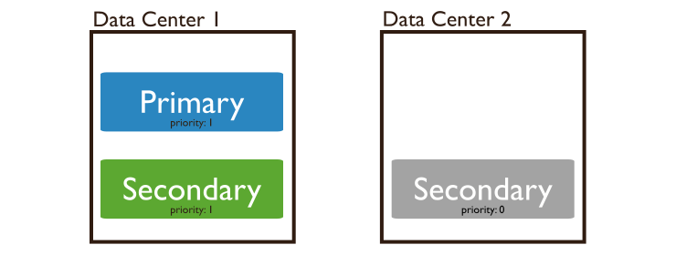

# replication
> 复制集

一个复制集，是一组mongod进程，维持了同样的数据集合。复制集提供了冗余和高可用,是所有功能的基础。

## 冗余和高可用
复制集提供了冗余和增加了数据的可用性。
用多个数据备份再不同的数据库服务器上，
复制集比单个服务器 提高了一个容错级别。

复制集，提供了更大的读取容量，因为客户端可以将读取操作发送到不同的服务器。

在不同的数据中心维护数据副本，可以提高分布式应用程序的数据位置和可用性。

您还可以为专用的目的（如灾难恢复，报告或备份）维护其他副本。

## 复制集在MongoDB上的

复制集，是一组维护相同数据集的mongod实例。

副本集包含多个数据承载节点（data bearing nodes）和一个仲裁节点（arbiter node）（可选）.

在数据承载节点中，一个且只有一个成员被用作主节点（primary node），其他节点用作辅助节点（secondary node）。

主节点负责接收所有的读写操作。

辅助节点，复制主节点的oplog，并应用到自身的数据集。

如果主节点不可用，一个合格的辅助节点将举行选举，自行选出新的主节点。

你也可以将一个mongod实例作为仲裁节点（arbiter node）添加到副本集。仲裁节点不维护数据集。
仲裁节点的功能是通过响应其他副本集成员的心跳和选择请求来维护副本集中的仲裁。
因为它们不存储数据集，所以仲裁节点是提供副本集仲裁功能的一种好方法，与具有数据集的完全功能副本集成员相比，仲裁节点的资源成本更低。
如果副本集的成员数为偶数，则添加一个仲裁节点以在初选中获得多数票。
仲裁节点不需要专用的硬件。

一个仲裁节点永远是一个仲裁节点，一个主节点可能会停止，变成一个辅助节点，一个辅助接点也可能选举变成一个主节点。

