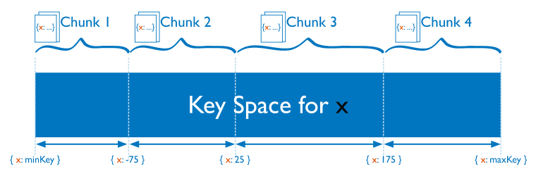

# Sharding

分片，是一种跨多台机器分布数据的方法，mongodb使用分片来支持具有非常大的数据集和高吞吐量操作的部署。

具有大数据集或高吞吐量应用程序的数据库系统可能会挑战单个服务器的容量。例如，高查询率会耗尽服务器的CPU容量。大于系统RAM的工作集大小会对磁盘驱动器的I/O容量造成压力。

解决系统增长的方法有两种：垂直和水平缩放。

垂直扩展，包括增加单个服务器的容量，例如使用更强大的CPU，更多的RAM，更多的存储空间。垂直缩放有一个实际的最大值。

横向扩展，包括将系统数据集和负载划分到多台服务器上，根据需要添加额外的服务器以增加容量。虽然一台机器的整体速度或容量可能不高，但每台机器都处理整体工作负载的一个子集，可能比单个高速高容量服务器提供更好的效率。
扩展部署的容量只需要根据需要添加额外的服务器，这可能比单台机器的高端硬件的总体成本更低。权衡是增加了部署的基础设施和维护的复杂性。

MongoDB通过分片进行水平缩放。

## Sharded Cluster

一个分片集群包含下面几个组件：

- shard: 每一个分片包含了分片数据的一个子集，每一个分片可以被部署为一个副本集。
- mongos：mongos职责是作为一个请求的路由，提供一个接口，处于客户端程序和分片集群中间。
- config servers: 配置服务器存储元数据和集群的配置信息。配置服务器必须部署为一个副本集。

分片数据是在collection 的级别，分布集合的数据到分片集群上。

## Shard Keys

mongodb使用片键在不同的分片之间分发集合的文档。
片键由目标集合中每个文档存在的一个或多个字段组成。

在对一个集合进行分片时选择片键。一旦选择，不能更改。一个分片集合只能有一个片键。

要对非空集合进行分片，集合必须具有以片键开始的索引。
对一个空的集合进行分片，如果集合没有针对指定的片键的适当索引，mongodb将创建索引。

选择分片会影响分片集群的性能，效率和可伸缩性。片键可能会阻碍具有最佳硬件和基础结构的集群。片键的选择及其支持索引也会影响集群使用分片的策略。

## Chunks
mongodb将分片数据分割成块。每一个块都有一个基于片键的包含的范围。

## Balancer and Even Chunk Distribution
为了在集群的所有分片上实现块的均匀分布，在后台运行一个均衡器来跨分片迁移块。

## Advantages of Sharding (分片的优势)

### Reads/Writes

读写会被分摊在多个分片上。

### Storage Capacity(存储容纳)

### High Availability（高可用）

## Considerations Before Sharding（分片前的注意事项）

分片集群的基础设施和复杂性需要自己的规划，执行和维护。

为了保证集群的性能和效率，在选择片键时要慎重考虑，切分后不能更改片键。也不能取消分片集合的共享。

分片有一定的操作要求和限制。

如果 查询不包括 片键 或复合片键的前缀，那么mongos将执行广播操作，查询分片集群中的所有片。这些查询可能耗时很长。

## Sharded and Non-Sharded Collections(分片和未分片的集合)

一个数据库可以混合使用有分片和未分片的集合。
分片集合在集群中的分片之间进行切割和分布。
未分片的集合存储在主片上。每个数据库都有自己的主片。

## Connecting to a Sharded Cluster

你必须连接到mongos路由器，才能与分片集群中的任何集合进行交互。这包括分片和未分片的集合。为了执行读写操作，客户端不应该连接到单个的分片。

你可以用连接mongod一样的方式连接mongos。

## Sharding Strategy(分片策略)

支持两种分片策略。

### Hashed Sharding(哈希分片)
哈希分片，计算分片片键的散列值，然后根据散列值为每个块分配一个范围。

当一个range 片键是关闭状态，但他们的散列值不太可能位于同一块。基于散列值的数据分布有助于更均匀的 数据分布，尤其是在片键单调变化的数据集中。

然而，散列分布，意味着基于片键的查询不太可能以单个片为目标，从而导致更多的集群范围的广播操作。

### Ranged Sharding （范围分片）

范围分片，根据片键将数据划分为多个范围，然后根据片键值为每个块分配一个范围。

一个范围的片键个能会位于同一个块。这允许目标操作，只将操作路由到包含所需数据的片。

范围分片，的效率取决于选择的片键。考虑不周的片键可能会导致数据分布不均匀，这可能会抵消分片的好处，或导致性能瓶颈。

## Zones in Sharded Clusters

## Collations in Sharding

## Change Streams

## Transactions

