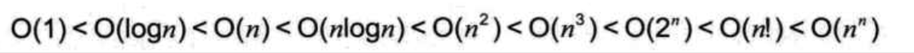

| Title                | Date             | Modified         | Category          |
|:--------------------:|:----------------:|:----------------:|:-----------------:|
| algorithm            | 2019-07-01 12:00 | 2019-07-01 12:00 | algorithm         |


# 算法

算法（Algorithm）是解决特定问题求解步骤的描述，在计算机中表现为指令的有限序列，并且每条指令表示一个或多个操作。


## 算法的特性
算法具有五个基本特性：输入，输出，有穷性，明确性，可行性。

- 输入输出：算法具有零个或多个输入。算法至少有一个或多个输出。
- 有穷性：算法在执行有限的步骤之后，自动结束而不会出现无限循环，并且每一个步骤在可接受的时间内完成。
- 确定性：算法的每一步骤都具有确定的含义，不会出现二义性。
- 可行性：算法的每一步都必须是可行的，也就是说，每一步都能够通过执行有限次数完成。

## 算法设计的要求

- 正确性：算法的正确性是指算法至少应该具有输入，输出和加工处理无歧义性，能正确反映问题的需求，能够得到问题的正确答案，
- 可读性：算法设计的另一目的是为了便于阅读，理解和交流。
- 健壮性：当输入数据不合法时，算法也能做出相关处理，而不是产生异常或莫名其妙的结果。
- 时间效率高和存储量低：设计算法应该尽量满足时间效率高和存储量低的需求。
    - 时间效率：指的是算法的执行时间，对于同一个问题，如果有多个算法能够解决，执行时间短的算法效率高，执行时间长的效率低。
    - 存储量需求：指的是算法在执行过程中需要的最大存储空间，主要指算法程序运行时所占用的内存或外部硬盘存储空间。


    


## 算法效率的度量方法

- 事后统计方法：这种方法主要是通过设计好的测试程序和数据，利用计算机计时器对不同算法编制的程序的运行时间进行比较，从而确定算法效率的高低。
- 事前分析估算法：在计算机程序编制前，依据统计方法对算法进行估算。


## 函数的渐进增长

函数的渐进增长：给定两个函数f(n)和g(n)，如果存在一个整数N，使得对于所有的n>N,f(n)总是比g(n)大，那么，我们说f(n)的增长渐近快于g(n)。

判断一个算法的效率时，函数中的常数和其他次要项常常可以忽略，而更应该关注主项（最高阶项）的阶数。

某个算法，随着n的增大，它会越来越优于另一算法，或者越来越差于另一算法。

这其实就是事前估算方法的理论依据，通过算法时间复杂度来估算算法时间效率。


## 算法时间复杂度


在进行算法分析时，语句总的执行次数T(n)是关于问题规模n的函数，进而分析T(n)随n的变化情况并确定T(n)的数量级。算法的时间复杂度，也就是算法的时间量度，记作：T(n) = O(f(n))。它表示随问题规模n的增大，算法执行时间的增长率和f(n)的增长率相同，称作算法的渐近时间复杂度，简称为时间复杂度。其中f(n)是问题规模n的某个函数。


这样用大写O()来体现算法时间复杂度的记法，我们称之为 大O记法。

一般情况下，随着n的增大，T(n)增长最慢的算法为最优算法。

显然，由此算法时间复杂度的定义可知，我们的三个求和算法的时间复杂度分别为O(n), O(1), O(n^2)。我们分别给它们取了非官方的名称，O(1)叫常数阶，O(n)叫线性阶，O(n^2)叫平方阶，当然，还有其他的一些阶，我们之后会介绍。


### 推导大O阶方法

推导大O阶：
1. 用常数1取代运行时间中的所有加法常数
2. 在修改后的运行次数函数中，只保留最高阶项。
3. 如果最高阶项存在且不是1，则去除与这个项相乘的常数。

得到的结果就是大O阶。


### 常数阶
首先顺序结构的时间复杂度。下面的算法，也就是刚才的第二种算法（高斯算法），为什么时间复杂度不是O（3）而是O（1）。
```c
int sum = 0, n = 100; /* 执行一次 */
sum = (1 + n) * n / 2; /* 执行一次 */
printf("%d", sum); /* 执行一次 */
```

这个算法的运行次数函数是f(n)=3。根据我们推导大O阶的方法，第一步就是把常数项3改为1。在保留最高阶项时发现，它根本没有最高阶项，所以这个算法的时间复杂度为O(1)。


另外，我们试想一下，如果这个算法当中的语句sum=(1+n)*n/2有10句，即：
```c
int sum = 0, n = 100; /* 执行一次 */
sum = (1 + n) * n / 2; /* 执行第1次 */
sum = (1 + n) * n / 2; /* 执行第2次 */
sum = (1 + n) * n / 2; /* 执行第3次 */
sum = (1 + n) * n / 2; /* 执行第4次 */
sum = (1 + n) * n / 2; /* 执行第5次 */
sum = (1 + n) * n / 2; /* 执行第6次 */
sum = (1 + n) * n / 2; /* 执行第7次 */
sum = (1 + n) * n / 2; /* 执行第8次 */
sum = (1 + n) * n / 2; /* 执行第9次 */
sum = (1 + n) * n / 2; /* 执行第10次 */
printf("%d", sum); /* 执行一次 */
```

事实上无论n为多少，上面的两段代码就是3次和12次执行的差异。这种与问题的大小无关（n的多少），执行时间恒定的算法，我们称之为具有O（1）的时间复杂度，又叫常数阶。

注意：不管这个常数是多少，我们都记作O（1），而不能是O（3），O（12）等其他任何数字，这是初学者常常犯的错误。

对于分支结构而言，无论是真，还是假，执行的次数都是恒定的，不会随着n的变大而发生变化，所以单纯的分支结构（不包含在循环结构中），其时间复杂度也是O(1)。


### 线性阶
线性阶的循环结构会复杂很多。要确定某个算法的阶次，我们常常需要确定某个特定语句或某个语句集运行的次数。

因此，我们要分析算法的复杂度，关键就是要分析循环结构的运行情况。


下面这段代码，它的循环的时间复杂度为O(n), 因为循环体中的代码须要执行n次。

```c
int i;
for (i = 0; i < n; i++)
{
    /* 时间复杂度为O(1)的程序步骤序列 */
}

```


### 对数阶

下面的这段代码，时间复杂度又是多少呢？
```c
int count = 1;
while (count < n)
{
    count = count * 2;
    /* 时间复杂度为O(1)的程序步骤序列 */
}
```

由于每次count乘以2之后，就距离n更近了一分。也就是说，有多少个2相乘后大于n，就会退出循环。由2^x=n得到x=log2n. 所以这个循环的时间复杂度为O(logn)。


### 平方阶

下面例子是一个循环嵌套，它的内循环刚才我们已经分析过，时间复杂度为O(n)。

```c
int i,j;
for (i = 0; i < n; i++)
{
    for (j = 0; j < n; j++)
    {
        /* 时间复杂度为O(1)的程序步骤序列 */
    }
}
```


而对于外层的循环，不过是内部这个时间复杂度为O(n)的语句，再循环n次。所以这段代码的时间复杂度为O(n^2)。


如果外循环的循环次数改为了m，时间复杂度就变为O(m*n)。
```c
int i,j;
for (i = 0; i < m; i++)
{
    for (j = 0; j < n; j++)
    {
        /* 时间复杂度为O(1)的程序步骤序列 */
    }
}
```


所以我们可以总结得出，循环的时间复杂度等于循环体的复杂度乘以该循环运行的次数。


那么下面这个循环嵌套，它的时间复杂度是多少呢？

```c
int i,j;
for (i = 0; i < n; i++)
{
    for (j = i; j < n; j++) /* 注意j = i 而不是0 */
    {
        /* 时间复杂度为O(1)的程序步骤序列 */
    }
}
```
由于当i=0时，内循环执行了n次，当i=1时，执行了n-1次，…当i=n-1时，执行了1次。所以总的执行次数为：
n + (n - 1) + (n - 2) + ...+ 1 = n(n + 1) / 2 = n^2/2 + n/2

用我们推导大O阶的方法，第一条，没有加法常数不予考虑；第二条，只保留最高阶项，因此保留n^2/2;第三条，去除这个项相乘的常数，也就是去除1/2,最终这段代码的时间复杂度为O(n^2)。


从这个例子，我们也可以得到一个经验，其实理解大O推导不算难，难的是对数列的一些相关运算，这更多的是考察你的数学知识和能力。


我们继续看例子，对于方法调用的时间复杂度又如何分析。
```c
int i,j;
for (i = 0; i < n; i++)
{
    function(i);
}


void function (int count)
{
    print(count);
}

```
函数体是打印这个参数。其实这很好理解，function函数的时间复杂度是O(1)。所以整体的时间复杂度为O(n)。


加入function是下面这样的：
```c
void function(int count)
{
    int j;
    for (j = count; j < n; j++)
    {
        /* 时间复杂度为O(1)的程序步骤序列 */
    }
}

```


事实上，这和刚才举的例子是一样的，只不过把嵌套内循环放到了函数中，所以最终的时间复杂度为O(n^2)。


下面这段相对复杂的语句：


```c
n++; /* 执行次数为1 */
function(n); /* 执行次数为n */
int i,j;
for (i = 0; i < n; i++) /* 执行次数为n^2 */
{
    function(i);
}
for (i = 0; i < n; i++) /* 执行次数为n(n + 1)/2 */
{
    for (j = i; j < n; j++)
    {
        /* 时间复杂度为O(1)的程序步骤序列 */
    }
}
```

它的执行次数f(n) = 1 + n + n^2 + n(n+1)/2 = 3/2 * n^2 + 3/2 * n + 1, 根据推导大O阶的方法，最终这段代码的时间复杂度也是O(n^2)。


### 常见的时间复杂度

常见的时间复杂度如表2-10-1所示。


常用的时间复杂度所耗费的时间从大到小依次是：




### 最坏情况与平均情况

算法的分析也是类似，我们查找一个有n个随机数字数组中的某个数字，最好的情况是第一个数字就是，那么算法的时间复杂度为O(1)，但也有可能这个数字就在最后一个位置上待着，那么算法的时间复杂度就是O(n), 这是最坏的一种情况了。

- 最坏情况运行时间是一种保证，那就是运行时间将不会再坏了。在应用中，这是一种最重要的需求，通常，除非特别指定，我们提到的运行时间都是最坏情况的运行时间。
- 而平均运行时间也就是从概率的角度看，这个数字在每一个位置的可能性是相同的，所以平均的查找时间为n/2次后发现这个目标元素。
- 平均运行时间是所有情况中最有意义的，因为它是期望的运行时间。


对算法的分析，

- 一种方法是计算所有情况的平均值，这种时间复杂度的计算方法称为平均时间复杂度。
- 另一种方法是计算最坏情况下的时间复杂度，这种方法称为最坏时间复杂度。
- 一般在没有特殊说明的情况下，都是指最坏时间复杂度。


### 算法空间复杂度

我们在写代码时，完全可以用空间来换时间。

算法的空间复杂度通过计算算法所需的存储空间实现，算法空间复杂度的计算公式记作：S(n)=O(f(n))，其中，n为问题的规模，f(n)为语句关于n所占存储空间的函数。

一般情况下，一个程序在机器上执行时，除了需要存储程序本身的指令，常数，变量和输入数据外，还需要存储对数据操作的存储单元。

若输入数据所占空间只取决于问题本身，和算法无关，这样只需要分析该算法在实现时所需的辅助单元即可。

若算法执行时所需的辅助空间相对于输入数据量而言是个常数，则称此算法为原地工作，空间复杂度为O(1)。


通常，我们都是用”时间复杂度“来指运行时间的需求，使用”空间复杂度“指空间需求。

当不用限定词的使用”复杂度“时，通常都是指时间复杂度。显然我们这本书重点要讲的还是算啊发的时间复杂度问题。


## 总结

主要谈了算法的一些基本概念。谈到了数据结构与算法的关系是相互依赖不可分割的。

算法的定义：算法是解决特定问题求解步骤的描述，在计算机中为指令的有限序列，并且每条指令表示一个或多个操作。

算法的特性：有穷性，确定性，可行性，输入，输出。

算法的设计的要求：正确性，可读性，健壮性，高效率和低存储量需求。

算法特性与算法设计的要求 容易混， 需要对比记忆。

算法的度量方法：事后统计方法（不科学，不准确），事前分析估算方法。

函数的渐近增长：给定两个函数f(n)和g(n), 如果存在一个整数N，使得对于所有的n>N，f(n)总是比g(n)大，那么，我们说f(n)的增长渐近快于g(n)。于是我们可以得出一个结论，判断一个算法好不好，我们只通过少量的数据是不能做出准确判断的，如果我们可以对比算法的关键执行次数函数的渐近增长性，基本就可以分析出：某个算法，随着n的变大，它会越来越优于另一算法，或者越来越差于另一算法。

然后给出了算法时间复杂度的定义和推导大O阶的步骤。

推导大O阶：
* 用常数1取代运行时间中的所有加法常数
* 在修改后的运行次数函数中，只保留最高阶项
* 如果最高阶项存在且不是1，则去除与这个项相乘的常数。

得到的结果就是大O阶。

通过这个步骤，我们可以在得到算法的运行次数表达式后，很快得到它的时间复杂度，即大O阶。同时也提醒了大家，其实推导大O阶很容易，但如何得到运行次数的表达式却是需要数学功底的。

接着我们给出了常见的时间复杂度所消耗时间的大小排列：


最后，我们给出了关于算法最坏情况和平均情况的概念，以及空间复杂度的概念。


# 参考资料
## books
- 《大话数据结构》