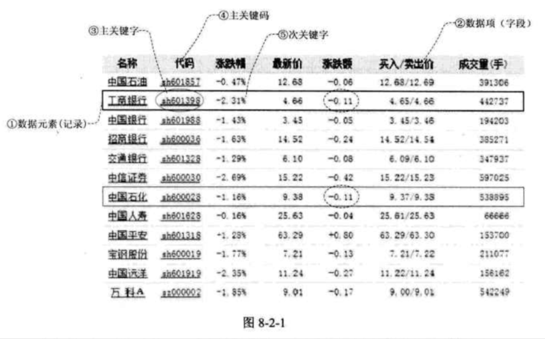

| Title                | Date             | Modified         | Category          |
|:--------------------:|:----------------:|:----------------:|:-----------------:|
| searching            | 2019-07-09 12:00 | 2019-07-09 12:00 | algorithm         |

# searching

查找（Searching）就是根据给定的某个值，在查找表中确定一个其关键字等于给定值的数据元素（或记录）。

## 查找概论

查找表（Search Table）是由同一类型的数据元素（或记录）构成的集合。

关键字（Key）是数据元素中某个数据项的值，又称为键值，用它可以标识一个数据元素。

若此关键字可以唯一的标识一个记录，则称此关键字为主关键字（Primary Key）。

对于那些可以识别多个数据元素（或记录）的关键字，我们称为次关键字（Secondary Key）。

查找（Searching）就是根据给定的某个值，在查找表中确定一个其关键字等于给定值的数据元素（或记录）。

查找表按照操作方式来分有两大种：静态查找表和动态查找表。

静态查找表（Static Search Table）：只作查找操作的查找表。它的主要操作有：
1. 查询某个“特定的”数据元素是否在查找表中
2. 检索某个“特定的”数据元素和各种属性。

动态查找表（Dynamic Search Table）：在查找过程中同时插入查找表中不存在的数据元素，或者从查找表中删除已经存在的某个数据元素。显然动态查找表的操作就是两个：
1. 查找时插入数据元素
2. 查找时删除数据元素

为了提高查找的效率，我们需要专门为查找操作设置数据结构，这种面向查找操作的数据结构称为查找结构。

## 查找方法

- [顺序表查找](./sequential_search.md)
- [有序表查找](./sorted_search.md)
- [线性索引查找](./index_search.md)
- [二叉排序树查找](./binary_sort_tree_search.md)
- [散列表查找](./hash_search.md)

# 总结回顾

首先，介绍了，查找表，记录，关键字，主关键字，静态查找表，动态查找表，等，这些概念。

然后，对于顺序表查找来说，尽管很土（简单），但它却是后面很多查找的基础，
注意设置“哨兵”的技巧，可以使得本已经很难提升的简单算法里还是提高了性能。

有序查找
- 折半查找，
- 插值查找，
- 斐波那契查找。

线性索引查找，
- 稠密索引，
- 分块索引，
- 倒排索引。

二叉排序树，是动态查找最重要的数据结构。
- 平衡二叉树（AVL树）
- B树（2-3树），2-3-4树，B+树。

散列表

# 参考资料
## books
- 《大话数据结构》