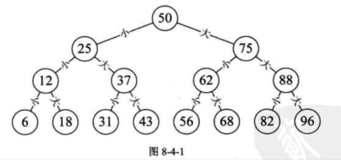
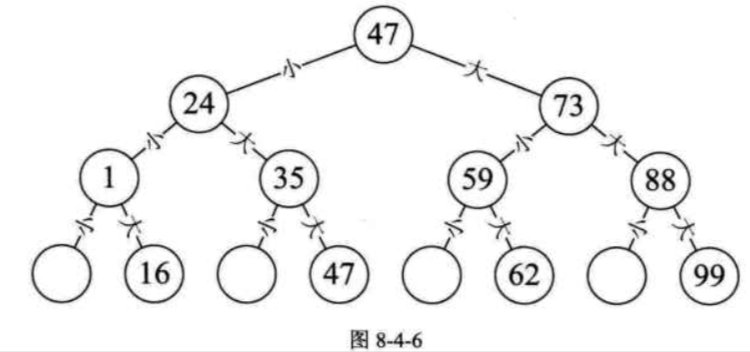
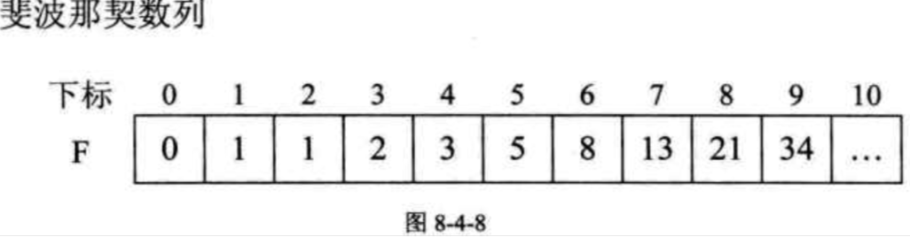

| Title                | Date             | Modified         | Category          |
|:--------------------:|:----------------:|:----------------:|:-----------------:|
| searching            | 2019-07-09 12:00 | 2019-07-09 12:00 | algorithm         |

## 有序表查找

### 折半查找

折半查找（Binary Search）技术，又称为二分查找。
它的前提是线性表中的记录必须是关键码有序（通常从小到大有序），线性表必须采用顺序存储。
折半查找的基本思想是：在有序表中，取中间记录作为比较对象，若给定值与中间记录的关键字相等，则查找成功；若给定值小于中间记录的关键字，则在中间记录的左半区继续查找；若给定值大于中间记录的关键字，则在中间记录的右半区继续查找。不断重复上述过程，直到查找成功，或所有查找区域无记录，查找失败为止。

最坏情况是查找到关键字或查找失败的次数为[log2n]+1.

最好情况1次。

因此最终我们折半算法的时间复杂度为O(logn), 它显然远远好于顺序查找的O(n)时间复杂度了。

折半查找的前提条件是需要有序表顺序存储，对于静态查找表，一次排序后不再变化，这样的算法已经比较好了。但对于需要频繁执行插入或删除操作的数据集来说，维护有序的排序会带来不小的工作量，那就不建议使用。

### 插值查找

插值查找（Interpolation Search）是根据要查找的关键字key与查找表中最大最小记录的关键字比较后的查找方法，其核心就在于插值的计算公式
(key - a[low]) / (a[high] - a[low])

### 斐波那契查找

