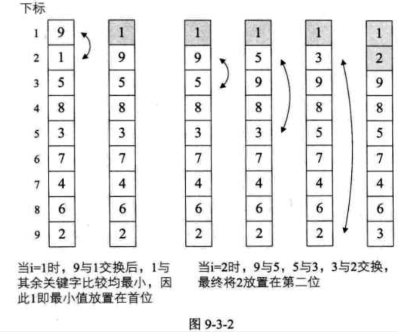
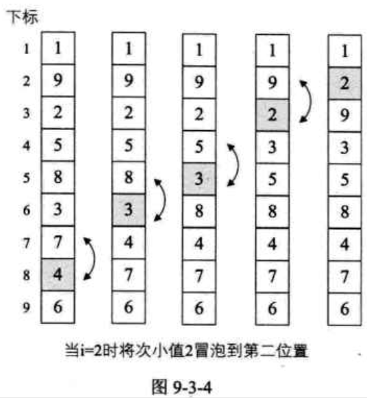

| Title                | Date             | Modified         | Category          |
|:--------------------:|:----------------:|:----------------:|:-----------------:|
| bubble sort            | 2019-07-09 12:00 | 2019-07-09 12:00 | algorithm         |


# bubble sort（冒泡排序）


冒泡排序（Bubble Sort）是一种交换排序，它的基本思想是：两两比较相邻记录的关键字，如果反序则交换，直到没有反序的记录为止。


## 最简单排序实现

冒泡的实现在细节上可以有很多种变化，我们将分别就3种不同的冒泡实现代码，来讲解冒泡排序的思想。这里，我们就先来看看比较容易理解的一段。


```c
/* 对顺序表L作交换排序（冒泡排序初级版） */

void BubbleSort0(SqList *L)
{
    int i, j;
    for (i = 1; i < L->length; i++)
    {
        for (j = i + 1; j <= L->length; j++)
        {
            if (L->r[i] > L->r[j])
            {
                swap(L, i, j); /* 交换L->r[i] 与 L->r[j]的值 */
            }
        }
    }
}

```


这段代码严格意义上说，不算是标准的冒泡排序算法，因为它不满足“两两比较相邻记录”的冒泡排序思想，它更应该是最最简单的交换排序而已。

它的思路就是让每一个关键字，都和它后面的每一个关键字比较，如果大则交换，这样第一位置的关键字在一次循环后一定变成最小值。




它应该算是最最容易写出的排序代码了，不过这个简单易懂的代码，却是有缺陷的。观察后发现，在排序好1和2的位置后，对其余关键字的排序没有什么帮助（数字3反而还被换到了最后一位）。也就是说，这个算法的效率是非常低的。


## 冒泡排序算法

我们来看看正宗的冒泡算法，有没有什么改进的地方。

```c

/* 对顺序表L作冒泡排序 */
void BubbleSort(SqList *L)
{
    int i, j;
    for (i = 1; i < L->length; i++)
    {
        for (j = L->length-1; j >= i; j--) /* 注意j是从后往前循环 */
        {
            if (L->r[j] > L->r[j+1]) /* 若前者大于后者（注意这里与上一算法差异） */
            {
                swap(L, j, j+1); /* 交换L->r[j] 与 L->r[j+1] 的值 */
            }
        }
    }
}

```

图中较小的数字如同气泡般慢慢浮到上面，因此就将此算法命名为冒泡算法。





## 冒泡排序优化
这样的冒泡程序是否还可以优化呢？答案是肯定的。

增加一个标记变量flag来实现这一算法的改进。
```c
void BubbleSort2(SqList *L)
{
    int i, j;
    Status flag = TRUE; /* flag用来作为标记 */
    for (i = 1; i < L->length && flag; i++) /* 若flag为false则退出循环 */
    {
        flag = FALSE; /* 初始化为false */
        for (j = L->length - 1; j >= i; j--)
        {
            if (L->r[j] > L->r[j+1])
            {
                swap(L, j, j+1); /* 交换L->r[j] 与 L->r[j+1] 的值 */
                flag = TRUE; /* 如果有数据交换，则flag为true */
            }
        }
    }
}

```


## 冒泡排序复杂度分析

时间复杂度。
- 最好的情况，也就是要排序的表本身就是有序的，那么我们比较次数，根据最后改进的代码，可以推断出就是n-1次的比较，没有数据交换，时间复杂度为O(n)。
- 最坏的情况，即待排序表是逆序的情况，此时需要比较1+2+3+…+(n-1) = n(n-1)/2 次，并作等数量级的记录移动。因此，总的时间复杂度为O(n^2)。


# 参考资料
## books
- 《大话数据结构》