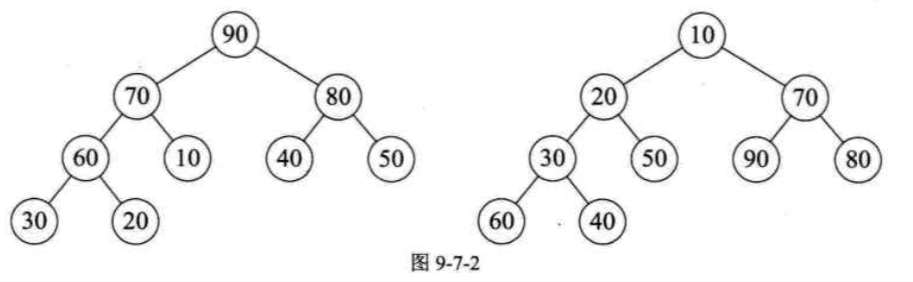
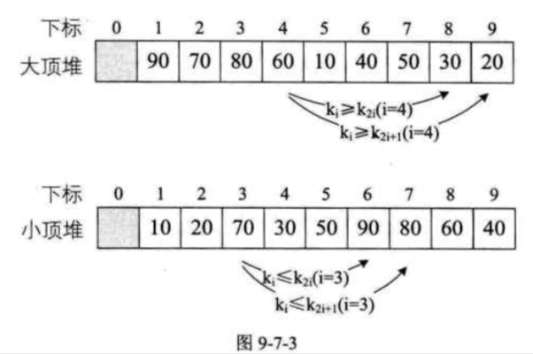
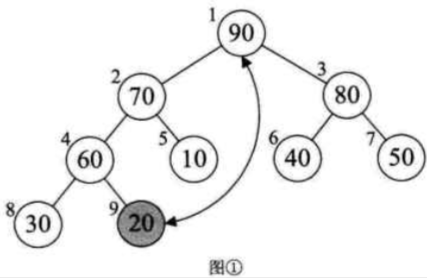
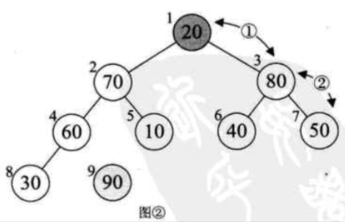
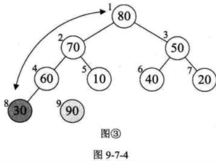

| Title                | Date             | Modified         | Category          |
|:--------------------:|:----------------:|:----------------:|:-----------------:|
| heap sort            | 2019-07-09 12:00 | 2019-07-09 12:00 | algorithm         |


# heap sort



## 堆

堆是具有下列性质的完全二叉树：
- 每个结点的值都大于或等于其左右孩子结点的值，称为大顶堆（例如图9-7-2左图所示）；
- 或者每个节点的值都小于或等于其左右孩子节点的值，称为小顶堆（例如图9-7-2右图所示）。


如果将图9-7-2的大顶堆和小顶堆用层序遍历存入数组，则一定满足上面的关系表达，如图9-7-3所示。




我们现在讲这个堆结构，其目的就是为了堆排序用的。


## 堆排序算法

堆排序（Heap Sort）就是利用堆（假设利用大顶堆）进行排序的方法。

它的基本思想是，

将待排序的序列构造成一个大顶堆。此时，整个序列的最大值就是堆顶的根节点。将它移走（其实就是将其与堆数组的末尾元素交换，此时末尾元素就是最大值），然后将剩余的n-1个序列重新构造成一个堆，这样就会得到n个元素中的次小值。如此反复执行，便能得到一个有序序列了。






相信大家有些明白堆排序的基本思想了，不过要实现它还需要解决两个问题：
1. 如何由一个无序序列构建成一个堆？
2. 如何在输出堆顶元素后，调整剩余元素成为一个新的堆？


要解释清楚它们，让我们来看代码。


```c
/* 对顺序表L进行堆排序 */
void HeapSort(SqList *L)
{
    int i;
    for (i = L->length / 2; i > 0; i--) /* 把L中的r构建成一个大顶堆 */
    {
        HeapAdjust(L, i, L->length);
    }
    
    for (i = L->length; i > 1; i--)
    {
        swap(L, 1, i); /* 将堆顶记录和当前未经排序子序列的最后一个记录交换 */
        HeapAdjust(L, 1, i-1); /* 将L->r[1...i-1]重新调整为大顶堆 */
    }
    
}

```
从代码中也可以看出，整个排序过程分为两个for循环。
第一个循环要完成的就是将现在的待排序序列构建成一个大顶堆。
第二个循环要完成的就是逐步将每个最大值的根节点与末尾元素交换，并且再调整其成为大顶堆。


既然已经弄清楚i的变化是在调整哪些元素了，现在我们来看关键的HeapAdjust（堆调整）函数是如何实现的。


```c
/* 已知L->r[s..m]中记录的关键字除L->r[s]之外均满足堆的定义 */

/* 本函数调整L->r[s]的关键字，使L->r[s..m]成为一个大顶堆 */
void HeapAdjust(SqList *L, int s, int m)
{
    int twmp, j;
    temp = L->r[s];
    for (j = 2 * s; j <= m; j*= 2) /* 沿关键字较大的孩子节点向下筛选 */
    {
        if (j < m && L->r[j] < L->r[j+1])
        {
            ++j; /* j为关键字中较大的记录的下标 */
        }
        if (temp >= L->r[j])
        {
            break; /* rc应插入在位置s上 */
        }
        L->r[s] = L->r[j];
        s = j;
    }
    
    L->r[s] = temp; /* 插入 */
    
}
```


## 堆排序复杂度分析


整个构建堆的时间复杂度为O(n)。

在正式排序时，第i次取堆顶记录重建堆需要用O(logi)的时间（完全二叉树的某个节点到根节点的距离为[log2i] + 1）, 并且需要取n-1次堆顶记录，因此，重建堆的时间复杂度为O(nlogn)。

所以总体来说，堆排序的时间复杂度为O(nlogn)。由于堆排序对原始记录的排序状态并不敏感，因此它无论是最好，最坏和平均时间复杂度均为O(nlogn)。这在性能上要远远好于冒泡，简单选择，直接插入的O(n^2)的时间复杂度了。

空间复杂度上，它只有一个用来交换的暂存单元，也非常不错。不过由于记录的比较与交换是跳跃式进行，因此堆排序也是一种不稳定的排序方法。

另外，由于初始构建堆所需的比较次数较多，因此，它并不适合待排序序列个数较少的情况。


# 参考资料
## books
- 《大话数据结构》