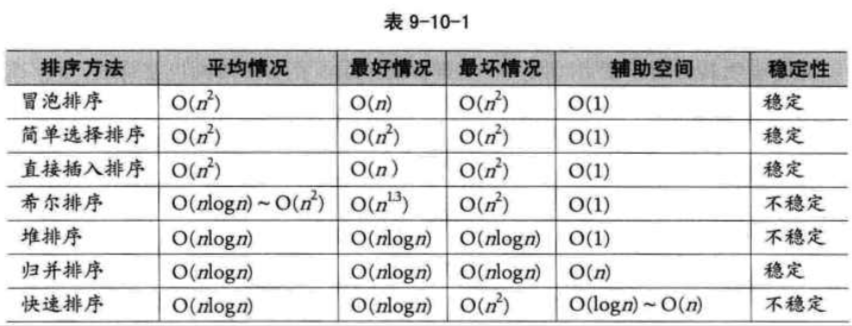
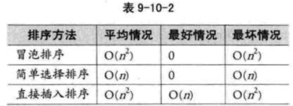

| Title                | Date             | Modified         | Category          |
|:--------------------:|:----------------:|:----------------:|:-----------------:|
| sort            | 2019-07-09 12:00 | 2019-07-09 12:00 | algorithm         |


# sort


我们在排序问题中，通常将数据元素称为记录。显然我们输入的是一个记录集合，输出的也是一个记录集合，所以说，可以将排序看成是线性表的一种操作。

排序的依据是关键字之间的大小关系，那么，对同一个记录集合，针对不同的关键字进行排序，可以得到不同序列。


## 排序的稳定性

也正是由于排序不仅是针对主关键字，那么对于次关键字，因为待排序的记录序列中可能存在两个或两个以上的关键字相等的记录，排序结果可能会存在不唯一的情况，我们给出了稳定与不稳定排序的定义。

假设ki=kj（1<=i<=n, 1<=j<=n, i!=j），且在排序前的序列中ri领先于rj（即i<j）。
如果排序后ri仍领先于rj，则称所用的排序方法是稳定的；
反之，若可能使得排序后的序列中rj领先ri，则称所用的排序方法是不稳定的。


## 内排序与外排序

根据在排序过程中待排序的记录是否全部被放置在内存中，排序分为：内排序和外排序。
- 内排序是在排序整个过程中，待排序的所有记录全部被放置在内存中。
- 外排序是由于排序的记录个数太多，不能同时放置在内存，整个排序过程需要在内外存之间多次交换数据才能进行。


对于内排序来说，排序算法的性能主要是受3个方面影响：
1. 时间性能
2. 辅助空间
3. 算法复杂性


根据排序过程中借助的主要操作，我们把内排序分为：
- 插入排序，
- 交换排序，
- 选择排序，
- 归并排序。


本章一共要讲解七种排序的算法，按照算法的复杂度分为两大类，

- 冒泡排序，简单选择排序，直接插入排序属于简单算法。
- 希尔排序，堆排序，归并排序，快速排序属于改进算法。


## 排序用到的结构与函数

为了讲清楚排序算法的代码，我先提供一个用于排序用的顺序表结构，此结构也将用于之后我们要讲的所有排序算法。


```c
#define MAXSIZE 10 /* 用于要排序数组个数最大值，可根据需要修改 */
typedef struct
{
    int r[MAXSIZE+1]; /* 用于存储要排序数组，r[0]用作哨兵或临时变量 */
    int length; /* 用于记录顺序表的长度 */
}SqList;

```


另外，由于排序最最常用到的操作是数组两元素的交换，我们将它写成函数，在之后的讲解中会大量的用到。

```c
/* 交换L中数组r的下标为i和j的值 */

void swap(SqList *L, int i, int j)
{
    int temp = L->r[i];
    L->r[i] = L->r[j];
    L->r[j] = temp;
}

```


## 总结回顾


首先，我们讲了排序的定义，并提到了排序的稳定性，

排序稳定对于某些特殊需求来说是至关重要的，因此在排序算法中，我们需要关注此算法的稳定性如何。

我们根据将排序记录是否全部被放置在内存中，将排序分为 内排序 与 外排序 两种。

外排序需要在内外存之间多次交换数据才能进行。

我们本章主要讲的是内排序的算法。

根据排序过程中借助的主要操作，我们将内排序分为：
- 插入排序
- 交换排序
- 选择排序
- 归并排序。

之后介绍的7种排序法，就分别是各种分类的代表算法，


事实上，目前还没有十全十美的排序算法，有优点就会有缺点，即使是快速排序法，也只是在整体性能上优越，它也存在排序不稳定，需要大量辅助空间，对少量数据排序无优势等不足。

因此我们就来从多个角度来剖析一下提到的各种排序的长与短。


我们将7种算法的各种指标进行对比。



- 从算法的简单性来看，我们将7种算法分为两类：
    - 简单算法：冒泡，简单选择，直接插入
    - 改进算法：希尔，堆，归并，快速
- 从平均情况来看，显然最后3种改进算法要胜过希尔排序，并远远胜过前3种简单算法。
- 从最好情况看，反而冒泡和直接插入排序要更胜一筹，也就是说，如果你的待排序序列总是基本有序，反而不应该考虑4种复杂的改进算法。
- 从最坏情况看，堆排序与归并排序又强过快速排序以及其他简单排序。
- 从空间复杂度来说，归并排序，快速排序，对空间有要求，反而堆排序等对空间要求是O(1)。
- 从稳定性来看，归并排序最好，对于非常在乎排序稳定性的应用中，归并排序是个好算法。
- 从待排序记录的个数上来说，待排序的个数n越小，采用简单排序方法越合适。反之，n越大，采用改进排序方法越合适。


- 3种简单排序算法的移动次数比较，此时简单选择排序就变得非常有优势，原因在于，它通过大量比较后选择明确记录进行移动，有的放矢。因此对于数据量不是很大而记录的关键字信息量较大的排序要求，简单排序算法是占优的。



总之，从综合各项指标来说，经过优化的快速排序是性能最好的排序算法，但是不同的场合我们也应该考虑使用不同的算法来应对它。


# 参考资料
## books
- 《大话数据结构》