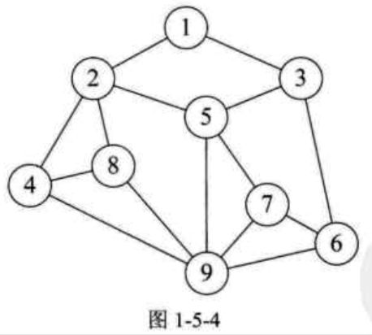
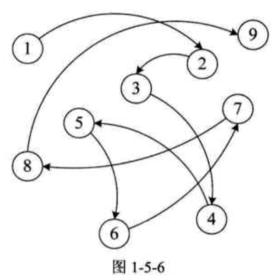
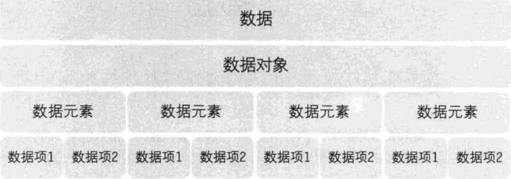

| Title                | Date             | Modified         | Category          |
|:--------------------:|:----------------:|:----------------:|:-----------------:|
| 数据结构            | 2019-07-01 12:00 | 2019-07-01 12:00 | algorithm         |


# 数据结构

> 数据结构：是相互之间存在一种或多种特定关系的数据元素的集合。

## 基本概念

### 数据
数据：是描述客观事物的符号，是计算机中可以操作的对象，是能被计算机识别，并输入给计算机处理的符号集合。
### 数据元素
数据元素：是组成数据的，有一定意义的基本单位，在计算机中通常作为整体处理，也被称为记录。

### 数据项
数据项：一个数据元素可以由若干个数据项组成。

数据项是数据不可分割的最小单位。

### 数据对象

数据对象：是性质相同的数据元素的集合，是数据的子集。

### 数据结构
数据结构：是相互之间存在一种或多种特定关系的数据元素的集合。


## 逻辑结构与物理结构


我们在用示意图表示数据的逻辑结构时，要注意两点：
- 将每一个元素看做一个节点，用圆圈表示。
- 元素之间的逻辑关系用节点之间的连线表示，如果这个关系是有方向的，那么用带箭头的连线表示。


### 逻辑结构：是指数据对象中数据元素之间的相互关系。

逻辑结构是针对具体问题的，是为了解决某个问题，在对问题理解的基础上，选择一个合适的数据结构表示数据元素之间的逻辑关系。


#### 集合结构
集合结构：集合结构中的数据元素除了同属于一个集合外，它们之间没有其他关系。


#### 线性结构
线性结构：线性结构中的数据元素之间是一对一的关系。


#### 树形结构
树形结构：树形结构中的数据元素之间存在一种一对多的层次关系。


#### 图形结构
图形结构：图形结构的数据元素是多对多的关系。



### 物理结构

物理结构：是指数据的逻辑结构在计算机中的存储形式。


逻辑结构是面向问题的，而物理结构就是面向计算机的，其基本的目标就是将数据及其逻辑关系存储到计算机的内存中。


数据元素的存储结构形式有两种：顺序存储和链式存储

#### 顺序存储结构

顺序存储结构：是把数据元素存放在地址连续的存储单元里，其数据间的逻辑关系和物理关系是一致的。


#### 链式存储结构

链式存储结构：是把数据元素存放在任意的存储单元里，这组存储单元可以是连续的，也可以是不连续的。




## 抽象数据类型

### 数据类型

数据类型：是指一组性质相同的值的集合及定义在此集合上的一些操作的总称。


在C语言中，按照取值的不同，数据类型可以分为两类：
- 原子类型：是不可以再分解的基本类型，包括整型，实型，字符型等。
- 结构类型：由若干个类型组合而成，是可以再分解的。例如，整型数组是由若干整型数据组成的。

抽象是指抽取出事物具有的普遍性的本质。


### 抽象数据类型

抽象数据类型（Abstract Data Type，ADT）：是指一个数学模型及定义在该模型上的一组操作。

”抽象“的意义在于数据类型的数学抽象特性。

抽象数据类型体现了程序设计中问题分解，抽象和信息隐藏的特性。

为了便于在之后的讲解中对抽象数据类型进行规范的描述，我们给出了描述抽象数据类型的标准格式：

```
ADT 抽象数据类型名
Data
    数据元素之间逻辑关系的定义
Operation
    操作1
        初始条件
        操作结果描述
    操作2
        ...
    操作n
        ...
endADT
```


## 总结回顾




# 参考资料
## books
- 《大话数据结构》