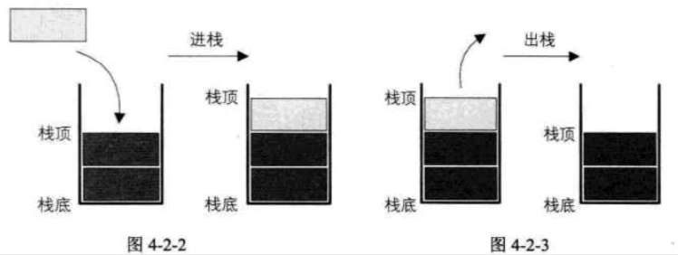
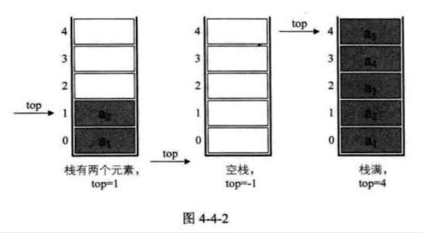

| Title                | Date             | Modified         | Category          |
|:--------------------:|:----------------:|:----------------:|:-----------------:|
| stack            | 2019-07-01 12:00 | 2019-07-05 12:00 | algorithm         |

# stack


栈（stack）是限定仅在表尾进行插入和删除操作的线性表。


我们把允许插入和删除的一端称为栈顶（top），另一端称为栈底（bottom），不含任何数据元素的栈称为空栈。栈又称为后进先出（Last In First Out）的线性表，简称LIFO结构。

栈的插入操作，叫作进栈，也称压栈，入栈。

栈的删除操作，叫作出栈，也有的叫作弹栈。





```
ADT 栈(stack)
Data
    同线性表。元素具有相同的类型，相邻元素具有前驱和后继关系。
Operation
    InitStack(*S): 初始化操作，建立一个空栈S。
    DestroyStack(*s): 若栈存在，则销毁它。
    ClearStack(s): 将栈清空。
    StackEmpty(S): 若栈为空，返回true，否则返回false。
    GetTop(S, *e): 若栈存在且非空，用e返回S的栈顶元素。
    Push(*S, e): 若栈S存在，插入新元素e到栈S中并成为栈顶元素。
    Pop(*S, e): 删除栈S中栈顶元素，并用e返回其值。
    StackLength(S): 返回栈S的元素个数。
endADT
```


由于栈本身就是一个线性表，那么上一章我们讨论了线性表的顺序存储和链式存储，对于栈来说，也是同样适用的。


## 栈的顺序存储结构及实现

```C
typedef int SElemType; /* SElemType 类型根据实际情况而定，这里假设为int */
typedef struct
{
    SElemType data[MAXSIZE];
    int top; /* 用于栈顶指针 */
}SqStack;

```


### 顺序存储结构的 进栈 出栈 操作


### 两栈共享空间

如果我们有两个相同类型的栈，我们为它们各自开辟了数组空间，极有可能是第一个栈已经满了，再进栈就溢出了，而另一个栈还有很多存储空间空闲。


```C
/* 两栈共享空间结构 */
typedef struct
{
    SElemType data[MAXSIZE];
    int top1; /* 栈1栈顶指针 */
    int top2; /* 栈2栈顶指针 */
} SqDoubleStack;

```


## 栈的链式存储结构及实现

栈的链式存储结构，简称为链栈。


```C
typedef struct StackNode
{
    SElemType data;
    struct StackNode * next;
} StackNode, *LinkStackPtr;

typedef struct LinkStack
{
    LinkStackPtr top;
    int count;
}LinkStack;

```

### 栈的链式存储结构 进栈 出栈 操作


## 栈的作用

栈的引入简化了程序设计的问题，划分了不同关注层次，使得思考范围缩小，更加聚焦于我们要解决的问题核心。

反之，像数组等，因为要分散精力去考虑数组的下标增减等细节问题，反而掩盖了问题的本质。


# 总结

- 顺序栈
    - 两栈共享空间
- 链栈


# 参考资料
## books
- 《大话数据结构》