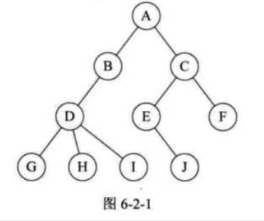
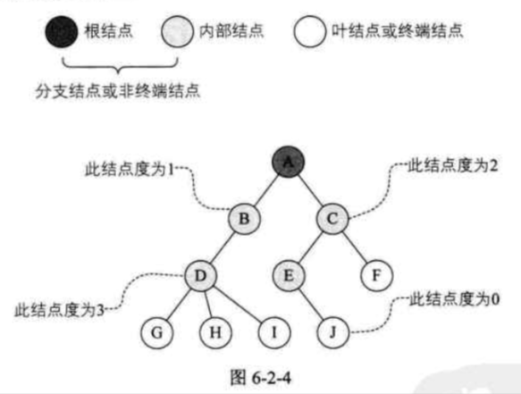
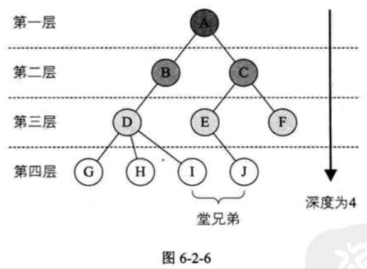
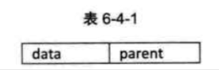
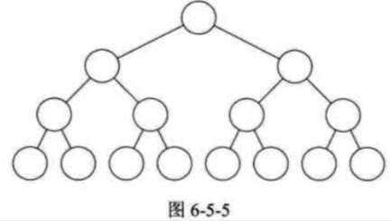
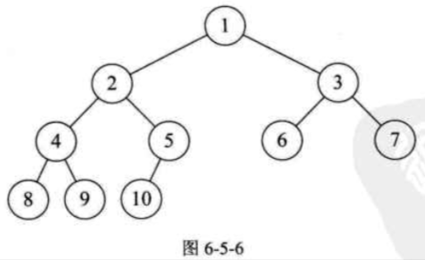

| Title                | Date             | Modified         | Category          |
|:--------------------:|:----------------:|:----------------:|:-----------------:|
| tree            | 2019-07-01 12:00 | 2019-07-08 12:00 | algorithm         |


# tree


## 树的定义

树(Tree)是n(n>=0)个节点的有限集。n=0时称为空树，

在任意一棵非空树中：
- 有且仅有一个特定的称为根（Root）的节点；
- 当n>1时，其余节点可分为m(m>0)个互不相交的有限集T1,T2,…Tn，其中每一个集合本身又是一棵树，并且称为根的子树（SubTree）。




树的定义其实就是我们在讲解栈时提到的递归的方法。也就是在树的定义之中还用到了树的概念，这是一种比较新的定义方法。


### 节点分类

树的节点包含一个数据元素及若干指向其子树的分支。

节点拥有的子树数称为节点的度（Degree）。度为0的节点称为叶节点（Leaf）或终端节点；度不为0的节点称为非终端节点或分支节点。除根节点之外，分支节点也称为内部节点。树的度是树内各节点的度的最大值。





### 节点间关系

节点的子树的根称为该节点的孩子（Child），相应的，该节点称为孩子的双亲（Parent）。

同一个双亲的孩子之间互称兄弟（Sibling）。

节点的祖先是从根到该节点所经分支上的所有节点。

以某节点为根的子树中的任一节点都称为该节点的子孙。


### 树的其他相关概念




如果将树中节点的各子树看成从左至右是有次序的，不能互换的，则称该树为有序树，否则称为无序树。

森林（Forest）是m(m>=0)棵互不相交的树的集合。


## 树的抽象数据类型

```
ADT 树（tree）
Data
    树是由一个根节点和若干棵子树构成。树中节点具有相同数据类型及层次关系。
Operation
    InitTree(*T): 构造空树T。
    DestroyTree(*T): 销毁树T。
    CreateTree(*T, definition): 按definition中给出树的定义来构造树。
    ClearTree(*T): 若树T存在，则将树T清为空树。
    TreeEmpty(T): 若T为空树，返回true，否则返回false。
    TreeDepth(T): 返回T的深度。
    Root(T): 返回T的根节点。
    Value(T, cur_e): cur_e是树T中一个节点，返回此节点的值。
    Assign(T, cur_e, value): 给树T的节点cur_e赋值为value。
    Parent(T, cur_e): 若cur_e是树T的非根节点，则返回它的双亲，否则返回空。
    LeftChild(T, cur_e): 若cur_e是树T的非叶节点，则返回它的右兄弟，否则返回空。
    RightSibling(T, cur_e): 若cur_e有右兄弟，则返回它的右兄弟，否则返回空。
    InsertChild(*T, *p, i, c): 其中p指向树T的某个节点，i为所指节点p的度加上1，非空树c与T不相交，操作结果为插入c为树T中p指节点的第i棵子树。
    DeleteChild(*T, *p, i): 其中p指向树T的某个节点，i为所指节点p的度，操作结果为删除T中p所指节点的第i棵子树。
endADT
```


## 树的存储结构

三种不同的表示方法：
- 双亲表示法
- 孩子表示法
- 孩子兄弟表示法


### 双亲表示法
我们假设以一组连续空间存储树的节点，同时在每个节点中，附设一个指示器指示其双亲节点到链表中的位置。



其中data是数据域，存储节点的数据信息。而parent是指针域，存储该节点的双亲在数组中的下标。


```c
/* 树的双亲表示法节点结构定义 */

#define MAX_TREE_SIZE 100

typedef int TElemType; /* 树节点的数据类型，目前暂定为整型 */

typedef struct PTNode /* 节点结构 */
{
    TElemType data; /* 节点数据 */
    int parent; /* 双亲位置 */
}PTNode;


typedef struct /* 树结构 */
{
    PTNode nodes[MAX_TREE_SIZE]; /* 节点数组 */
    int r, n; /* 根的位置和节点数 */
} PTree;

```


存储结构的设计是一个非常灵活的过程。一个存储结构设计的是否合理，取决于基于该存储结构的运算是否适合，是否方便，时间复杂度好不好等。


### 孩子表示法
每个节点有多个指针域，其中每个指针指向一棵子树的根节点，我们把这种方法叫做多重链表表示法。


### 孩子兄弟表示法
任意一棵树，它的节点的第一个孩子如果存在就是唯一的，它的右兄弟如果存在也是唯一的。因此，我们设置两个指针，分别指向该节点的第一个孩子和此节点的右兄弟。


## 二叉树的定义


二叉树（Binary Tree）是n(n>=0)个节点的有限集合，该集合或者为空集（称为空二叉树），或者由一个根节点和两棵互不相交的，分别称为根节点的左子树和右子树的二叉树组成。


### 二叉树的特点

二叉树的特点有：

- 每个节点最多有两棵子树，所以二叉树中不存在度大于2的节点。注意不是只有两棵子树，而是最多有。没有子树或者有一棵子树都是可以的。
- 左子树和右子树是有顺序的，次序不能任意颠倒。
- 即使树中某节点只有一棵子树，也要区分它是左子树还是右子树。

二叉树具有五种基本形态：

1. 空二叉树
2. 只有一个根结点
3. 根节点只有左子树
4. 根节点只有右子树
5. 根节点既有左子树又有右子树


### 特殊二叉树

#### 斜树
所有的节点都只有左子树的二叉树叫左斜树。所有节点都是只有右子树的二叉树叫右斜树。这两者统称为斜树。

#### 满二叉树

在一棵二叉树中，如果所有分支节点都存在左子树和右子树，并且所有叶子都在同一层上，这样的二叉树称为满二叉树。




满二叉树的特点有：
- 叶子只能出现在最下一层。出现在其他层就不可能达成平衡
- 非叶子节点的度一定是2.否则就是“缺胳膊少腿”了。
- 在同样深度的二叉树中，满二叉树的节点个数最多，叶子数最多。


#### 完全二叉树

对一棵具有n个节点的二叉树按层序编号，如果编号为i（1<=i<=n）的节点与同样深度的满二叉树中编号为i的节点在二叉树中位置完全相同，则这课二叉树称为完全二叉树。



这是一种有些理解难度的特殊二叉树。

首先从字面上要区分，“完全”和“满”的差异，满二叉树一定是一棵完全二叉树，但完全二叉树不一定是满的。

完全二叉树的特点：

- 叶子节点只能出现在最下两层
- 最下层的叶子一定集中在左部连续位置
- 倒数二层，若有叶子节点，一定都在右部连续位置
- 如果节点度为1，则该节点只有左孩子，则不存在只有右子树的情况
- 同样节点数的二叉树，完全二叉树的深度最小。


### 二叉树的性质

- 性质1：在二叉树的第i层上至多有2^(i-1)个节点(i>=1)
- 性质2：深度为k的二叉树至多有2^k-1个节点(k>=1)
- 性质3：对任何一棵二叉树T，如果其终端节点数为n0, 度为2的节点数为n2,则n0=n2+1。
- 性质4：具有n个节点的完全二叉树的深度为[log2n] +1（[x]表示不大于x的最大整数）
- 性质5：如果对一棵有n个节点的完全二叉树（其深度为[logxn]+1）的节点按层序编号（从第1层到第[log2n]+1层，每层从左到右），对任一节点i(1<=i<=n)有：
1）如果i=1, 则节点i是二叉树的根，无双亲；如果i>1，则其双亲是节点[i/2]。
2）如果2i>n，则节点i无左孩子（节点i为叶子节点）；否则其左孩子是节点2i。
3）如果2i+1>n, 则节点i无右孩子；否则其右孩子是节点2i+1。


### 二叉树的存储结构

#### 二叉树顺序存储结构
#### 二叉链表

二叉树每个节点最多有两个孩子，所以为它设计一个数据域和两个指针域是比较自然的想法，我们称这样的链表叫做二叉链表。


```c
/* 二叉树的二叉链表节点结构定义 */

typedef struct BiTNode /* 节点结构 */
{
    TElemType data; /* 节点数据 */
    struct BiTNode *lchild, *rchild; /* 左右孩子指针 */
} BiTNode, *BiTree;
```


### 遍历二叉树

二叉树的遍历（traversing binary tree）是指从根节点触发，按照某种次序依次访问二叉树中所有节点，使得每个节点被访问一次且仅被访问一次。

两个关键词：访问  ，次序。


#### 二叉树遍历方法

1. 前序遍历

规则是若二叉树为空，则空操作返回，否则先访问根节点，然后前序遍历左子树，再前序遍历右子树。

2. 中序遍历

规则是若树为空，则空操作返回，否则从根节点开始（注意并不是县访问根节点），中序遍历根节点的左子树，然后是访问根节点，最后中序遍历右子树。

3. 后序遍历

规则是若树为空，则空操作返回，否则从左到右先叶子后节点的方式遍历访问左右子树，最后是访问根节点。

4. 层序遍历

规则是若树为空，则空操作返回，否则从树的第一层，也就是根节点开始访问，从上而下逐层遍历，在同一层中，按从左到右的顺序对节点逐个访问。


#### 推导遍历结果


已知前序和后序遍历，是不能确定一棵二叉树的。


### 线索二叉树


### 树，森林与二叉树的转换
### 赫夫曼树及其应用


## 总结回顾


# 参考资料

## books
- 《大话数据结构》