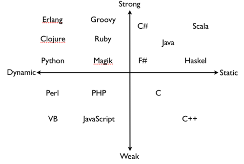
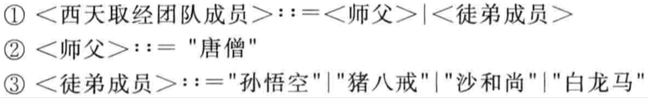
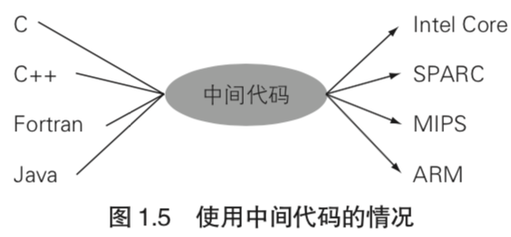
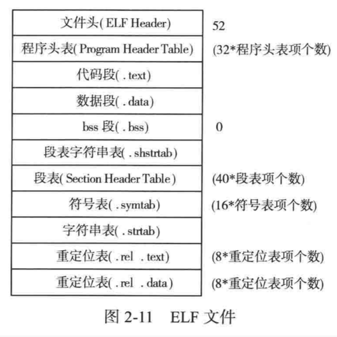

| Title                | Date             | Modified         | Category          |
|:--------------------:|:----------------:|:----------------:|:-----------------:|
| compiler             | 2019-06-06 12:00 | 2019-12-16 12:00 | compiler          |

**禁止转载**

**一些图文 出自参考书籍中的截图，如有侵权，请联系删除**

# 编程语言的分类

## 解释型与编译型之分

编程语言可分为解释型和编译型。

### 解释型

- 源代码转换为某种中间状态，如语法树，语法树直接执行

源代码，词法分析，生成token串，语法分析，生成分析树，语法分析树，或语法树，抽象语法树，执行

**纯粹的解释型，读一句，解释执行一句，执行到有语法错误的时候才会报错**

- 字节码，解释器运行字节码, 也可称为虚拟机
将抽象语法树转换成字节码，字节码可在虚拟机里执行

**也有编译的一个过程**

### 编译型

#### 编译过程

词法分析, 生成token串，语法分析，生成抽象语法树，生成中间代码，生成各个CPU架构的汇编代码，生成各个平台的二进制，

二进制：真实CPU架构下的二进制，或虚拟机下的二进制（操作码或字节码）

#### 链接过程

链接器，链接成可执行文件

## 动态类型与静态类型之分
### 动态
### 静态

## 强类型与弱类型之分
### 强类型
### 弱类型

# 编译器前端与编译器后端

## 编译器前端(Front End)
从源代码到抽象语法树的过程

## 编译器后端(Back End)
从抽象语法树到二进制的过程

# 编程语言的开发方法

- 工具型
- 手工型

## 工具生成

用一些工具，定义一些文法，通过工具输入文法，自动生成编译器代码。

或者 用正则表达式解析源代码

- yacc,lex
- Javacc

## 手工构造

自顶向下的分析，编写代码

# 编程语言的开发过程

首先进行编程语言的设计，然后是词法分析，语法分析，语义分析，生成抽象语法树，生成中间代码，生成操作码，

## 编程语言的设计

编程语言的设计，有两种文法表示

### bnf, ebnf定义文法

- BNF（巴科斯范式，Backus Normal Form）

- EBNF(扩展巴克斯范式，Extend BNF)

示例：

### 地铁图描述文法

### 少许理论知识

消除左递归（LL（1））

LL(1)

LALR(1)

理解 i++ + ++i 怎么执行的

TODO

## 词法分析

将源代码分割成若干个记号（token）的过程。

首先定义token(记号)，用ebnf文法定义词法

每个token有相应的有限自动机

顺序读取源代码文件每个字符，用token的有限自动机来选择生成不同的token

## 语法分析
即从记号构建分析树（parse tree）的过程。分析树也叫作语法树（syntax tree）或抽象语法树（abstract syntax tree，AST）。

用ebnf定义文法，根据文法写不同的解析代码

## 抽象语法树

终结符与非终结符

可直接编写eval方法，执行每个节点

## 语义分析
检查AST中，是否有语义错误，比如不能除0等

## 符号管理
需要将各个级别的变量，保存到环境变量中，并标记好级别，
在eval的时候，如果生成变量，就new Var，并记录到环境变量中，
如果计算用到了变量，就从环境变量中取出Var用于计算

如果推出当前级别的空间，就释放当前级别的空间内的变量,作用域管理

## 生成中间代码
符号表，语义分析，中间代码优化等。

## 生成汇编代码
了解不同CPU架构的汇编语言，或自定义虚拟机的汇编语法

汇编代码优化

## 二进制格式

## 二进制生成，汇编器
了解各个平台的可执行文件结构，格式，编写汇编器，生成二进制

## 可执行文件生成，链接器
链接成可执行文件

## 错误处理
伴随着每个过程，都需要有错误处理，和友好的错误提示

## 优化
中间代码优化，汇编代码优化，等，每一部分都有优化部分

# CPU架构
- intel x86
- ARM
- Power

TODO

# 虚拟机的设计
模拟真实CPU架构

定义栈空间，定义堆空间，定义寄存器，等数据结构

## 字节码文件的解析
读取文件，读取一个个指令，巨大的switch case结构

## 运行时数据区

### 栈(stack)的设计
#### 栈帧

### 堆(heap)的设计

### 局部变量
### 全局变量

## 汇编指令与机器码的设计

## 解释器的设计

## GC垃圾回收

# JIT
java，.NET Framework都具备在运行的同时将字节码转换为机器码的功能，这叫做JIT，Just-In-Time编译技术。

# 编程语言分类漫谈

JVM虚拟机，Java，Groovy，Scala，Clojure，Jython，JRuby等。

CPython

Pypy

go

js

# 编程语言开发示例demo
- [py.calc](https://github.com/mingz2013/py.calc)
- [py.cond](https://github.com/mingz2013/py.cond)
- [py.script](https://github.com/mingz2013/py.script)
- [vm-py](https://github.com/mingz2013/vm-py)
- [lang-py](https://github.com/mingz2013/lang-py)

# 参考资料

## books

- 《Lua设计与实现》
- 《Lua 源码欣赏》
- 《Go 1.5 源码剖析》
- 《Python源码剖析--深度探索动态语言核心技术》

- 《编译器构造（Java语言版）》
- 《自己动手写Java虚拟机》
- 《揭秘Java虚拟机-JVM设计原理与实现》

- 《自制编程语言》
- 《两周自制脚本语言》

- 《自制编译器》
- 《自己动手构造编译系统 编译、汇编与链接》
- 《自己动手写编译器、链接器》

- 《C编译器剖析》
- 《可变目标C编译器：设计与实现》
- 《深入分析GCC》
- 《高级编译器设计与实现》

- 《编译系统透视  图解编译原理》
- 《编译原理》
- 《现代编译原理：c语言描述》

- 《程序是怎样跑起来的》
- 《计算的本质：深入剖析程序和计算机》
