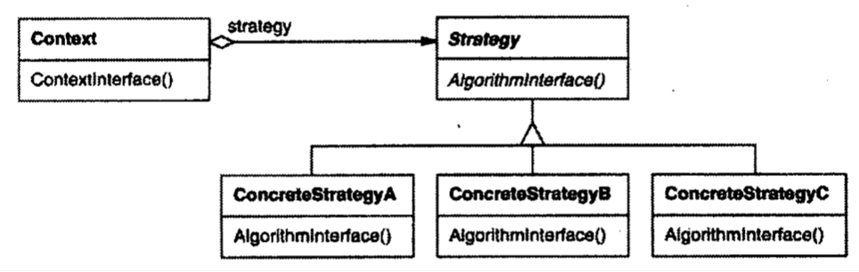

| Title                | Date             | Modified         | Category          |
|:--------------------:|:----------------:|:----------------:|:-----------------:|
| design patterns      | 2019-11-20 12:00 | 2019-11-20 12:00 | design patterns   |

# 策略
## 意图
定义一系列的算法，把它们一个个封装起来，并且使它们可相互替换。本模式使得算法可独立于使用它的客户而变化。

## 别名
政策（Policy）

## 动机

## 适用性
当存在以下情况时使用Strategy模式
- 许多相关的类仅仅是行为有异。”策略“提供了一种用多个行为中的一个行为来配置一个类的方法。
- 需要使用一个算法的不同变体。
- 算法使用客户不应该知道的数据。
- 一个类定义了多种行为，并且这些行为在这个类的操作中以多个条件语句的形式出现。将相关的条件分支移入它们各自的Strategy类中以代替这些条件语句。

## 结构

## 参与者

### Strategy（策略）
定义所有支持的算法的公共接口。Context使用这个接口来调用某ConcreteStrategy定义的算法。

### ConcreteStrategy（具体策略）
以Strategy接口实现某具体算法。

### Context（上下文）
- 用一个ConcreteStrategy对象来配置。
- 维护一个对Strategy对象的引用。
- 可定义一个接口来让Strategy访问它的数据。

## 协作
- Strategy和Context相互作用以实现选定的算法。当算法被调用时，Context可以将该算法所需要的所有数据都传递给该Strategy。或者，Context可以将自身作为一个参数传递给Strategy操作。这就让Strategy在需要时可以回调Context。
- Context将它的客户的请求转发给它的Strategy。客户通常创建并传递一个ConcreteStrategy对象给该Context；这样。客户仅与Context交互。通常有一系列的ConcreteStrategy类可供客户从中选择。

## 效果
Strategy模式有下面的一些优点和缺点：
- 相关算法系列
- 一个替代继承的方法
- 消除了一些条件语句
- 实现的选择
- 客户必须了解不同的Strategy
- Strategy和Context之间的通信开销
- 增加了对象的数目

## 实现
考虑下面的实现问题：
- 定义Strategy和Context接口
- 将Strategy作为模板参数
- 使Strategy对象成为可选的

## 代码示例
## 已知应用
## 相关模式
