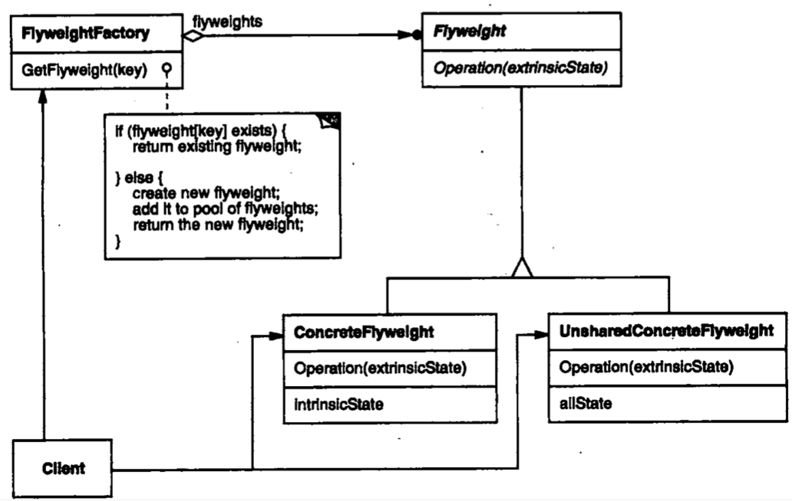
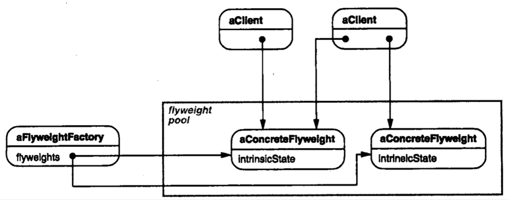

| Title                | Date             | Modified         | Category          |
|:--------------------:|:----------------:|:----------------:|:-----------------:|
| design patterns      | 2019-11-20 12:00 | 2019-11-20 12:00 | design patterns   |

# 享元

## 意图
运用共享技术有效地支持大量细粒度的对象。

## 动机
- 有些应用程序得益于在其整个设计过程中采用对象技术，但简单化的实现代价极大。
- Flyweight模式描述了如何共享对象，使得可以细粒度地使用它们而无需高昂的代价。

## 适用性
Flyweight模式的有效性很大程度上取决于如何使用它以及在何处使用它。当以下情况都成立时使用Flyweight模式：
- 一个应用程序使用了大量的对象。
- 完全由于使用大量的对象，造成很大的存储开销。
- 对象的大多数状态都可变为外部状态。
- 如果删除对象的外部状态，那么可以用相对较少的共享对象取代很多组对象。
- 应用程序不依赖于对象标识。由于Flyweight对象可以被共享，对于概念上明显有别的对象，标识测试将返回真值。

## 结构

下面的对象图说明了如何共享flyweight。

## 参与者

### Flyweight
描述一个接口，通过这个接口flyweight可以接受并作用于外部状态。

### ConcreteFlyweight
实现Flyweight接口，并为内部状态（如果有的话）增加存储空间。ConcreteFlyweight对象必须是可共享的。它所存储的状态必须是内部的；即，它必须独立于ConcreteFlyweight对象的场景。

### UnsharedConcreteFlyweight
并非所有的Flyweight子类都需要被共享。Flyweight接口使共享成为可能，但它并不强制共享。在Flyweight对象结构的某些层次，UnsharedConcreteFlyweight对象通常将ConcreteFlyweight对象作为子节点。

### FlyweightFactory
- 创建并管理flyweight对象。
- 确保合理地共享flyweight。当用户请求一个flyweight时，FlyweightFactory对象提供一个已创建的实例或者创建一个（如果不存在的话）。

### Client
- 维持一个对flyweight的引用。
- 计算或存储一个（多个）flyweight的外部状态。

## 协作
- flyweight执行时所需的状态必定是内部的或外部的。内部状态存储于ConcreteFlyweight对象之中；而外部对象则由Client对象存储或计算。当用户调用flyweight对象的操作时，将该状态传递给它。
- 用户不应直接对ConcreteFlyweight类进行实例化，而只能从FlyweightFactory对象得到ConcreteFlyweight对象，这可以保证对它们适当地进行共享。

## 效果
使用Flyweight模式时，传输、查找和/或计算外部状态都会产生运行时的开销，尤其当flyweight原先被存储为内部状态时。然而，空间上的节省抵消了这些开销。共享的flyweight越多，空间节省也就越大。

存储节约由以下几个因素决定：
- 因为共享，实例总数减少的数目
- 对象内部状态的平均数目
- 外部状态是计算的还是存储的

## 实现
在实现Flyweight模式时，注意以下几点：
- 删除外部状态
- 管理共享对象

## 代码示例

## 已知应用

## 相关模式
