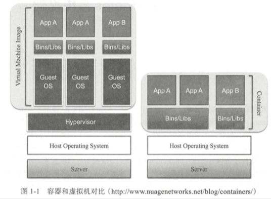
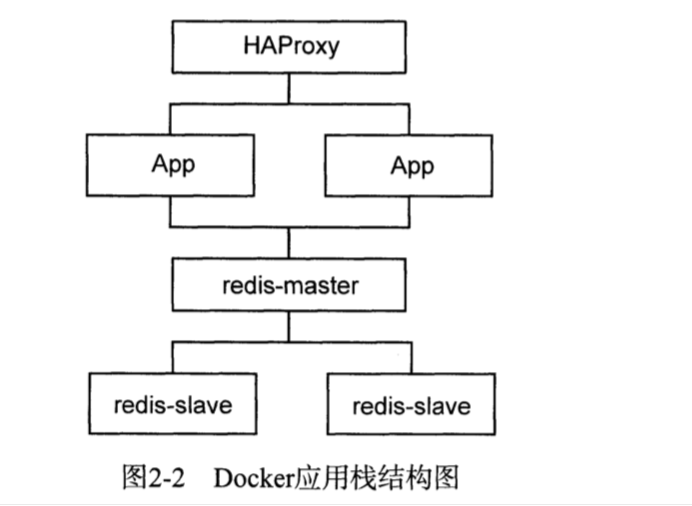
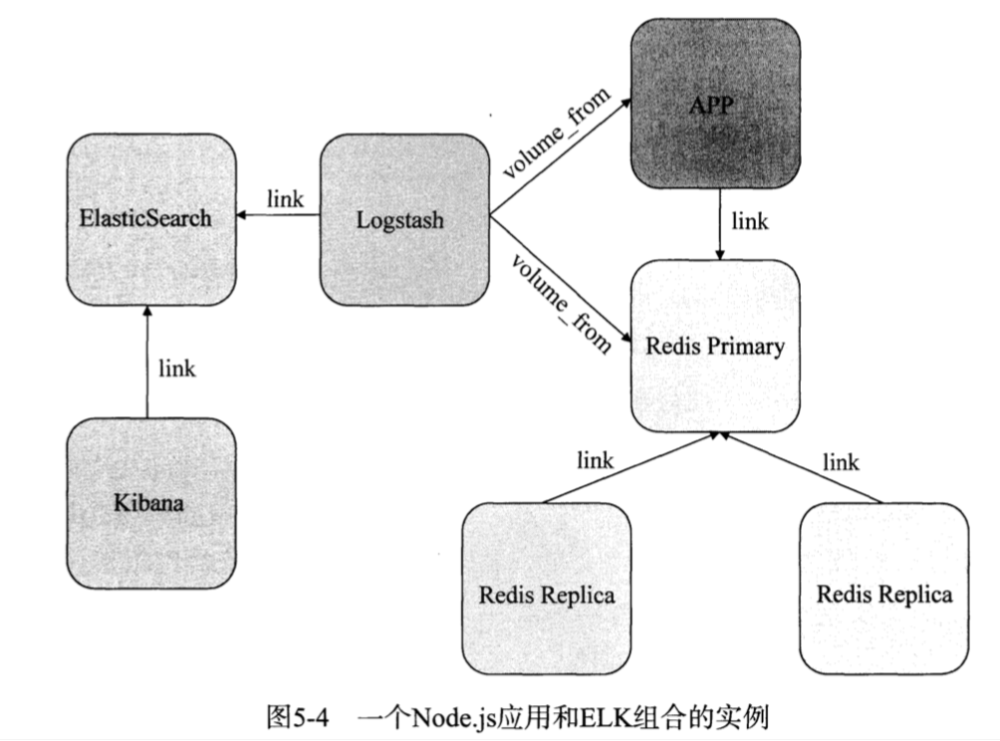

| Title                | Date             | Modified         | Category          |
|:--------------------:|:----------------:|:----------------:|:-----------------:|
| docker              | 2019-05-29 12:00 | 2019-05-29 12:00 | micros            |

# Docker

## 概述

### Container

### Docker

事实上的标准

docker，优势，可以构建一个隔离的，稳定的，安全地，高性能的容器运行环境。

## 使用

`docker help`

## Docker 与微服务

## Docker周边工具

### 运维工具
- Ansible

### 网络支持
- Pipework
- Flannel
- Weave Net
- Calico

### 监控与日志
- cAdvisor 原生集群监控
- Logspout 日志处理
- Grafana  数据可视化
- Heapster
- Prometheus
- EFK
- Filebeat
- ELK (ElasticSearch，Logstash，Kibana)
- Fluentd
- Graylog

- Cat
- Zipkin
- Pinpoint
- InfluxDB

### Docker持续集成

- Drone 轻量级CI工具

- Travis CI 著名的CI/CD服务商

### 私有镜像仓库

- https://github.com/docker/distribution 
- VMWare Harbor
- SUSE Portus

### 公有云
- GKE

### 集群管理面板
- Shipyard
- Portainer  **
- Panamax
- Seagull

## 基于Docker的PaaS平台

- Deis 轻量级PaaS平台
- Tsuru 可扩展PaaS平台, 基于Swarm
- Flynn 模块化PaaS平台
- openshift

### 操作系统
- CoreOS
- RancherOS
- Red hat Atomic
- VMWare Photon

### Serverless
- Kubeless
- Function
- Trigger
- Fission
- OpenFaaS

## 参考资料

### GitHub
- https://github.com/docker

### WebSite
- https://www.docker.com/

### Books
- 《Docker技术入门与实战（第3版）》
