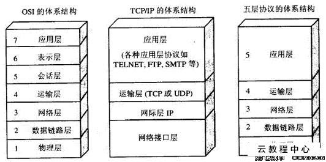

# Istio

## 概述

### Service Mesh
要讨论服务网格（Service Mesh），就必须提到微服务（Microservices）。

为了解决微服务架构产生的一些问题，以k8s为代表的容器云系统出现了。这类容器云系统以容器技术为基础，在进程级别为微服务提供了一致的部署，调度，伸缩，监控，日志等功能。

然而，除了进程本身的问题，微服务之间的通信和联系更加复杂，其中的观测，控制和服务质量等都成为微服务方案的短板，因此随着k8s成为事实标准，Service mesh顺势登场。

自Service Mesh技术诞生以来，国内外出现了很多产品，下面选择其中几个重要的产品和事件，大概理理Service Mesh相关产品的发展情况。

Buoyant公司的CEO William，曾经给出对服务网格的定义：服务网格是一个独立的基础设施层，用来处理服务之间的通信。

现代的云原生应用是由各种复杂技术构建的服务组成的，服务网格负责在这些组成部分之间进行可靠的请求传递。

目前典型的服务网格通常提供了一组轻量级的网络代理，这些代理会在应用无感知的情况下，同应用并行部署，运行。

Service Mesh主要功能：
1. 负载均衡
2. 服务发现
3. 熔断
4. 动态路由
5. 安全通信
6. 多语言支持
7. 多协议支持
8. 指标和分布式追踪
9. 重试和最后期限

总结一下，Service Mesh实现了四大关键功能：
1. 实现对基础设施的抽象化
2. 为应用请求提供可靠传递
3. 每个业务节点部署轻量级代理
4. 透明化，应用程序无感知。

Service Mesh类似于更高级的一层网络栈。

k8s就是微服务级别的操作系统。

Helm是k8s的包管理工具，类似于yum，apt-get。

#### Sidecar

### Istio

事实上的标准

2017年5月，Google，IBM和Lyft宣布了Istio的诞生。Istio以Envoy为数据平面，通过Sidecar的方式让Envoy同业务容器一起运行，并劫持其通信，接受控制平面的统一管理，在此基础上为服务之间的通信提供了丰富的连接，控制，观察，安全等特性。

Istio一经发布，便立刻获得Red Hat，F5等大牌厂商的响应，虽然立足不稳，但各个合作方都展示了对社区，行业的强大影响力。于是，Istio很快就超越了Linkerd，成为Service Mesh的代表产品。

这里将Istio的特性总结如下。
- 连接：对网格内部的服务之间的调用所产生的流量进行智能管理，并以此为基础，为微服务的部署，测试和升级等操作提供有力保障。
- 安全：为网络内部的服务之间的调用提供认证，加密和鉴权支持，在不侵入代码的情况下，加固现有服务，提高其安全性。
- 策略：在控制面定制策略，并在服务中实施
- 观察：对服务之间的调用进行跟踪和测量，获取服务的状态信息。

## todos demo

TODO

## 参考资料

### GitHub
- https://github.com/istio

### WebSite
- https://istio.io/
- https://istio.io/zh/docs/

### Books
- 《深入浅出Istio：Service Mesh快速入门与实践》