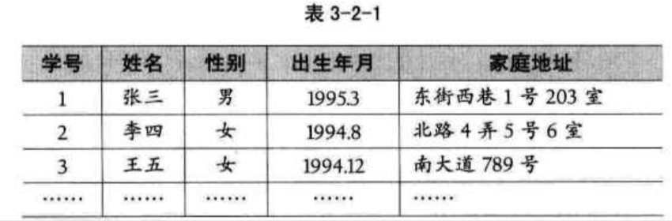
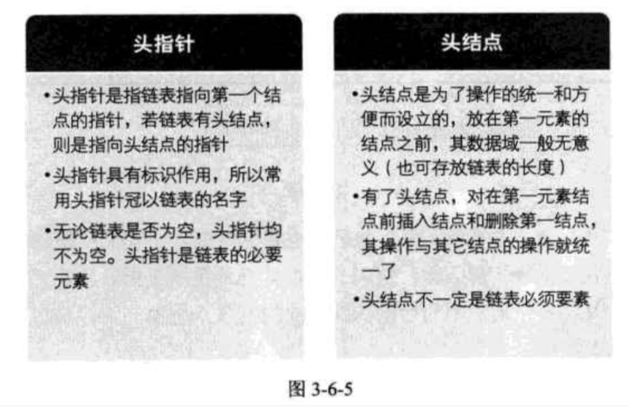

| Title                | Date             | Modified         | Category          |
|:--------------------:|:----------------:|:----------------:|:-----------------:|
| 线性表            | 2019-07-01 12:00 | 2019-07-05 12:00 | algorithm         |


# 线性表

线性表（List）：零个或多个数据元素的有限序列。

若将线性表记为（a1,…,ai-1,ai,ai+1,…,an）,则表中ai-1领先于ai, ai领先于ai+1，称ai-1是ai的直接前驱元素，ai+1是ai的直接后继元素。当i=1,2…,n-1时，ai有且仅有一个直接后继，当i=2,3,…n时，ai有且仅有一个直接前驱。如图3-2-1所示。


线性表元素的个数n（n>=0）定义为线性表的长度，当n=0时，称为空表。


在较复杂的线性表中，一个数据元素可以由若干个数据项组成。



## 线性表的抽象数据类型
```
ADT 线性表(List)
Data
    线性表的数据对象集合为{a1, a2, ..., an}, 每个元素的类型均为DataType。其中，除第一个元素a1外，每一个元素有且只有一个直接前驱元素，除了最后一个元素an外，每一个元素有且只有一个直接后继元素。数据元素之间的关系是一对一的关系。
Operation
    InitList(*L): 初始化操作，建立一个空的线性表L。
    ListEmpty(L): 若线性表为空，返回true，否则返回false。
    ClearList(*L): 将线性表清空。
    GetElem(L, i, *e): 将线性表L中的第i个位置元素值返回给e。
    LocateElem(L, e): 在线性表L中查找与给定值e相等的元素，如果查找成功，返回该元素在表中序号表示成功；否则，返回0表示失败。
    ListInsert(*L, i, e): 在线性表L中的第i个位置插入新元素e。
    ListDelete(*L, i, *e): 删除线性表L中第i个位置元素，并用e返回其值。
    ListLength(L): 返回线性表L的元素个数。
endADT
```

对于不同的应用，线性表的基本操作是不同的，上述操作是最基本的，对于实际问题中涉及的关于线性表的更复杂操作，完全可以用这些基本操作的组合来实现。


## 线性表的顺序存储结构

线性表的顺序存储结构，指的是用一段地址连续的存储单元依次存储线性表中的数据元素。

线性表（a1,a2,…an）的顺序存储示意图如下：


既然线性表的每个数据元素的类型都相同，所以可以用C语言（其他语言也相同）的一维数组来实现顺序存储结构，即把第一个数据元素存到数组下标为0的位置中，接着把线性表相邻的元素存储在数组中相邻的位置。


```C
#define MAXSIZE 20 /* 存储空间初始分配量 */
typedef int ElemType; /* ElemType类型根据实际情况而定，这里假设为int */
typedef struct
{
    ElemType data[MAXSIZE]; /* 数组存储数据元素，最大值为MAXSIZE */
    int length; /* 线性表当前长度 */
} SqList;
```


我们发现描述顺序存储结构需要三个属性：
- 存储空间的起始位置：数组data，它的存储位置就是存储空间的存储位置。
- 线性表的最大存储容量：数组长度MaxSize。
- 线性表的当前长度：length。


### 数据长度与线性表长度区别

数组的长度，线性表的长度，两个概念需要区分一下。
- 数组的长度是存放线性表的存储空间的长度，存储分配后这个量是一般是不变的。
- 线性表的长度是线性表中数据元素的个数，随着线性表插入和删除操作的进行，这个量是变化的。
- 在任意时刻，线性表的长度应该小于等于数组的长度。


### 地址计算方法


用数组存储顺序表意味着要分配固定长度的数组空间，由于线性表中可以进行插入和删除操作，因此分配的数组空间要大于等于当前线性表的长度。

存储器中的每个存储单元都有自己的编号，这个编号称为地址。

假设每个数据元素占用的是C个存储单元，那么线性表中第i+1个数据元素的存储位置和第i个数据元素的存储位置满足下列关系（LOC表示获得存储位置的函数）。


所以对于第i个数据元素ai的存储位置可以由a1推算得出：


从图3-4-4来理解：


通过这个公式，你可以随时算出线性表中任意位置的地址，不管它是第一个还是最后一个，都是相同的时间。那么我们对每个线性表位置的存入或者取出数据，对于计算机来说都是相等的时间，也就是一个常数，因此用我们算法中学到的时间复杂度的概念来说，它的存取时间性能为O(1)。我们通常把具有这一特点的存储结构称为随机存取结构。


### 顺序存储结构的插入与删除

现在我们来分析一下，插入和删除的时间复杂度。

最好情况O(1), 最坏情况O(n)。平均时间复杂度还是O(n)。

这说明，线性表的顺序存储结构，在存，读数据时，不管是哪个位置，时间复杂度都是O(1)，而插入或删除时，时间复杂度都是O(n)。

这说明，它比较适合元素个数不太变化，而更多是存取数据的应用。


### 线性表顺序存储结构的优缺点


## 线性表的链式存储结构


为了表示每个数据元素ai与其直接后继数据元素ai+1之间的逻辑关系，对数据元素ai来说，除了存储其本身的信息之外，还需存储一个指示其直接后继的信息（即直接后继的存储位置）。我们把存储数据元素信息的域称为数据域，把存储直接后继位置的域称为指针域。指针域中存储的信息称作指针或链。这两部分信息组成数据元素ai的存储映像，称为节点（Node）。


n个节点（ai的存储映像）链接成一个链表，即为线性表（a1,a2,…an）的链式存储结构，因为此链表的每个节点中只包含一个指针域，所以叫做单链表。


我们把链表中第一个节点的存储位置叫做头指针。


为了更加方便对链表进行操作，会在单链表的第一个节点前附设一个节点，称为头结点。


### 头指针与头结点的异同




### 线性表链式存储结构代码描述

```c
/* 线性表的单链表存储结构 */
typedef struct Node
{
    ElemType data;
    struct Node * next;
} Node;

typedef struct Node * LinkList; /* 定义LinkList */

```

从这个结构定义中，我们知道，节点由存放数据元素的数据域存放后继结点地址的指针域组成。


### 单链表的读取
最坏情况的时间复杂度是O(n)


### 单链表的插入和删除

从整个算法来说，我们很容易推导出：它们时间复杂度都是O(n).

如果在我们不知道第i个元素的指针位置，单链表数据结构在插入和删除操作上，与线性表的顺序存储结构是没有太大优势的。

但如果，我们希望从第i个位置，插入10个元素，对于顺序存储结构意味着，每一次插入都需要移动n-i个元素，每次都是O(n).而单链表，我们只需要在第一次时，找到第i个位置的指针，此时为O(n)。接下来只是简单地通过赋值移动指针而已，时间复杂度都是O(1)。

显然，对于插入或删除数据越频繁的操作，单链表的效率优势就越是明显。


### 单链表的整表创建和整表删除


## 单链表结构和顺序存储结构优缺点


若线性表需要频繁查找，很少进行插入和删除操作时，宜采用顺序存储结构。

若需要频繁插入和删除时，宜采用单链表结构。


当线性表中的元素个数变化较大或者根本不知道有多大时，最好采用单链表结构，这样可以不需要考虑存储空间的大小问题。

而如果事先知道线性表的大致长度，比如一年12个月，一周就是七天，这种用顺序存储结构效率会高很多。


## 静态链表


用数组描述的链表叫做静态链表，这种描述方法还有起名叫做游标实现法。

```c
/* 线性表的静态链表存储结构 */
#define MAXSIZE 1000 /* 假设链表的最大长度是1000 */
typedef struct
{
    ElemType data;
    int cur; /* 游标(Cursor), 为0时表示无指向 */
} Component, StaticLinkList[MAXSIZE];
```


### 静态链表的插入删除操作


### 静态链表优缺点


## 循环链表

将单链表中终端节点的指针端由空指针改为指向头结点，就使整个单链表形成一个环，这种头尾相接的单链表称为单循环链表，简称循环链表（circular linked list）。


## 双向链表

双向链表（double linked list）是在单链表的每个节点中，再设置一个指向其前驱节点的指针域。

```C
typedef struct DulNode
{
    ElemType data;
    struct DulNode * prior; /* 直接前驱指针 */
    struct DulNode * next; /* 直接后继指针 */
} DulNode, *DuLinkList;


```


# 总结


# 参考资料
## books
- 《大话数据结构》


