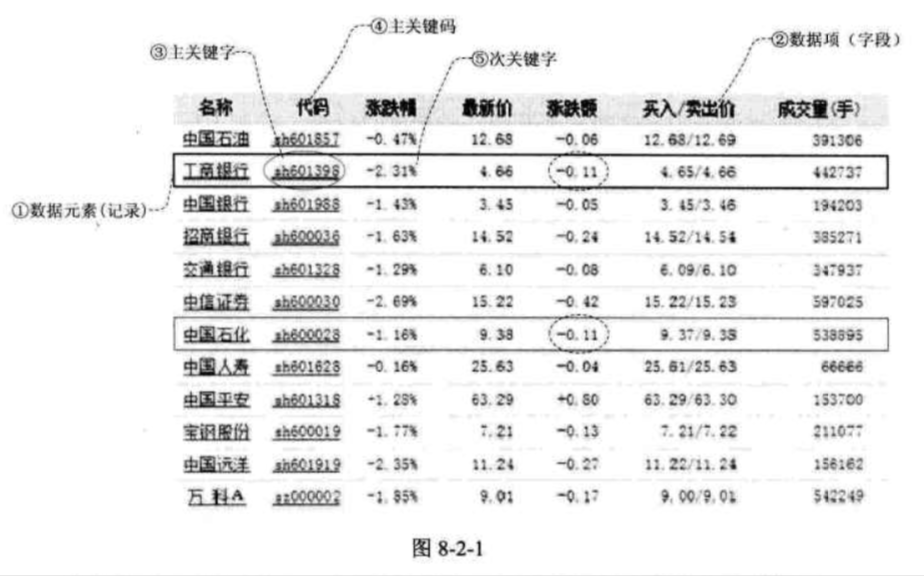
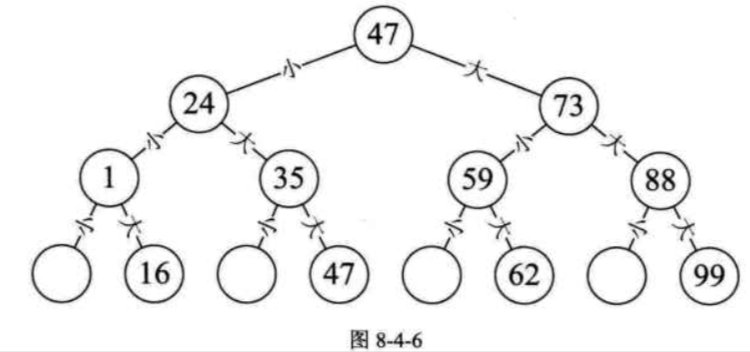
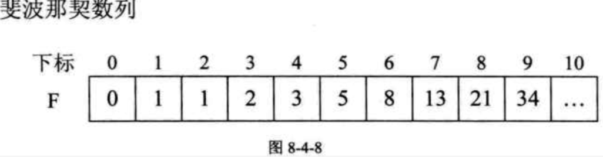
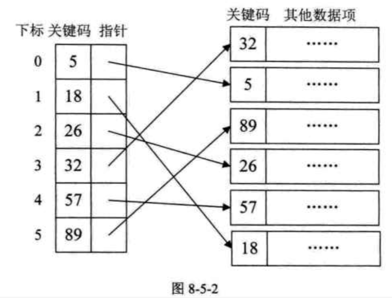
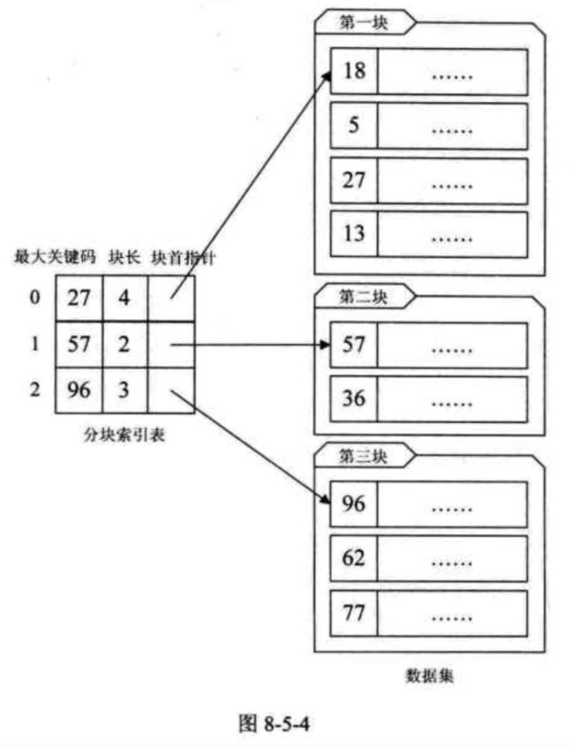
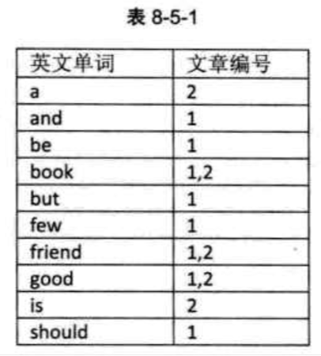
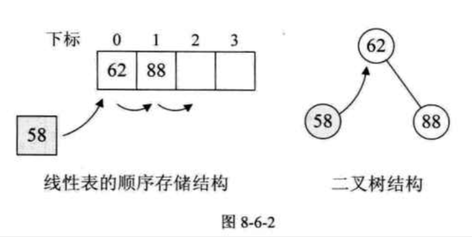
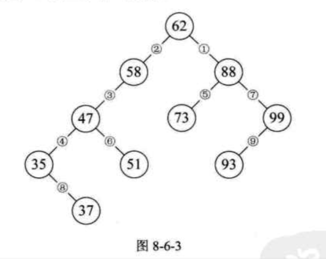
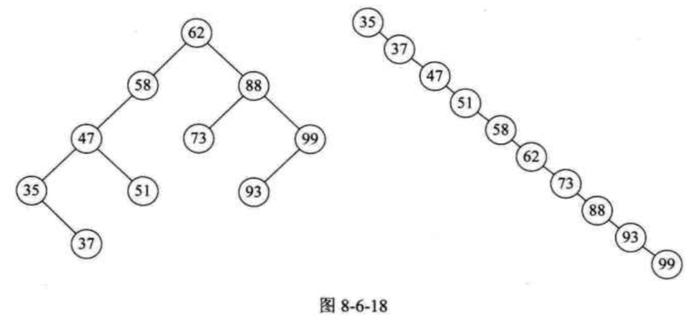

| Title                | Date             | Modified         | Category          |
|:--------------------:|:----------------:|:----------------:|:-----------------:|
| searching            | 2019-07-01 12:00 | 2019-07-01 12:00 | algorithm         |

# searching

查找（Searching）就是根据给定的某个值，在查找表中确定一个其关键字等于给定值的数据元素（或记录）。

## 查找概论

查找表（Search Table）是由同一类型的数据元素（或记录）构成的集合。

关键字（Key）是数据元素中某个数据项的值，又称为键值，用它可以标识一个数据元素。

若此关键字可以唯一的标识一个记录，则称此关键字为主关键字（Primary Key）。

对于那些可以识别多个数据元素（或记录）的关键字，我们称为次关键字（Secondary Key）。

查找（Searching）就是根据给定的某个值，在查找表中确定一个其关键字等于给定值的数据元素（或记录）。

查找表按照操作方式来分有两大种：静态查找表和动态查找表。

静态查找表（Static Search Table）：只作查找操作的查找表。它的主要操作有：
1. 查询某个“特定的”数据元素是否在查找表中
2. 检索某个“特定的”数据元素和各种属性。

动态查找表（Dynamic Search Table）：在查找过程中同时插入查找表中不存在的数据元素，或者从查找表中删除已经存在的某个数据元素。显然动态查找表的操作就是两个：
1. 查找时插入数据元素
2. 查找时删除数据元素

为了提高查找的效率，我们需要专门为查找操作设置数据结构，这种面向查找操作的数据结构称为查找结构。

## 顺序表查找

顺序查找（Sequential Search）又叫线性查找，是最基本的查找技术，它的查找过程是：从表中第一个（或最后一个）记录开始，逐个进行记录的关键字和给定值比较，若某个记录的关键字和给定值相等，则查找成功，找到所查的记录；如果直到最后一个（或第一个）记录，其关键字和给定值比较都不等时，则表中没有所查的记录，查找不成功。

对于这种顺序查找算法来说，
查找成功最好的情况就是第一个位置就找到了，算法时间复杂度为O(1),
最坏的情况是在最后一位置才找到，需要n次比较，时间复杂度为O(n)，
当查找不成功时，需要n+1次比较，时间复杂度为O(n)。
我们之前推导过，关键字在任何一位置的概率是相同的，所以平均查找次数为(n+1)/2, 所以最终时间复杂度还是O(n)。

## 有序表查找

### 折半查找

折半查找（Binary Search）技术，又称为二分查找。
它的前提是线性表中的记录必须是关键码有序（通常从小到大有序），线性表必须采用顺序存储。
折半查找的基本思想是：在有序表中，取中间记录作为比较对象，若给定值与中间记录的关键字相等，则查找成功；若给定值小于中间记录的关键字，则在中间记录的左半区继续查找；若给定值大于中间记录的关键字，则在中间记录的右半区继续查找。不断重复上述过程，直到查找成功，或所有查找区域无记录，查找失败为止。

最坏情况是查找到关键字或查找失败的次数为[log2n]+1.

最好情况1次。

因此最终我们折半算法的时间复杂度为O(logn), 它显然远远好于顺序查找的O(n)时间复杂度了。

折半查找的前提条件是需要有序表顺序存储，对于静态查找表，一次排序后不再变化，这样的算法已经比较好了。但对于需要频繁执行插入或删除操作的数据集来说，维护有序的排序会带来不小的工作量，那就不建议使用。

### 插值查找

插值查找（Interpolation Search）是根据要查找的关键字key与查找表中最大最小记录的关键字比较后的查找方法，其核心就在于插值的计算公式
(key - a[low]) / (a[high] - a[low])

### 斐波那契查找

## 线性索引查找

数据结构的最终目的是提高数据的处理速度，索引是为了加快查找速度而设计的一种数据结构。

索引就是把一个关键字与它对应的记录相关联的过程，一个索引由若干个索引项构成，每个索引项至少应包含关键字和其对应的记录在存储器中的位置等信息。

索引技术是组织大型数据库以及磁盘文件的一种重要技术。

索引按照结构可以分为线性索引，树形索引和多级索引。

我们这里就只介绍线性索引技术。

所谓线性索引就是将索引项集合组织为线性结构，也称为索引表。

我们重点介绍三种线性索引：稠密索引，分块索引和倒排索引。

### 稠密索引

稠密索引是指在线性索引中，将数据集中的每个记录对应一个索引项，如图8-5-2所示。

对于稠密索引这个索引表来说，索引项一定是按照关键码有序的排列。

索引项有序也就意味着，我们要查找关键字时，可以用到折半，插值，斐波那契等有序查找算法，大大提高了效率。

这显然是稠密索引优点，但是如果数据集非常大，比如上亿，那也就意味着索引也得同样的数据集长度规模，对于内存有限的计算机来说，可能就需要反复去访问磁盘，查找性能反而大大下降了。

### 分块索引

稠密索引因为索引项与数据集的记录个数相同，所以空间代价很大。为了减少索引项个数，我们可以对数据集进行分块，使其分块有序，然后再对每一块建立一个索引项，从而减少索引项的个数。

分块有序，是把数据集的记录分成了若干块，并且这些块需要满足两个条件：

- 块内无序，即每一块内的记录不要求有序。
- 块间有序，例如第二块所有记录的关键字均要大于第一块中所有记录的关键字。

对于分块有序的数据集，将每块对应一个索引项，这种索引方法叫做分块索引。

如图8-5-4所示，我们定义的分块索引的索引项结构分三个数据项：
- 最大关键码，
- 存储了块中的记录个数，以便于循环时使用
- 用于指向块首数据元素的指针。

在分块索引表中查找，就是分两步进行：
1. 在分块索引表中查找关键字所在的块。由于分块索引表是块间有序的，因此很容易利用折半，插值等算法得到结果。
2. 根据块首指针找到相应的块，并在块中顺序查找关键码。因为块中可以是无序的，因此只能顺序查找。

分析一下分块索引的平均查找长度。

可见，分块索引的效率比之顺序查找的O(n)是高了不少，不过显然它与折半查找的O(logn)相比还有不少的差距。因此在确定所在块的过程中，由于块间有序，所以可以应用折半，插值等手段来提高效率。

总的来说，分块索引在兼顾了对细分快不需要有序的情况下，大大增加了整体查找的速度，所以普遍被用于数据库表查找等技术的应用当中。

### 倒排索引

在这里这张单词表就是索引表，索引项的通用结构是：
- 次关键码，
- 记录号表

其中记录号表存储具有相同次关键字的所有记录的记录号（可以是指向记录的指针或是该记录的主关键字）。这样的索引方法就是倒排索引（inverted index）。

## 二叉排序树

有没有一种既可以使得插入和删除效率不错，又可以比较高效率的实现查找的算法呢？

也就是说，若我们现在需要对集合{62,88,58,47,35,73,51,99,37,93}做查找，在我们打算创建此集合时就考虑用二叉树结构，而且是排好序的二叉树来创建。

这样我们就得到了一棵二叉树，并且当我们对它进行中序遍历时，就可以得到一个有序的序列{35,37,47,51,58,62,73,88,93,99}, 所以我们通常称它为二叉排序树。

二叉排序树（Binary Sort Tree），又称为二叉查找树。它或者是一棵空树，或者是具有下列性质的二叉树：
- 若它的左子树不空，则左子树上所有节点的值均小于它的根结构的值
- 若它的右子树不空，则右子树上所有节点的值均大于它的根节点的值
- 它的左，右子树也分别为二叉排序树

### 二叉排序树查找操作
### 二叉排序树插入操作
### 二叉排序树删除操作
### 二叉排序树总结

总之，二叉排序树是以链接的方式存储，保持了链接存储结构在执行插入或删除操作时不用移动元素的优点，只要找到合适的插入和删除位置后，仅需修改链接指针即可。插入删除的时间性能比较好。

而对于二叉排序树的查找，走的就是从根节点到要查找的节点的路径，其比较次数等于给定值的节点在二叉排序树中的层数。

极端情况，最少为1次，即根节点就是要找的节点，最多也不会超过树的深度。

也就是说，二叉排序树的查找性能取决于二叉排序树的形状。

可问题就在于，二叉排序树的形状是不确定的。

也就是说，我们希望二叉排序树是比较平衡的，即其深度与完全二叉树相同，均为[log2n]+1,那么查找的时间复杂度也就为O(logn)，近似于折半查找，事实上，图8-6-18的左图也不够平衡，明显的左重右轻。

不平衡的最坏情况就是像图8-6-18右图的斜树，查找时间复杂度为O(n), 这等同于顺序查找。

因此，如果我们希望对一个集合按二叉排序树查找，最好是把它构建成一颗平衡的二叉排序树。

这样我们就引申出另一个问题，如何让二叉排序树平衡的问题。

## 平衡二叉树（AVL树）

## 多路查找树（B树）

## 散列表查找（哈希表）概述

# 参考资料
## books
- 《大话数据结构》