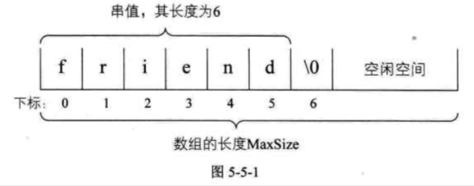
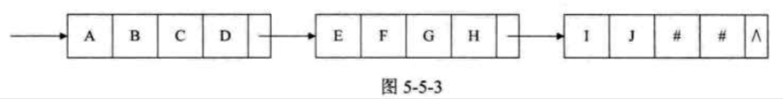

| Title                | Date             | Modified         | Category          |
|:--------------------:|:----------------:|:----------------:|:-----------------:|
| string            | 2019-07-01 12:00 | 2019-07-08 12:00 | algorithm         |

# string

串（string）是由零个或多个字符组成的有限序列，又名叫字符串。


## 串的比较


事实上，串的比较是通过组成串的字符之间的编码来进行的，而字符的编码指的是字符在对应字符集中的符号。

计算机中的常用字符是使用标准的ASCii编码，更准确一点，由7位二进制数表示一个字符，总共可以表示128个字符。

后来发现一些特殊符号的出现，128个不够用，于是扩展ASCii码由8位二进制数表示一个字符，总共可以表示256个字符，这已经足够满足以英文为主的语言和特殊符号进行输入，存储，输出等操作的字符需要了。

可是，全世界估计要有成百上千种语言与文字，显然这256个字符是不够的，因此后来就有了Unicode编码，比较常用的是由16位的二进制数表示一个字符，这样总共就可以表示216个字符，约是65万多个字符，足够表示世界上所有语言的所有字符了。当然，为了和ASCii码兼容，Unicode的前256个字符与ASCii码完全相同。

所以如果我们要在C语言中比较两个串是否相等，必须是它们串的长度以及它们各个对应位置的字符都相等时，才算是相等。即给定两个串：s=“a1,a2,a3…an”,t=“b1,b2…bm”, 当且仅当n=m,且a1=b1,a2=b2,…an=bm时，我们认为s=t。


那么对于两个串不相等时，如何判定它们的大小呢。我们这样定义：

给定两个串：s=“a1,a2…an”, t=“b1,b2…bm”, 当满足以下条件之一时，s<t.
- n<m, 且ai=bi(i=1, 2, …n)
- 存在某个k<=min(m, n), 使得ai=bi(i=1, 2, …k-1), ak < bk.


## 串的抽象数据类型

```
ADT 串（string）
Data
    串中元素仅由一个字符组成，相邻元素具有前驱和后继关系。
Operation
    StrAssign(T, *chars): 生成一个其值等于字符串常量chars的串T。
    StrCopy(T, S): 串S存在，由串S复制得串T。
    ClearString(S): 串S存在，将串清空。
    StringEmpty(S): 若串S为空，返回true，否则返回false。
    StrLength(S): 返回串S的元素个数，即串的长度。
    StrCompare(S, T): 若S>T, 返回值>0, 若S=T, 返回0，若S<T，返回值<0。
    Concat(T, S1, S2): 用T返回由S1和S2联接而成的新串。
    SubString(Sub, S, pos, len): 串S存在，1<=pos<=StrLength(S), 且0<=len<=StrLength(S)-pos+1, 用Sub返回串S的第pos个字符起长度为len的子串。
    Index(S, T, pos): 串S和T存在，T是非空串，1<=pos<=StrLength(S). 若主串S中存在和串T值相同的子串，则返回它在主串S中第pos个字符之后第一次出现的位置，否则返回0.
    Replace(S, T, V): 串S，T和V存在，T是非空串。用V替换主串S中出现的所有与T相等的不重叠的子串。
    StrInsert(S, pos, T): 串S和T存在，1<=pos<=StrLength(S) + 1. 在串S的第pos个字符之前插入串T。
    StrDelete(S, pos, len): 串S存在，1<=pos<=StrLength(S)-len+1。从串S中删除第pos个字符起长度为len的子串。
endADT
```


## 串的存储结构

### 串的顺序存储结构
串的顺序存储结构是用一组地址连续的存储单元来存储串中的字符序列的。按照预定义的大小，为每个定义的串变量分配一个固定长度的存储区。一般是用定长数组来定义。



### 串的链式存储结构
对于串的链式存储结构，与线性表是相似的，但由于串结构的特殊性，结构中的每个元素数据是一个字符，如果也简单的应用链表存储串值，一个节点对应一个字符，就会存在很大的空间浪费。因此，一个节点可以存放一个字符，也可以考虑存放多个字符，最后一个节点若是未被沾满时，可以用”#”或其他非串值字符补全。




当然，这里一个节点存多少个字符才合适就变得很重要，这会直接影响着串处理的效率，需要根据实际情况作出选择。

但串的链式存储结构除了在连接串与传操作时有一定方便之外，总的来说不如顺序存储灵活，性能也不如顺序存储结构好。


## 朴素的模式匹配算法

子串的定位操作通常称作串的模式匹配。应该算是串中最重要的操作之一。

简单地说，就是对主串的每一个字符作为子串开头，与要匹配的字符串进行匹配。对主串做大循环，每个字符开头做T的长度的小循环，直到匹配成功或全部遍历完成为止。

最好的情况O(1), 最坏的情况，O（[n-m+1]*m）

太低效。


## KMP模式匹配算法
模式匹配算法，可以大大避免重复遍历的情况，我们把它称之为克努特-莫里斯-普拉特算法，简称KMP算法。


## 总结回顾

这一章节我们重点讲了“串”这样的数据结构，串（string）是由零个或多个字符组成的有限序列，又名叫字符串。

本质上，它是一种线性表的扩展，但相对于线性表关注一个个元素来说，我们对串这种结构更多的是关注它子串的应用问题，如查找，替换等操作。

现在的高级语言都有针对串的函数可以调用。我们在使用这些函数的时候，同时也应该要理解它当中的原理，以便于在碰到复杂的问题时，可以更加灵活的使用，比如KMP模式匹配算法的学习，就是更有效地去理解index函数当中的实现细节。


# 参考资料
## books
- 《大话数据结构》