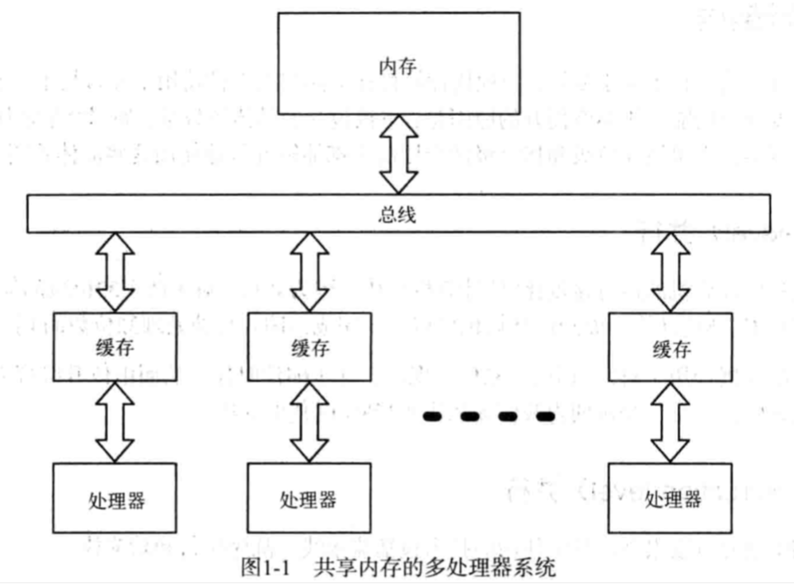
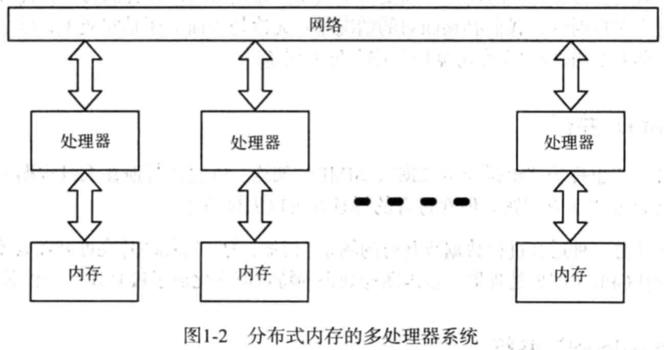

| Title                | Date             | Modified         | Category          |
|:--------------------:|:----------------:|:----------------:|:-----------------:|
| concurrent              | 2019-07-13 12:00 | 2019-07-13 12:00 | concurrent            |

# concurrent

## 引论
并发编程的概念并不新，却直到最近才火起来。

并发编程复兴的主要驱动力来自于所谓的“多核危机”。正如摩尔定律所语言的那样，芯片性能仍在不断提高，CPU的速度会继续提升，但计算机的发展方向已然转向多核化。

为了让代码运行的更快，单纯依靠更快的硬件已无法满足要求，我们需要利用多核，也就是发掘并行执行的潜力。

## 概念

- 并发 是 同一时间应对（dealing with）多件事情的能力
- 并行 是 同一时间动手做（doing）多件事情的能力

并发和并行的共同点就是它们比传统的串行编程模型更优秀。

## 并行架构

人们通常认为并行等同于多核，但现代计算机在不同层次上都使用了并行技术。

### 位级（bit-level）并行
为什么32位计算机的运行速度比8位计算机更快？因为并行。对于两个32位数的加法，8位计算机必须进行多次8位计算，而32位计算机可以一步完成。即并行的处理32位数的4字节。

### 指令级（instruction-level）并行
现代CPU的并行度很高，其中使用的技术包括流水线，乱序执行和猜测执行等。
程序猿通常可以不关心处理器内部并行的细节，因为尽管处理器内部的并行度很高，但是经过精心设计，从外部看上去所有处理都像是串行的。

### 数据级（data）并行

数据级并行（也称为“单指令多数据”， SIMD）架构，可以并行的在大量数据上施加同一操作。这并不适合解决所有问题，但在适合的场景却可以大展身手。
图像处理就是一种适合进行数据级并行的场景。比如，为了增加图片亮度就需要增加每一个像素的亮度。现代GPU（图形处理器）也因图像处理的特点而演化成了极其强大的数据并行处理器。

### 任务级（task-level）并行
终于来到了大家所认为的并行形式——多处理器。从程序猿的角度来看，多处理器架构最明显的分类特征是其内存模型（共享内存模型或分布式内存模型）。

对于共享内存的多处理器系统，每个处理器都能访问整个内存，处理器之间的通信主要通过内存进行。

对于分布式内存的多处理器系统，每个处理器都有自己的内存，处理器之间的通信主要通过网络进行，

通过内存通信比通过网络通信更简单更快速，所以用共享内存编程往往更容易。

然而，当处理器个数逐渐增多，共享内存就会遭遇性能瓶颈----此时不得不转向分布式内存。

如果要开发一个容错系统，就要使用多台计算机以规避硬件故障对系统的影响，此时也必须借助于分布式内存。

## 并发架构

使用并发的目的，不仅仅是为了让程序并行运行从而发挥多核的优势。若正确使用并发，程序还将获得以下优点：及时响应，高效，容错，简单。

### 并发的世界，并发的软件
世界是并发的，为了与其有效地交互，软件也应是并发的。

### 分布式的世界，分布式的软件
有时，我们要解决地理分布型问题。软件在非同步运行的多台计算机上分布式的运行，其本质是并发。
此外，分布式软件还具有容错性。我们可以将服务器一半部署在欧洲，另一半部署在美国，这样如果一个区域停电就不会造成软件整体不可用。

### 不可预测的世界，容错性强的软件
软件有bug，程序会崩溃。即使存在完美的没有bug的程序，运行程序的硬件也可能出现故障。

为了增强软件的容错性，并发代码的关键是独立性和故障检测。

串行程序的容错性远不如并发程序。

### 复杂的世界，简单的软件
用串行方案解决一个并发问题往往需要付出额外的代价，而且解决方案会晦涩难懂。如果解决方案有着与问题类似的并发结构，就会简单许多：我们不需要创建一个复杂的线程来处理问题中的多个任务，只需要用多个简单的线程分别处理不同的任务即可。

## 七个模型

- [线程与锁](./thread.md)
    
    线程与锁模型有很多众所周知的不足，但仍是其他模型的技术基础，也是很多并发软件开发的首选。

- [函数式编程](./function.md)
    
    函数式编程日渐重要的原因之一，是其对并发编程和并行编程提供了良好的支持。函数式编程消除了可变状态，所以从根本上是线程安全的，而且易于并行执行。

- [Clojure之道-分离标识与状态](./clojure.md)

    编程语言Clojure是一种指令式编程和函数式编程的混搭方案，在两种编程方式上取得了微妙的平衡来发挥两者的优势。

- [actor](./actor.md)

    actor模型是一种适用性很广的并发编程模型，适用于共享内存模型和分布式内存模型，也适合解决地理分布型问题，能提供强大的容错性。

- [通信顺序编程](./csp.md)

    表面上看，CSP模型与actor模型很相似，两者都基于消息传递。不过CSP模型侧重于传递消息的通道，而actor模型侧重于通道两端的实体，使用CSP模型的代码会带有明显不同的风格。

- [数据级并行](./data_concurrent.md)

    每个笔记本电脑里都藏着一台超级计算机——GPU。GPU利用了数据级并行，不仅可以快速进行图像处理，也可以用于更广阔的领域。

- [Lambda架构](./lambda.md)

    大数据时代的到来离不开并行----现在我们只需要增加计算资源，就能具有处理TB级数据的能力。Lambda架构综合了MapReduce和流式处理的特点，是一种可以处理多种大数据问题的架构。

## 总结回顾

## 参考资料

### books
- 《七周七并发模型》