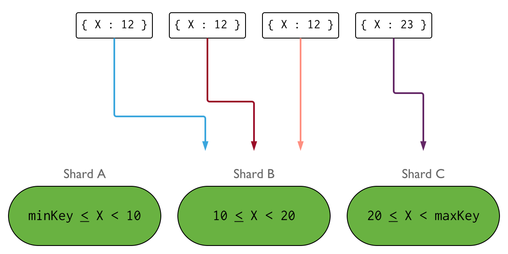
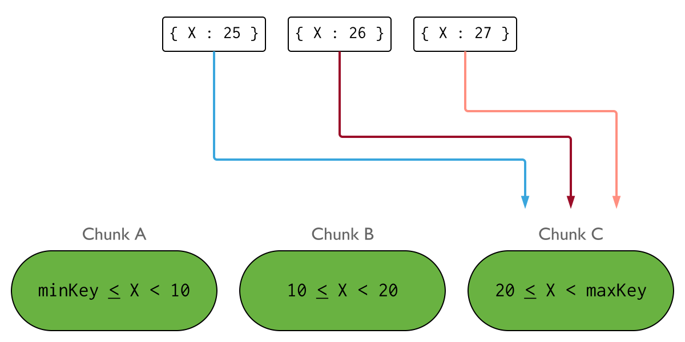
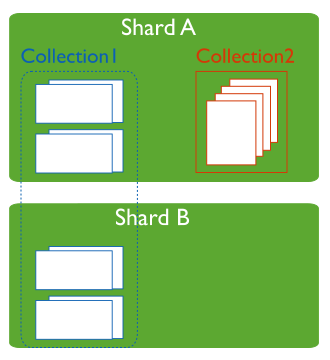
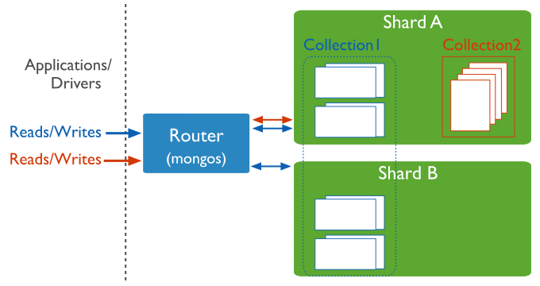

# Sharding

分片，是一种跨多台机器分布数据的方法，mongodb使用分片来支持具有非常大的数据集和高吞吐量操作的部署。

具有大数据集或高吞吐量应用程序的数据库系统可能会挑战单个服务器的容量。例如，高查询率会耗尽服务器的CPU容量。大于系统RAM的工作集大小会对磁盘驱动器的I/O容量造成压力。

解决系统增长的方法有两种：垂直和水平缩放。

垂直扩展，包括增加单个服务器的容量，例如使用更强大的CPU，更多的RAM，更多的存储空间。垂直缩放有一个实际的最大值。

横向扩展，包括将系统数据集和负载划分到多台服务器上，根据需要添加额外的服务器以增加容量。虽然一台机器的整体速度或容量可能不高，但每台机器都处理整体工作负载的一个子集，可能比单个高速高容量服务器提供更好的效率。
扩展部署的容量只需要根据需要添加额外的服务器，这可能比单台机器的高端硬件的总体成本更低。权衡是增加了部署的基础设施和维护的复杂性。

MongoDB通过分片进行水平缩放。

## Sharded Cluster

一个分片集群包含下面几个组件：

- shard: 每一个分片包含了分片数据的一个子集，每一个分片可以被部署为一个副本集。
- mongos：mongos职责是作为一个请求的路由，提供一个接口，处于客户端程序和分片集群中间。
- config servers: 配置服务器存储元数据和集群的配置信息。配置服务器必须部署为一个副本集。

分片数据是在collection 的级别，分布集合的数据到分片集群上。

### Production Configuration
在生产环境中，确保数据是冗余的，并且您的系统是高度可用的。请参考下面内容部署生产环境的分片集群：
部署Config Servers 为3个节点的副本集
部署每个分片为3个节点的副本集
部署一个或多个mongos 路由

#### Replica Set Distribution
如果有可能，考虑部署每个副本集的一个副本到作为灾难恢复位置的站点中。

#### Number of Shards
分片需要至少两个分片来分发数据。
如果你计划在不就的将来启用分片，那么单分片集群可能很有用，但在部署时不需要这样做。

#### Number of mongos and Distribution
部署多个mongos路由器支持高可用和可扩展性。一种常见的模式是在每个应用服务器上放置一个mongos。在每个应用服务器上部署一个mongos路由器可以减少应用程序和路由器之间的网路延迟。

或者，您可以在专用主机上放置mongos，大型部署受益于这种方法，因为它将客户端应用程序服务器的数量和mongos实例的数量分离开来。可以更好地控制mongod实例所服务的连接数。

在自己的主机上安装mongos实例允许这些实例使用更多的内存。内存不会与mongod实例共享。可以使用主片来承载mongos路由器，但要注意，内存争用可能成为大型部署中的一个问题。

部署中可以拥有的mongos数量没有限制。但是，由于mongos路由器经常与您的配置服务器通信，因此随着路由器数量的增加，请密切监视配置服务器的性能。如果您看到性能下降，那么在您的部署中限制mongos路由器的数量可能是有益的。

### Development Configuration

为了测试和开发，你可以部署一个分片集群用一个最小数量的组件。这些非生产环境集群由如下组件。

一个有一个成员的config server的复制集
至少一个分片，并搭建一个节点的复制集
一个mongos实例

## Shards

一个分片包含了分片集群的分片数据的一个子集，整个集群的分片一起保持了集群的整个数据集。

mongodb3.6, 分片必须被部署为复制集去提供冗余和高可用。

用户，客户端，或应用程序只能连接到一个分片来执行本地管理和维护操作。

对单个片的执行查询只会返回数据的子集。连接到mongos以执行集群级别的操作，包括读或写操作。

### Primary Shard（主片）

在分片集群中，每个数据库都有一个主片，它保存了所有未分片的集合。每个数据库都有自己的主片。主片与复制集中的主节点没有关系。

在创建新数据库时，mongos通过在数据量最少的集群中选择片来作为主片。

mongos使用listDatabase命令返回的totalsize字段作为选择条件的一部分。

要更改数据库的主片，请使用moveprimary命令。迁移主片的过程可能需要很长时间才能完成，在完成之前，你不应该访问与数据库关联的集合。根据迁移的数据量，迁移可能会影响整个集群操作。在尝试更改主片之前，请考虑对集群操作和网络负载的影响。

当你使用以前作为复制集的片部署新的分片集群时，所有现有的数据库将继续驻留在其原始的复制集上。随后创建的数据库可以驻留在集群中的任何碎片上。

### Shard Status
sh.status()方法可以查看集群状态。这些报告包括哪些碎片是数据库的主要碎片以及碎片之间的块分布。

### Sharded Cluster Security
使用内部/成员身份验证来加强集群内的安全性，并防止未经授权的集群组件访问集群。必须使用适当的安全设置启动集群中的每个mongod，以便强制进行内部身份验证。

## Config Servers
配置服务器存储分片集群的元数据。元数据反应了分片集群中所有数据和组件的状态和组织。元数据包括每个碎片上的块列表以及定义块的范围。

mongos实例缓存这些数据，并使用它将读写操作路由到正确的片。当集群的元数据发生变化时，mongos会更新缓存，例如块分割或添加片。片还从配置服务器读取块元数据。

配置服务器还存储身份验证配置信息，如基于角色的访问控制或集群的内部身份验证设置。

mongodb还是用配置服务器来管理分布式锁。

每个分片集群必须有自己的配置服务器。不要对不同的分片集群使用相同的配置服务器。

### Replica Set Config Servers
从mongodb3.2开始，可以将分片集群的配置服务器部署为复制集（CSR），而不是三个镜像配置服务器（SCCC）。为配置服务器使用复制集可以提高配置服务器之间的一致性，因为mongodb可以利用配置数据的标准副本集读写协议。此外，为配置服务器使用副本集允许分片集群拥有3个及以上的配置服务器，因为复制集最多可以有50个成员。要将配置服务器部署为复制集，配置服务器必须运行wiredtiger存储引擎。

在3.4版本中，mongodb取消了对SCCC配置服务器的支持。

当用于配置服务器时，以下限制适用于复制集配置：
必须没有仲裁人。
必须没有延迟成员。
必须生成索引（即，任何成员都不应将BuildIndexes设置为false）。

### Read and Write Operations on Config Servers
#### Writes to Config Servers
#### Reads from Config Servers

### Config Server Availability

如果配置服务器副本集丢失其主节点，并且无法选择主节点，则集群的元数据将变为只读。您仍然可以从碎片中读取和写入数据，但是在副本集可以选择主数据之前，不会发生块迁移或块分割。

在分片集群中，mongod和mongos实例监视分片集群中的副本集（例如shard replica set，config server replica set）。

如果所有配置服务器都不可用，那么集群可能会变得不可操作。为了确保配置服务器保持可用和完整，配置服务器的备份至关重要。与集群中存储的数据相比，配置服务器上的数据较小，并且配置服务器的活动负载相对较低。

对于3.2分片集群，如果连续不成功的尝试监视配置服务器副本集的次数超过replmonitormaxfailedcheck参数值，则在重新启动该实例前，监视mongos或mongod实例将不可用。

### Sharded Cluster Metadata

`use config`连接config 数据库。

含有以下表：
changelog
chunks
collections
databases
lockpings
locks
mongos
settings
shards
version

### Sharded Cluster Security

## mongos
mongos实例将查询和写操作路由到一个分片集群中的分片。从应用程序的角度来看，mongos提供了到分片集群的唯一接口。应用程序不应该与片直接通信。

mongos通过缓存配置服务器中的元数据来跟踪哪些数据是在哪些分片上的。mongos使用元数据将操作从应用程序和客户端路由到mongod实例。mongos没有持久状态，并且消耗最少的系统资源。

最常见的做法是在与应用服务器相同的系统上运行mongos实例，但是可以在分片上或其他专用资源上维护mongos实例。

### Routing And Results Process

mongos实例通过以下方式将查询路由到集群：
确定必须接收查询的片列表。
在所有目标片上建立游标。
然后，mongos合并来自每个目标片的数据，并返回结果文档。某些查询修饰符（如排序）在mongos检索结果之前对片执行。

在3.6版本中进行了更改：对于在多个碎片上运行的聚合操作，如果操作不需要在数据库的主碎片上运行，则这些操作可以将结果路由回mongos，然后在那里合并结果。

有两种情况下，管道不能在mongos上执行。

第一种情况发生在拆分管道的合并部分包含必须在主片上运行的阶段时。

第二种情况发生在拆分管道的合并部分包含一个可以将临时数据写入磁盘的阶段，并且客户端已指定allowdiskuse:true时。在这种情况下，假设合并管道中没有需要主片的其他阶段，合并将在聚集目标的片中随机选择的片上运行。

有关聚合工作如何在分片集群查询的组件之间拆分的详细信息，请使用explain:true作为aggregation()调用的参数。

在某些情况下，当片键或片键的前缀是查询的一部分时，mongos执行目标操作，将查询路由到集群中的分片子集。

### How mongos Handles Query Modifiers
### Confirm Connection to mongos Instances
### Targeted Operations vs. Broadcast Operations

## Shard Keys

mongodb使用片键在不同的分片之间分发集合的文档。
片键由目标集合中每个文档存在的一个或多个字段组成。

在对一个集合进行分片时选择片键。一旦选择，不能更改。一个分片集合只能有一个片键。

选择分片会影响分片集群的性能，效率和可伸缩性。片键可能会阻碍具有最佳硬件和基础结构的集群。片键的选择及其支持索引也会影响集群使用分片的策略。

片键决定集合文档在集群的片中的分布。片键是一个索引字段或索引复合字段，存在于集合中的每个文档中。

mongodb使用片键值的范围对集合中的数据进行分区。每个范围定义了一个不重叠的片键值范围，并与一个块相关联。

mongodb尝试在集群中的片中均匀地分布块。片键与分块匹配的有效性有直接关系。

### Shard Key Specification

### Change a Document’s Shard Key Value

### Shard Key Indexes
要对非空集合进行分片，集合必须具有以片键开始的索引。
对一个空的集合进行分片，如果集合没有针对指定的片键的适当索引，mongodb将创建索引。

#### Unique Indexes

不能在哈希索引上指定唯一约束。

对于基于范围分片的集合，只有以下索引可以是唯一的：
片键上的索引
一种复合索引，其中片键是前缀
默认的索引_id, 但是，如果_id字段不是片键或片键的前缀，那么_id索引只强制每个片的唯一性约束。

唯一的索引约束意味着：

对于待分片的集合，如何集合具有其他唯一索引，则不能分片该集合。

对于已分片的集合，不能在其他字段上创建唯一索引。

通过对片键使用唯一索引，mongodb可以强制片键值的唯一性。

mongodb对整个键的组合强制唯一性，而不是对片键的单个组件强制唯一性。

要对片键值强制唯一性，请将unique参数作为true传递给sh.shardcollection()方法。

如果集合为空，则sh.shardCollection在片键上创建唯一索引（如果该索引尚不存在）。
如果集合不为空，则必须先创建索引，然后才能使用sh.shardCollection()方法。

虽然可以有一个唯一的复合索引，其中片键是前缀，但如果使用unique参数，则集合必须具有片键上的唯一索引。

### Choosing a Shard Key

片键的选择会影响块在可用片之间的创建和分布。这会影响分片集群中操作的整体效率和性能。

片键影响分片集群所使用的切分策略的性能和效率。

理想的片键允许mongodb在集群中均匀地分发文档。

至少，考虑潜在片键的基数，频率，和变化率的后果。

#### Restrictions(限制)

#### Collection Size

#### Shard Key Cardinality (基数)
片键的基数决定了均衡器可以创建的最大块数。这可以降低或消除集群中水平缩放的有效性。

在任何给定时间，一个唯一的片键值只能存在于一个块上。如果一个片键的基数为4，那么在分片集群中不能有超过4个块，每个块存储一个唯一的片键值。这将集群中有效片的数量限制为4个, 添加额外的片不会带来任何好处。

下图说明了使用字段x作为片键的分片集群。如果x的基数较低，插入的分布可能与以下类似：

本例中的集群不会水平扩展，因为传入写入只会路由到碎片的一个子集。

具有高基数的片键不能保证数据在整个分片集群中均匀分布，尽管它更好的促进了水平缩放。片键的频率和变化率也有助于数据分布。选择片键时考虑每个因素。

如果数据模型需要对基数较低的键进行分片，请考虑使用具有较高相对基数的字段的复合索引。

#### Shard Key Frequency(频率)

考虑一个表示片键值范围的集合，片键值的频率表示给定值在数据中出现的频率。如果大多数文档只包含这些值的一个子集，那么存储这些文档的块将成为集群中的瓶颈。

此外，随着这些块的增长，它们可能会成为不可分割的块，因为它们不能再进一步分割。这会降低或消除集群中水平缩放的有效性。

下图说明了使用字段x作为片键的分片集群。如果X值的一个子集出现在高频下，插入的分布可能类似于以下情况：

低频片键不能保证数据在分片集群中均匀分布。片键的基数和变化率也有助于数据分布。选择片键时考虑每个因素。

如果您的数据模型需要对具有高频值的键进行切分，请考虑使用唯一或低频值的复合索引。

#### Monotonically Changing Shard Keys(单调变化的片键)

值上单调增加或减少的片键更有可能将插入分布到集群的单个片上。

这是因为每个集群都有一个块来捕获一个上限为maxkey的范围。

MAXKEY的比较值始终高于所有其他值。类似的，有一个块捕获的范围的下限为minkey，minkey的比较值总是低于所有其他值。

如果片键值始终在增加，则所有新插入都将以maxkey作为上限路由到块。如果片键值总是减少，那么所有新插入都将以minkey作为下界路由到块。包含该块的片成为写操作的瓶颈。

下图说明了使用字段想作为片键的分片集群。如果x的值是单调递增的，则插入的分布可能类似于以下内容：

如果片键值单调减少，那么所有插入都将路由到块a。

不单调变化的片键不能保证数据在分片集群中均匀分布。片键的基数和频率也有助于数据分布。选择片键时考虑每个因素。

如果您的数据模型需要对单调变化的键进行切分，请考虑使用哈希切分。

## Chunks
mongodb将分片数据分割成块。每一个块都有一个基于片键的包含的范围。

## Balancer and Even Chunk Distribution
为了在集群的所有分片上实现块的均匀分布，在后台运行一个均衡器来跨分片迁移块。

## Advantages of Sharding (分片的优势)

### Reads/Writes

读写会被分摊在多个分片上。

### Storage Capacity(存储容纳)

### High Availability（高可用）

## Considerations Before Sharding（分片前的注意事项）

分片集群的基础设施和复杂性需要自己的规划，执行和维护。

为了保证集群的性能和效率，在选择片键时要慎重考虑，切分后不能更改片键。也不能取消分片集合的共享。

分片有一定的操作要求和限制。

如果 查询不包括 片键 或复合片键的前缀，那么mongos将执行广播操作，查询分片集群中的所有片。这些查询可能耗时很长。

## Sharded and Non-Sharded Collections(分片和未分片的集合)

一个数据库可以混合使用有分片和未分片的集合。
分片集合在集群中的分片之间进行切割和分布。
未分片的集合存储在主片上。每个数据库都有自己的主片。

## Connecting to a Sharded Cluster

你必须连接到mongos路由器，才能与分片集群中的任何集合进行交互。这包括分片和未分片的集合。为了执行读写操作，客户端不应该连接到单个的分片。

你可以用连接mongod一样的方式连接mongos。

## Sharding Strategy(分片策略)

支持两种分片策略。

### Hashed Sharding(哈希分片)
哈希分片，计算分片片键的散列值，然后根据散列值为每个块分配一个范围。

当一个range 片键是关闭状态，但他们的散列值不太可能位于同一块。基于散列值的数据分布有助于更均匀的 数据分布，尤其是在片键单调变化的数据集中。

然而，散列分布，意味着基于片键的查询不太可能以单个片为目标，从而导致更多的集群范围的广播操作。

mongos可以将具有相等匹配的查询作为单个片的目标。

#### Hashed Sharding Shard Key
作为散列片键选择的字段应该具有良好的基数，或者具有大量不同的值。哈希键对于具有像ObjectId值或时间戳一样单调变化的字段的片键是理想的。一个很好的例子是默认的_id字段，假设它只包含ObjectId值。

#### Hashed vs Ranged Sharding

给定一个集合，使用单调递增的值x作为片键，使用范围分片导致传入插入的分布类似于以下内容：

因为x的值总是在增加，所以具有maxkey上限的块接收大多数写入。这将插入操作限制到包含这个块的单个片，从而减少或消除了分片集群中分布式写入的优势。

通过在x上使用哈希索引，插入的分布类似于以下内容：

由于数据现在分布的更均匀，插入可以有效地分布在整个集群中。

#### Shard the Collection

##### Shard a Populated Collection
##### Shard an Empty Collection

### Ranged Sharding （范围分片）

范围分片，根据片键将数据划分为多个范围，然后根据片键值为每个块分配一个范围。

一个范围的片键个能会位于同一个块。这允许目标操作，只将操作路由到包含所需数据的片。

范围分片，的效率取决于选择的片键。考虑不周的片键可能会导致数据分布不均匀，这可能会抵消分片的好处，或导致性能瓶颈。

如果没有配置诸如哈希分片或区域分片的其他选项，则默认基于范围的分片。

#### Shard Key Selection

范围分片是最有效的，当片键展示出如下特征：

Large Shard Key Cardinality

Low Shard Key Frequency

Non-Monotonically Changing Shard Keys

下图说明了使用字段x作为片键的分片集群。如果x的值具有较大的范围，低频率和非单调速率变化，则插入看上去如下所示：

##### Shard a Populated Collection
##### Shard an Empty Collection

## Zones in Sharded Clusters

在分片集群中，可以基于片键创建分片数据区域。可以将每个区域与集群中的一个或多个片关联。片可以与任意数量的区域关联。

在平衡集群中，mongodb将一个区域覆盖的块迁移到与该区域相关联的那些片上。

可以应用区域分片的一些常见部署模式如下：

隔离特定片集上的特定数据子集。

确保最相关的数据位于地理位置最靠近应用服务器的片上。

根据片硬件的硬件/性能将数据路由到片。

下图显示了一个带有三个片和两个区域的片集。A区表示下限为1，上限为10的范围。B区表示下限为10，上限为20的范围。片a和b有A区。片b也有B区。片Charlia
没有与之相关的区域。集群处于稳定状态，没有任何块违反任何区域。

### Behavior and Operations

#### Ranges

每个区域包含一个集合的一个或多个片键值范围。区域覆盖的每个范围始终包括其下边界，不包括其上边界。

区域不能共享范围，也不能有重叠的范围。

#### Initial Chunk Distribution

通过在对空集合或不存在的集合进行分片之前定义区域和区域范围，分片集合操作将为定义的区域范围以及任何其他块创建块，以覆盖整个片键值范围，并执行初始块分布平衡。位于区域范围内。最初创建和分发块允许更快的设置分区切分。在初始分布之后，平衡器将继续管理块分布。

#### Balancer

均衡器视图将一个分片集合的块平均分布在集群中的所有分片上。

对于标记为迁移的每个块，平衡器检查每个可能的目标片是否有任何已配置的区域。如果块范围属于一个区域，则平衡器会将块迁移到该区域内的片中。不属于某个区域的块可以存在于集群中的任何片上，并正常迁移。

在平衡回合中，如果平衡器检测到任何块违反了为给定片配置的区域，均衡器会将这些块迁移到不存在冲突的片。

将一个区域与一个或多个片关联，并为片收集配置一个片键范围后，集群可能需要一些时间来迁移片收集的受影响数据。这取决于块的划分和集群中数据的当前分布。当平衡完成时，给定区域中文档的读写只路由到该区域中的片。

配置后，在未来的平衡回合中，平衡器将尊重区域。

#### Shard Key

定义要覆盖的区域的新范围时，必须使用片键中包含的字段。如果使用复合片键，范围必须包括片键的前缀。

不能使用未包含片键的字段创建区域。

为集合选择片键时，请考虑可能要用于配置区域的字段。切分后，不能更改片键。

#### Hashed Shard Keys and Zones

在散列的片键上使用区域时，每个区域都包含散列的片键值。

边界表示的是散列值，而不是实际值。

通常，包含哈希片键值序列范围的区域可能会显示出意外的行为。

可以使用minkey和maxkey创建一个覆盖整个片键值范围的区域，以确保mongodb将特定集合的所有数据限制在该区域中的片或片。

#### Shard Zone Boundaries
区域范围始终包含下边界，不包括下边界。

### Manage Shard Zones
### Segmenting Data by Location
### Tiered Hardware for Varying SLA or SLO
### Segmenting Data by Application or Customer
### Distributed Local Writes for Insert Only Workloads

## Data Partitioning with Chunks （数据通过块迁移）

TODO

## Collations in Sharding

## Change Streams

## Transactions

