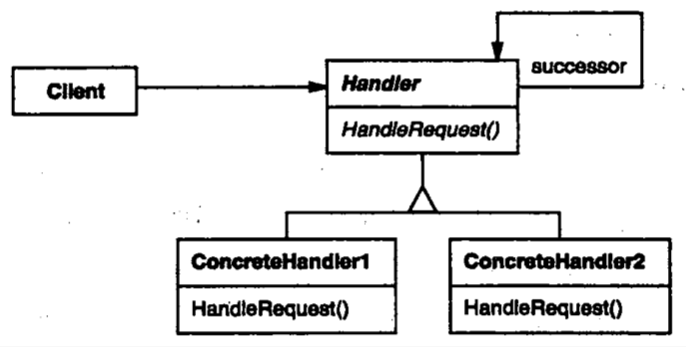
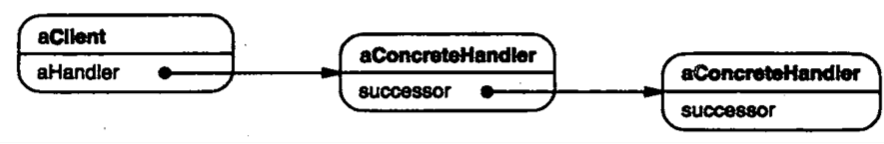

| Title                | Date             | Modified         | Category          |
|:--------------------:|:----------------:|:----------------:|:-----------------:|
| design patterns      | 2019-11-20 12:00 | 2019-11-20 12:00 | design patterns   |

# 职责链

1 意图
使多个对象都有机会处理请求，从而避免请求的发送者和接收者之间的耦合关系。将这些对象连成一条链，并沿着这条链传递该请求，直到有一个对象处理它为止。

2 动机

3 适用性
在以下条件下使用Responsibility链：
-有多个的对象可以处理一个请求，哪个对象处理该请求运行时刻自动确定。
-你想在不明确指定接收者的情况下，向多个对象中的一个提交一个请求。
-可处理一个请求的对象集合应被动态指定。

4 结构

一个典型的对象结构可能如下图所示：

5 参与者
-Handler
定义一个处理请求的接口。
（可选）实现后继链。
-ConcreteHandler
处理它所负责的请求。
可访问它的后继者。
如果可处理该请求，就处理之；否则将该请求转发给它的后继者。

-Client
向链上的具体处理者（ConcreteHandler）对象提交请求。

6 协作
当客户提交一个请求时，请求沿链传递直至有一个ConcreteHandler对象负责处理它。

7 效果
Responsibility链有下列优点和缺点（liabilities）：
1）降低耦合度
2）增强了给对象指派职责（Responsibility）的灵活性
3）不保证被接受

8 实现
下面是在职责链模式中要考虑的实现问题：
1）实现后继者链
2）连接后继者
3）表示请求
4）在Smalltalk中自动转发

9 代码示例
10 已知应用
11 相关模式
