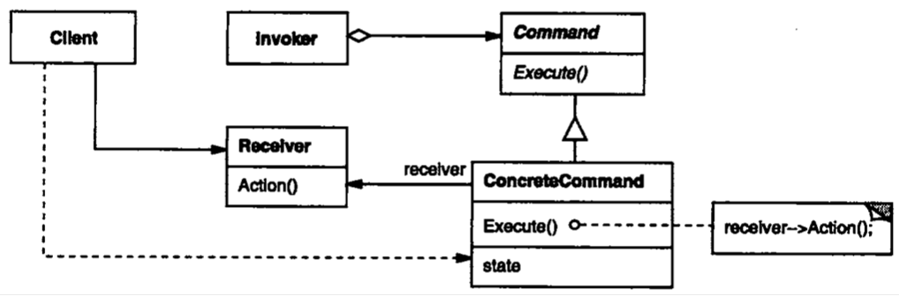
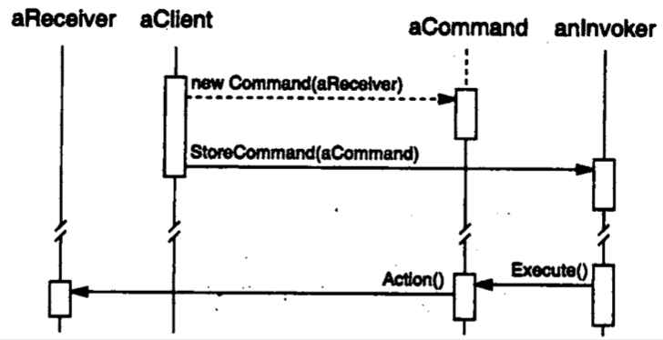

| Title                | Date             | Modified         | Category          |
|:--------------------:|:----------------:|:----------------:|:-----------------:|
| design patterns      | 2019-11-20 12:00 | 2019-11-20 12:00 | design patterns   |

# 命令

## 意图
将一个请求封装为一个对象，从而使你可用不同的请求对客户进行参数化；对请求排队或记录请求日志，以及支持可撤销的操作。

## 别名
动作（Action），事务（Transaction）

## 动机

## 适用性
当你有如下需求时，可使用Command模式：
- 抽象出待执行的动作以参数化某对象。
- 在不同的时刻指定、排列和执行请求。
- 支持取消操作。
- 支持修改日志，这样当系统崩溃时，这些修改可以被重做一遍。
- 用构建在原语操作上的高层操作构造一个系统。

## 结构

## 参与者

### Command
- 声明执行操作的接口。

### ConcreteCommand
- 将一个接收者对象绑定于一个动作。
- 调用接收者相应的操作，以实现Execute。

### Client
- 创建一个具体命令对象并设定它的接收者。

### Invoker
- 要求该命令执行这个请求。

### Receiver
知道如何实施与执行一个请求相关的操作。任何类都可能作为一个接收者。

## 协作
- Client创建一个ConcreteCommand对象并指定它的Receiver对象。
- 某Invoker对象存储该ConcreteCommand对象。
- 该Invoker通过调用Command对象的Execute操作来提交一个请求。若该命令是可撤销的，ConcreteCommand就在执行Excute操作之前存储当前状态以用于取消该命令。
- ConcreteCommand对象对调用它的Receiver的一些操作以执行该请求。

下图展示了这些对象之间的交互。它说明了Command是如何将调用者和接收者（以及它执行的请求）解耦的。

## 效果
Command模式有以下效果：
- Command模式将调用操作的对象与知道如何实现该操作的对象解耦。
- Command是头等的对象。它们可像其他的对象一样被操纵和扩展。
- 你可将多个命令装配成一个复合命令。例如是前面描述的MacroCommand类。一般说来，复合命令是Composite模式的一个实例。
- 增加新的Command很容易，因为这无需改变已有的类。

## 实现
实现Command模式时需考虑以下问题：
- 一个命令对象应达到何种智能程度
- 支持取消（undo）和重做（redo）
- 避免取消操作过程中的错误积累
- 使用C++模板

## 代码示例
## 已知应用
## 相关模式

