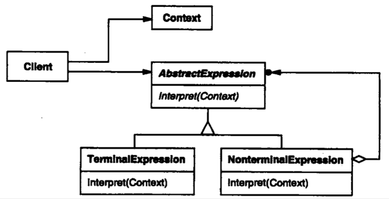

| Title                | Date             | Modified         | Category          |
|:--------------------:|:----------------:|:----------------:|:-----------------:|
| design patterns      | 2019-11-20 12:00 | 2019-11-20 12:00 | design patterns   |

# 解释器

## 意图
给定一个语言，定义它的文法的一种表示，并定义一个解释器，这个解释器使用该表示来解释语言中的句子。

## 动机
如果一种特定类型的问题发生的频率足够高，那么可能就值得将该问题的各个实例表述为一个简单语言中的句子。这样就可以构建一个解释器，该解释器通过解释这些句子来解决该问题。

## 适用性
当有一个语言需要解释执行，并且你可将该语言的句子表示为一个抽象语法树时，可使用解释器模式。而当存在以下情况时该模式效果最好：
- 该文法简单，对于复杂的文法，文法的类层次变得庞大而无法管理。此时语法分析程序生成器这样的工具是更好的选择。它们无需构建抽象语法树即可解释表达式，这样可以节省空间而且还可能节省时间。
- 效率不是一个关键问题，最高效的解释器通常不是通过直接解释语法分析树实现的，而是首先将它们转换成另一种形式。例如，正则表达式通常被转换成状态机。但即使在这种情况下，转换器仍可用解释器模式实现，该模式仍是有用的。

## 结构

## 参与者
### AbstractExpression（抽象表达式）
声明一个抽象的解释操作，这个接口为抽象语法树中所有的节点所共享。
### TerminalExpression（终结符表达式）
- 实现与文法中的终结符相关联的解释操作。
- 一个句子中的每个终结符需要该类的一个实例。
### NonterminalExpression（非终结符表达式）
- 对文法中的每一条规则R::=R1R2…Rn都需要一个NonterminalExpression类。
- 为从R1到Rn的每个符号都维护一个AbstractExpression类型的实例变量。
- 为文法中的非终结符实现解释（Interpret）操作。解释（Interpret）一般要递归的调用表示R1到Rn的那些对象的解释操作。
### Context（上下文）
- 包含解释器之外的一些全局信息。
### Client（客户）
- 构建（或被给定）表示该文法定义的语言中一个特定的句子的抽象语法树。该抽象语法树由NonterminalExpression和TerminalExpression的实例装配而成。
调用解释操作。

## 协作
- Client构建（或被给定）一个句子，它是NonterminalExpression和TerminalExpression的实例的一个抽象语法树，然后初始化上下文并调用解释操作。
- 每一非终结符表达式节点定义相应子表达式的解释操作。而各终结符表达式的解释操作构成了递归的基础。
- 每一节点的解释操作用上下文来存储和访问解释器的状态。

## 效果
解释器模式有下列的优点和不足：
- 易于改变和扩展文法
- 也易于实现文法
- 复杂的文法难以维护
- 增加了新的解释表达式的方式

## 实现
- 创建抽象语法树
- 定义解释操作
- 与Flyweight模式共享终结符

## 代码示例

## 已知应用

## 相关模式
