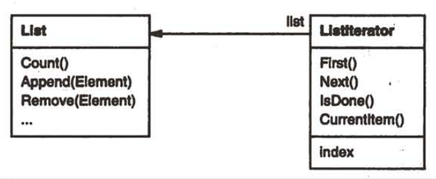
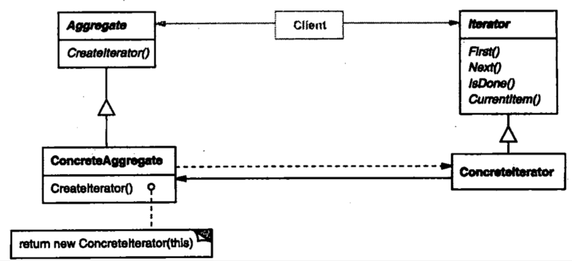

| Title                | Date             | Modified         | Category          |
|:--------------------:|:----------------:|:----------------:|:-----------------:|
| design patterns      | 2019-11-20 12:00 | 2019-11-20 12:00 | design patterns   |

# 迭代器

## 意图
提供一种方法顺序访问一个聚合对象中各个元素，而又不需暴露该对象的内部表示。
## 别名
游标（Cursor）
## 动机
一个聚合对象，如列表（list），应该提供一种方法来让别人可以访问它的元素，而又不需暴露它的内部结构。此外，针对不同的需要，可能要以不同的方式遍历这个列表。

## 适用性
迭代器模式可用来：
- 访问一个聚合对象的内容而无需暴露它的内部表示。
- 支持对聚合对象的多种遍历。
- 为遍历不同的聚合结构提供一个统一的接口（即，支持多态迭代）。

## 结构

## 参与者
### Iterator（迭代器）
迭代器定义访问和遍历元素的接口。
### ConcreteIterator（具体迭代器）
- 具体迭代器实现迭代器接口。
- 对该聚合遍历时跟踪当前位置。
### Aggregate（聚合）
聚合定义创建相应迭代器对象的接口。
### ConcreteAggregate（具体聚合）
具体聚合实现创建相应迭代器的接口，该操作返回ConcreteIterator的一个适当的实例。

## 协作
ConcreteIterator跟踪聚合中的当前对象，并能够计算出待遍历的后继对象。

## 效果
迭代器模式有三个重要的作用：
- 它支持以不同的方式遍历一个聚合
- 迭代器简化了聚合的接口
- 在同一个聚合上可以有多个遍历  每个迭代器保持它自己的遍历状态。因此你可以同时进行多个遍历。

## 实现
- 谁控制该迭代
- 谁定义遍历算法
- 迭代器健壮程度如何
- 附加的迭代器操作
- 在C++中使用多态的迭代器
- 迭代器可有特权访问
- 用于复合对象的迭代器
- 空迭代器

## 代码示例
## 已知应用
## 相关模式
