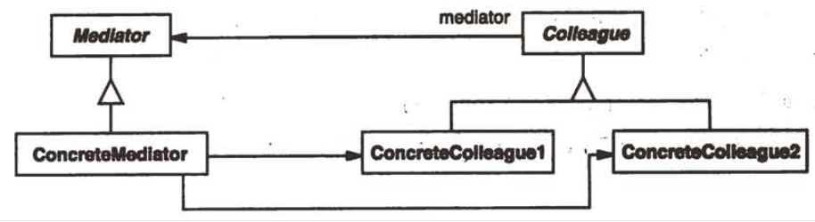
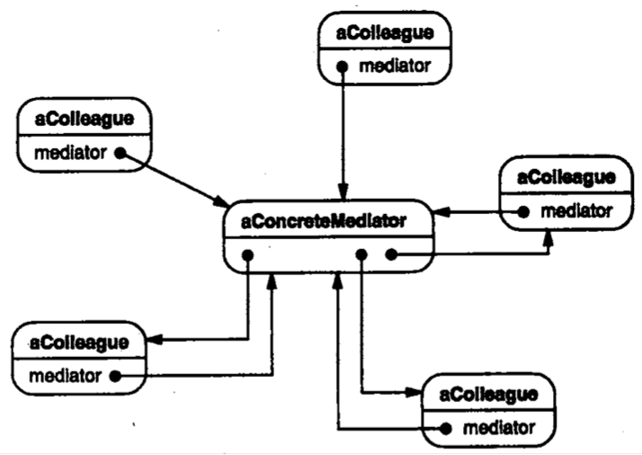

| Title                | Date             | Modified         | Category          |
|:--------------------:|:----------------:|:----------------:|:-----------------:|
| design patterns      | 2019-11-20 12:00 | 2019-11-20 12:00 | design patterns   |

# 中介者

## 意图
用一个中介对象来封装一系列的对象交互。中介者使各对象不需要显式地相互引用，从而使其耦合松散，而且可以独立地改变它们之间的交互。

## 动机
面向对象设计鼓励将行为分布到各个对象中。这种分布可能会导致对象间有许多连接。在最坏的情况下，每一个对象都知道其他所有对象。

## 适用性
在下列情况下使用中介者模式：
- 一组对象以定义良好但是复杂的方式进行通信。产生的相互依赖关系结构混乱且难以理解。
- 一个对象引用其他很多对象并且直接与这些对象通信，导致难以服用该对象。
- 想定制一个分布在多个类中的行为，而又不想生成太多的子类。

## 结构

## 参与者
### Mediator（中介者）
中介者定义一个接口用于与各同事（Colleague）对象通信。
### ConcreteMediator（具体中介者）
- 具体中介者通过协调各同事对象实现协作行为。
- 了解并维护它的各个同事。
### Colleague class（同事类）
- 每一个同事类都知道它的中介者对象。
- 每一个同事对象在需与其他的同事通信的时候，与它的中介者通信。

## 协作
同事向一个中介者对象发送和接收请求。中介者在各同事间适当地转发请求以实现协作行为。

## 效果
中介者模式有以下优点和缺点：
- 减少了子类生成
- 它将各Colleague解耦
- 它简化了对象协议
- 它对对象如何协作进行了抽象
- 它使控制集中化

## 实现
- 忽略抽象的Mediator类
- Colleague-Mediator通信

## 代码示例
## 已知应用
## 相关模式

