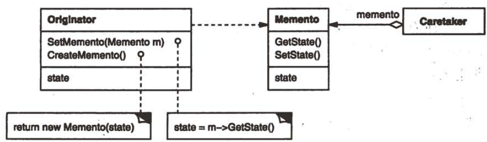
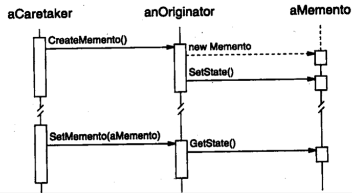

| Title                | Date             | Modified         | Category          |
|:--------------------:|:----------------:|:----------------:|:-----------------:|
| design patterns      | 2019-11-20 12:00 | 2019-11-20 12:00 | design patterns   |

# 备忘录
1 意图
在不破坏封装性的前提下，捕获一个对象的内部状态，并在该对象之外保存这个状态。这样以后就可将该对象恢复到原先保存的状态。

2 别名
Token

3 动机
有时有必要记录一个对象的内部状态。

4 适用性
在以下情况下使用备忘录模式：
-必须保存一个对象在某一个时刻的（部分）状态，这样以后需要时它才能恢复到先前的状态。
-如果一个用接口来让其它对象直接得到这些状态，将会暴露对象的实现细节并破坏对象的封装性。

5 结构

6 参与者
-Memento（备忘录）
-备忘录存储原发器对象的内部状态。原发器根据需要决定备忘录存储原发器的哪些内部状态。
-防止原发器以外的其他对象访问备忘录。

-Originator（原发器）
原发器创建一个备忘录，用于记录当前时刻它的内部状态。
使用备忘录恢复内部状态。

-Caretaker（负责人）
负责保存好备忘录
不能对备忘录的内容进行操作或检查。

7 协作
-管理器向原发器请求一个备忘录，保留一段时间后，将其送回给原发器，如下面的交互图所示。

有时管理者不会将备忘录返回给原发器，因为原发器可能根本不需要退到先前的状态。

-备忘录是被动的。只有创建备忘录的原发器会对它的状态进行赋值和检索。

8 效果
备忘录模式有以下一些效果：
1）保持封装边界
2）它简化了原发器
3）使用备忘录可能代价很高
4）定义窄接口和宽接口
5）维护备忘录的潜在代价

9 实现
下面是当实现备忘录模式时应考虑的两个问题：
1）语言支持
2）存储增量式改变

10 代码示例

11 已知应用

12 相关模式
