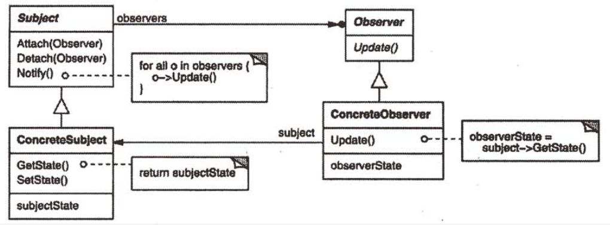
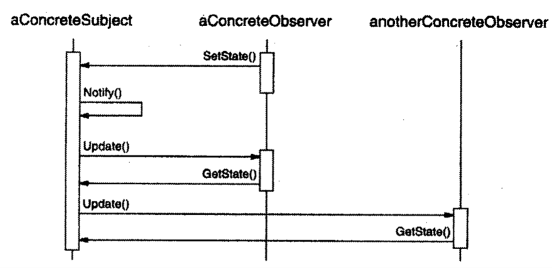

| Title                | Date             | Modified         | Category          |
|:--------------------:|:----------------:|:----------------:|:-----------------:|
| design patterns      | 2019-11-20 12:00 | 2019-11-20 12:00 | design patterns   |

# 观察者

1 意图
定义对象间的一种一对多的依赖关系，当一个对象的状态发生改变时，所有依赖于它的对象都得到通知并被自动更新。

2 别名
依赖（Dependents），发布-订阅（Publish-Subscribe）

3 动机
将一个系统分割成一系列相互协作的类有一个常见的副作用：需要维护相关对象间的一致性。我们不希望为了维持一致性而使各类紧密耦合，因为这样降低了它们的可重用性。

4 适用性
在以下任一情况下可以使用观察者模式：
-当一个抽象模型有两个方面，其中一个方面依赖于另一方面。将这两者封装在独立的对象中以使它们可以各自独立地改变和复用。
-当对一个对象的改变需要同时改变其他对象，而不知道具体有多少对象有待改变。
-当一个对象必须通知其他对象，而它又不能假定其他对象是谁。换言之，你不希望这些对象是紧密耦合的。

5 结构

6 参与者
-Subject（目标）
目标知道它的观察者。可以有任意多个观察者观察同一个目标。
提供注册和删除观察者对象的接口。
-Observer（观察者）
为那些在目标发生改变时需获得通知的对象定义一个更新接口。
-ConcreteSubject（具体目标）
将有关状态存入各ConcreteObserver对象。
当它的状态发生改变时，向它的各个观察者发出通知。
-ConcreteObserver（具体观察者）
维护一个指向ConcreteSubject对象的引用。
存储有关状态，这些状态应与目标的状态保持一致。
实现Observer的更新接口以使自身状态与目标的状态保持一致。

7 协作
-当ConcreteSubject发生任何可能导致其观察者与其本身状态不一致的改变时，它将通知它的各个观察者。
-在得到一个具体目标的改变通知后，ConcreteObserver对象可向目标对象查询信息。ConcreteObserver使用这些信息以使它的状态与目标对象的状态一致。
下面的交互图说明了一个目标对象和两个观察者之间的协作：

注意发出改变请求的Observer对象并不立即更新，而是将其推迟到它从目标得到一个通知之后。Notify不总是由目标对象调用。它也可被一个观察者或其它对象调用。实现一节将讨论一些常用的变化。

8 效果
Observer模式允许你独立的改变目标和观察者。你可以单独复用目标对象而无需同时复用其观察者，反之亦然。它也使你可以在不改动目标和其他的观察者的前提下增加观察者。

下面是观察者模式其他的一些优缺点：
1）目标和观察者间的抽象耦合
2）支持广播通信
3）以外的更新

9 实现
1）创建目标到其观察者之间的映射
2）观察多个目标
3）谁触发更新
4）对已删除目标的悬挂引用
5）在发出通知前确保目标的状态自身是一致的
6）避免特定于观察者的更新协议—推/拉模型
7）显式地指定感兴趣的改变
8）封装复杂的更新语义
9）结合目标类和观察者类

10 代码示例
11 已知应用
12 相关模式

