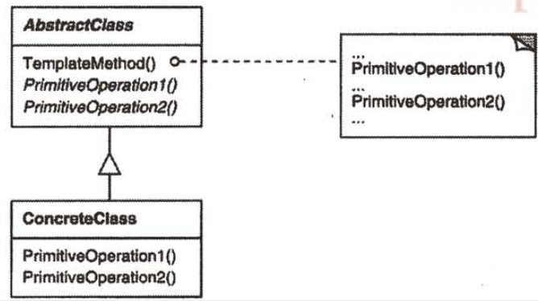
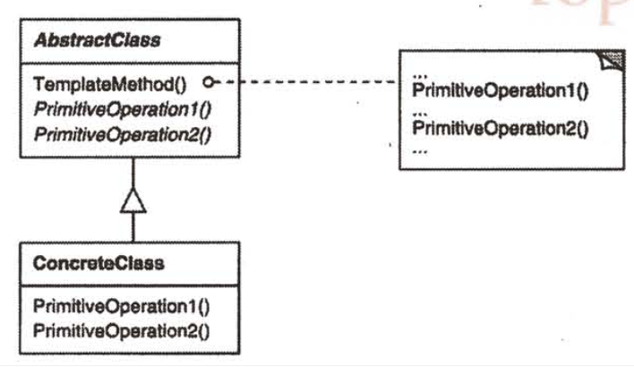

| Title                | Date             | Modified         | Category          |
|:--------------------:|:----------------:|:----------------:|:-----------------:|
| design patterns      | 2019-11-20 12:00 | 2019-11-20 12:00 | design patterns   |

# 模板方法
1 意图
定义一个操作中的算法的骨架，而将一些步骤延迟到子类中。TemplateMethod使得子类可以不改变一个算法的结构即可重定义该算法的某些特定步骤。

2 动机

3 适用性
模板方法应用于下列情况：
-一次性实现一个算法的不变的部分，并将可变的行为留给子类来实现。
-各子类中公共的行为应被提取出来并集中到一个公共父类中以避免代码重复。这是Opdyke和Johnson所描述过的”重分解以一般化“的一个很好的例子[OJ93]。首先识别现有代码中的不同之处，并且将不同之处分离为新的操作。最后，用一个调用这些新的操作的模板方法来替换这些不同的代码。
-控制子类扩展。模板方法只在特定点调用”hook“操作（参见效果一节），这样就只允许在这些点进行扩展。

4 结构

5 参与者
-AbstractClass（抽象类）
定义抽象的原语操作（primitive operation），具体的子类将重定义它们以实现一个算法的各步骤。

实现一个模板方法，定义一个算法骨架。该模板方法不仅调用原语操作，也调用定义在AbstractClass或其他对象中的操作。

-ConcreteClass（具体类）
实现原语操作以完成算法中与特定子类相关的步骤。

6 协作
ConcreteClass靠AbstractClass来实现算法中不变的步骤。

7 效果
模板方法是一种代码复用的基本技术。它们在类库中尤为重要，它们提取了类库中的公共行为。
模板方法导致一种反向的控制结构，这种结构有时被称为”好莱坞法则“，即”别找我们，我们找你“[Swe85]。这指的是一个父类调用一个子类的操作，而不是相反。

8 实现
有三个实现问题值得注意：
1）使用C++访问控制
2）尽量减少原语操作
3）命名约定

9 代码示例
10 已知应用
11 相关模式
