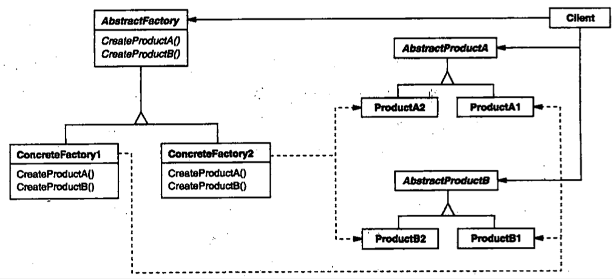

| Title                | Date             | Modified         | Category          |
|:--------------------:|:----------------:|:----------------:|:-----------------:|
| design patterns      | 2019-11-20 12:00 | 2019-11-20 12:00 | design patterns   |

# 抽象工厂

## 意图
提供一个创建一系列相关或相互依赖对象的接口，而无需指定它们具体的类。

## 别名
Kit

## 动机

## 适用性
在以下情况可以使用Abstract Factory模式
- 一个系统要独立于它的产品的创建，组合和表示时。
- 一个系统要由多个产品系列中的一个来配置时。
- 当你要强调一系列相关的产品对象的设计以便进行联合使用时。
- 当你提供一个产品类库，而只想显示它们的接口而不是实现时。

## 结构

## 参与者

### AbstractFactory 
声明一个创建抽象产品对象的操作接口。
### ConcreteFactory 
实现创建具体产品对象的操作。
### AbstractProduct 
为一类产品对象声明一个接口。
### ConcreteProduct 
定义一个将被相应的具体工厂创建的产品对象。实现AbstractProduct接口。
### Client 
仅使用由AbstractFactory和AbstractProduct类声明的接口。

## 协作
通常在运行时刻创建一个ConcreteFactory类的实例。这一具体的工厂创建具有特定实现的产品对象。为创建不同的产品对象，客户应使用不同的具体工厂。
AbstractFactory将产品对象的创建延迟到它的ConcreteFactory子类。

## 效果
AbstractFactory模式有下面的一些优点和缺点：
- 它分离了具体的类
- 它使得易于交换产品系列
- 它有利于产品的一致性
- 难以支持新种类的产品

## 实现
- 将工厂作为单件
- 创建产品
- 定义可扩展的工厂

## 代码示例

## 已知应用

## 相关模式
- AbstractFactory类通常用工厂方法（Factory Method）实现，但它们也可以用Prototype实现。
- 一个具体的工厂通常是一个单件（Singleton）

# 参考

- 《设计模式：可复用面向对象软件的基础》