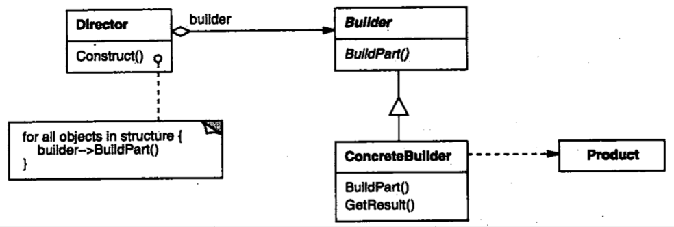
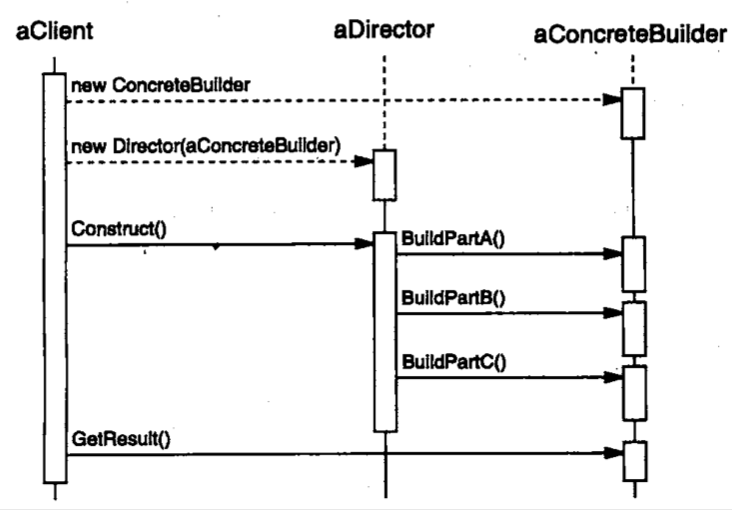

| Title                | Date             | Modified         | Category          |
|:--------------------:|:----------------:|:----------------:|:-----------------:|
| design patterns      | 2019-11-20 12:00 | 2019-11-20 12:00 | design patterns   |

# 生成器

## 意图
将一个复杂对象的构建与它的表示分离，使得同样的构建过程可以创建不同的表示。

## 动机

## 适用性
在以下情况使用Builder模式
- 当创建复杂对象的算法应该独立于该对象的组成部分以及它们的装配方法时。
- 当构造过程必须允许被构造的对象有不同的表示时。

## 结构

## 参与者
### Builder 
为创建一个Product对象的各个部件指定抽象接口。

### ConcreteBuilder 
- 实现Builder的接口以构造和装配该产品的各个部件。  
- 定义并明确它所创建的表示。  
- 提供一个检索产品的接口。  

### Director
构造一个使用Builder接口的对象。

### Product
- 表示被构造的复杂对象。ConcreteBuilder创建该产品的内部表示并定义它的装配过程。  
- 包含定义组成部件的类，包括将这些部件装配成最终产品的接口。

## 协作
- 客户创建Director对象，并用它所想要的Builder对象进行配置。
- 一旦产品部件被生成，导向器就会通知生成器。
- 生成器处理导向器的请求，并将部件添加到该产品中。
- 客户从生成器中检索产品。

下面的交互图说明了Builder和Director是如何与一个客户协作的。

## 效果
这里是Builder模式的主要效果：
- 它使你可以改变一个产品的内部表示
- 它将构造代码和表示代码分开
- 它使你可对构造过程进行更精细的控制

## 实现
通常有一个抽象的Builder类为导向者可能要求创建的每一个构件定义一个操作。这些操作缺省情况下什么都不做。一个ConcreteBuilder类对它有兴趣创建的构件重定义这些操作。

这里是其他一些要考虑的实现问题：
- 装配和构造接口
- 为什么产品没有抽象类
- 在Builder中缺省的方法为空

## 代码示例

## 已知应用

## 相关模式
