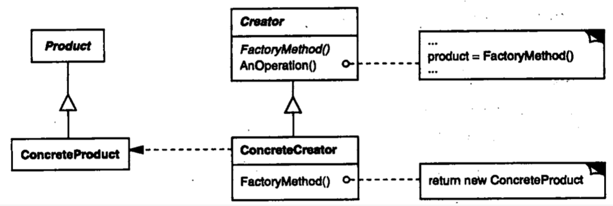

| Title                | Date             | Modified         | Category          |
|:--------------------:|:----------------:|:----------------:|:-----------------:|
| design patterns      | 2019-11-20 12:00 | 2019-11-20 12:00 | design patterns   |

# 工厂方法

1 意图
定义一个用于创建对象的接口，让子类决定实例化哪一个类。Factory Method使一个类的实例化延迟到其子类。

2 别名
虚构造器（Virtual Constructor）

3 动机
框架使用抽象类定义和维护对象之间的关系。这些对象的创建通常也由框架负责。

4 适用性
在下列情况下可以使用Factory Method模式：
-当一个类不知道它所必须创建的对象的类的时候。
-当一个类希望由它的子类来指定它所创建的对象的时候。
-当类将创建对象的职责委托给多个帮助子类中的某一个，并且你希望将哪一个帮助子类是代理者这一信息局部化的时候。

5 结构

6 参与者
-Product
定义工厂方法所创建的对象的接口。
-ConcreteProduct
实现Product接口。
-Creator
声明工厂方法，该方法返回一个Product类型的对象。Creator也可以定义一个工厂方法的缺省实现，它返回一个缺省的ConcreteProduct对象。
可以调用工厂方法以创建一个Product对象。
-ConcreteCreator
-重定义工厂方法以返回一个ConcreteProduct实例。

7 协作
Creator依赖于它的子类来定义工厂方法，所以它返回一个适当的ConcreteProduct实例。

8 效果
工厂方法不再将与特定应用有关的类绑定到你的代码中。代码仅处理Product接口；因此它可以与用户定义的任何ConcreteProduct类一起使用。
工厂方法的一个潜在缺点在于客户可能仅仅为了创建一个特定的ConcreteProduct对象，就不得不创建Creator的子类。当Creator子类不必须时，客户现在必然要处理类演化的其他方面；但是当客户无论如何必须创建Creator的子类时，创建子类也是可行的。

下面是Factory Method模式的另外两种效果：
1）为子类提供挂钩（hook）
2）连接平行的类层次

9 实现
当应用Factory Method模式时要考虑下面一些问题：
1）主要有两种不同的情况
2）参数化工厂方法
3）特定语言的变化和问题
4）使用模板以避免创建子类
5）命名约定

10 代码示例

11 已知应用

12 相关模式
