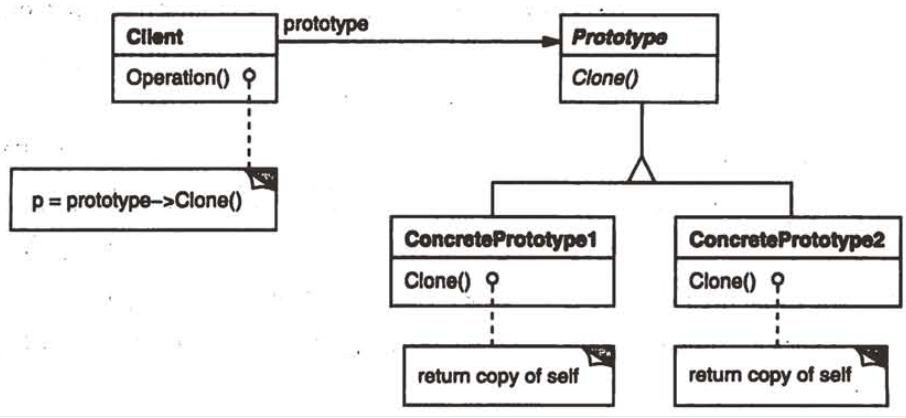

| Title                | Date             | Modified         | Category          |
|:--------------------:|:----------------:|:----------------:|:-----------------:|
| design patterns      | 2019-11-20 12:00 | 2019-11-20 12:00 | design patterns   |

# 原型

1 意图
用原型实例指定创建对象的种类，并且通过拷贝这些原型创建新的对象。
2 动机

3 适用性
当一个系统应该独立于它的产品创建，构成和表示时，要使用Prototype模式；以及
-当要实例化的类是在运行时刻指定时，例如，通过动态装载；或者
-为了避免创建一个与产品类层次平行的工厂类层次时；或者
-当一个类的实例只能有几个不同状态组合中的一种时。建立相应数目的原型并克隆它们可能比每次用合适的状态手工实例化该类更方便一些。

4 结构

5 参与者
-Prototype
声明一个克隆自身的接口。
-ConcretePrototype
实现一个克隆自身的操作
-Client
让一个原型克隆自身从而创建一个新的对象。

6 协作
客户请求一个原型克隆自身。

7 效果
Prototype有许多和Abstract Factory和Builder一样的效果：它对客户隐藏了具体的产品类，因此减少了客户知道的名字的数目。此外，这些模式使客户无需改变即可使用与特定应用相关的类。

下面列出Prototype模式的另外一些优点。
1）运行时刻增加和删除产品
2）改变值以指定新对象
3） 改变结构以指定新对象
4）减少子类的构造
5）用类动态配置应用

8 实现
当实现原型时，要考虑下面一些问题：
1）使用一个原型管理器。
2）实现克隆操作
3）初始化克隆对象

9 代码示例
10 已知应用
11 相关模式
