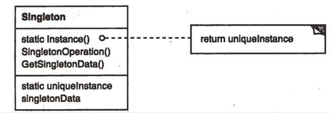

| Title                | Date             | Modified         | Category          |
|:--------------------:|:----------------:|:----------------:|:-----------------:|
| design patterns      | 2019-11-20 12:00 | 2019-11-20 12:00 | design patterns   |

# 单件

## 意图
保证一个类仅有一个实例，并提供一个访问它的全局访问点。

## 动机
对一些类来说，只有一个实例是很重要的。

我们怎么样才能保证一个类只有一个实例并且这个实例易于被访问呢？一个全局变量使得一个对象可以被访问，但它不能防止你实例化多个对象。

一个更好的办法是，让类自身负责保存它的唯一实例。这个类可以保证没有其他实例可以被创建（通过截取创建新对象的请求），并且它可以提供一个访问该实例的方法。这就是Singleton模式。

## 适用性
在下面的情况下可以使用Singleton模式
- 当类只能有一个实例而且客户可以从一个众所周知的访问点访问它时。
- 当这个唯一实例应该是通过子类化可扩展的，并且客户应该无需更改代码就能使用一个扩展的实例时。

## 结构

## 参与者

### Singleton
- 定义一个Instance操作，允许客户访问它的唯一实例。Instance是一个类操作
- 可能负责创建它自己的唯一实例。

## 协作
客户只能通过Singleton的Instance操作访问一个Singleton的实例。

## 效果
Singleton模式有许多优点：
- 对唯一实例的受控访问
- 缩小名空间
- 允许对操作和表示的精化
- 允许可变数目的实例
- 比类操作更灵活

## 实现
下面是使用Singleton模式时所要考虑的实现问题：
- 保证一个唯一的实例
- 创建Singleton类的子类

一个更灵活的方法是使用一个单件注册表（registry of singleton）。

## 代码示例

## 已知应用

## 相关模式
