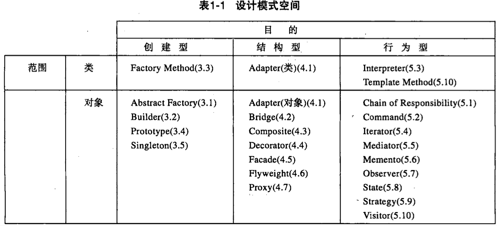
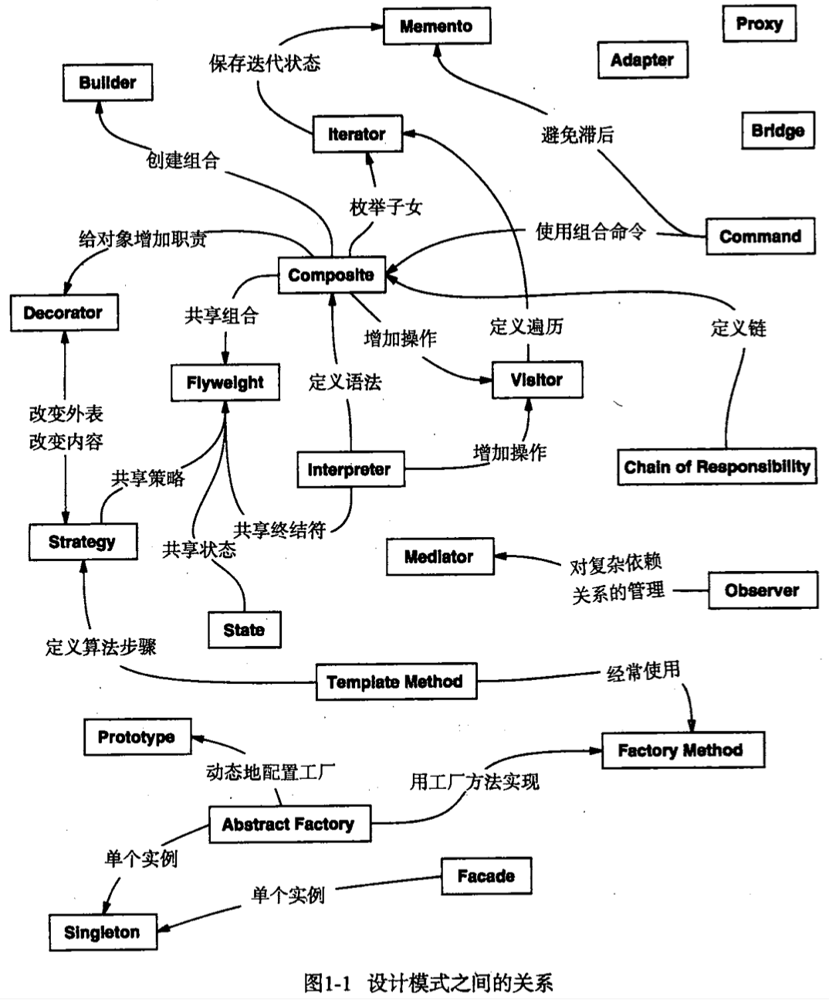

| Title                | Date             | Modified         | Category          |
|:--------------------:|:----------------:|:----------------:|:-----------------:|
| design patterns      | 2019-07-16 12:00 | 2019-11-20 12:00 | design patterns   |

# design patterns

- 设计模式，是对前人的已有的方案经验的总结，复用。
- 设计模式，通常依赖于面向对象设计相关的特性。
- 设计模式，重要是理解，灵活运用。不要生搬硬套，滥用，否则会造成过度设计。

### 历史
最早出现在建筑领域中

软件领域的设计模式是由 四人帮 在设计模式一书中提到的

### 定义

模式描述了一个在我们周围不断重复发生的问题，以及该问题的解决方案的核心。

即：模式是重复发生的问题的解决方案。

一般而言，一个模式包含如下几部分
-名称
-问题
-解决方案
-效果

《设计模式》一书把设计模式分为创建型模式，结构型模式，行为型模式，一共23个设计模式。

### 设计模式只是一把锤子

副标题：可复用面向对象软件的基础

设计模式解决的是“可复用”的设计问题

设计模式应用的领域是“面向对象”。

设计模式只能解决“可复用”的设计问题。

设计模式只是在面向对象语言中应用，如果是非面向对象的语言，就不怎么好用了。

所以，当你遇到一个问题就想到设计模式的时候，一定要注意“设计模式只是一把锤子”，不要拿着这把锤子到处去敲！

设计模式并没有提出新的解决方案，设计模式只是将前人的经验进行了总结，提炼出模式化的东西。

作用在于，对软件设计有很好的指导作用。用一些现有的思路去解决恰好对应的问题。

但是，不要为了用而用，要找到真正符合的问题。

### 设计模式之道

设计模式之道就隐藏在 “2.6.2封装实现依赖关系”的最后一段，很简单的一句话：
对变化的概念进行封装（encapsulate the concept that varies）。

首先，“找到变化”解决了“在哪里”使用设计模式的问题，即回答了“where”的问题。

其次，“封装变化”解决了“为什么”使用设计模式的问题，即回答了“why”的问题。

### 原则vs模式

设计原则和设计模式是互补的，设计原则和设计模式互补体现在：设计原则主要用于指导“类的定义”的设计；而设计模式主要用于指导“类的行为”的设计。

### 模式详解

“找到变化，封装变化”的设计模式之道，加上GOF给出的“基于接口编程，而不是基于实现编程”和“优先使用对象组合而不是类继承”两个设计原则，组成了《设计模式》一书中23个设计模式的指导思想，我称之为设计模式的“一个中心，两个基本点”紧紧抓住这个指导思想，理解23个设计模式就容易多了。

更进一步讲，GoF的23个设计模式，可以认为是“术”，而我们提炼出来的设计模式思想，却是“道”，如果你发现GoF的模式没有一个适合你，那么你完全可以自己想另外的方法来实现，而不必拘泥于已有的这23个设计模式。

### 为什么使用设计模式？
- 复用通用的模式。
- 沟通通用语言。
- 良好的设计

### 设计模式是必须的吗？
- 设计模式不是必须的。
- 设计模式提出之前，人们照常写代码，写面向对象的代码。
- 没有学过设计模式的同学，也可以写出不错的代码。
- 反而滥用设计模式会导致代码的复杂性。

### 我之前也没记住几个设计模式，但是也没有影响写出好的代码，我依据的是什么？
- 之前依据的是面向对象的思想，面向对象的原则。??
- 设计模式，是面向对象的思想，原则的，通用的实施方案。
- 虽然没有学过，或者没有记住几个设计模式。但由于有面向对象思想的指导。也可以写出不错的代码。??
- 甚至于，之前写的代码已经应用了许多的设计模式。只是没有得到命名。

- 或许，之前只是将模块进行大体的拆分，拆分之后，根本没有什么复杂的逻辑需要去面向对象的设计。
- 或许，之前的很多设计都是很糟糕的。
- 或许，只是动态性语言用多了，没有体验过静态类型语言那么麻烦。
- 我永远假设需求会更改，所以会做一些计划的设计，那就是尽可能的把代码拆分成多的模块，尽可能的解耦模块。
- python的鸭子类型，看起来像，那就是
- 设计的合理性，如果用静态语言的标准要求动态语言的编码，那动态语言的优势还有吗？
- 抽象使代码变得复杂，人类不擅长应对复杂的事务。

### 不依赖于面向对象的设计模式怎么用？
- 《软件工程》一书中也有说到，模式中封装经验的一般原则对于任何的软件设计都适用。
- 但我认为。设计模式，至少23个设计模式，都是依赖于面向对象的思想。
- 如果C语言用设计模式，那也是因为先要用面向对象的思想。
    - C语言作为面向过程的语言，也可以用面向对象的思想来写代码。
        - 例如，python源码中的PyObject。
        - 例如，内核中的kobject。
        - 例如，redis中的各种对象。
        

## 设计模式概述

在20世纪70年代，Christopher Alexander提出了城市建筑的模式，他认为：模式就是描述一个不断发生的问题和该问题的解决方案。

随后，Erich Gamma，Richard Helm，Ralph Johnson和John Vlissides写了一本著名的参考书《设计模式：可复用面向对象软件的基础》。后人也因为这本书称这4个人为4人组，将这本书中描述的模式称为GoF（Gang of Four）设计模式。

在这本书中，4人组将设计模式定义为：对被用来在特定场景下解决一般设计问题的类和互相通信的对象的描述。

通俗地说，可以把设计模式理解为对某一类问题的通用解决方案。

所谓“模式”是对问题和解决方案的基本内容的描述，所以该解决方案可以在不同的设置下复用。模式不是一个详细描述。实际上，可以把它当做积累的智慧和经验的描述。它是对一般问题的一个经过多次提炼的解决方案。

模式对面向对象的软件设计有着巨大的影响。除了作为常见问题的经验检验的解决方案外，模式已经成为了谈论设计必用词汇。因此，可以用对所用模式的描述来解释我们的设计。

## 设计模式与面向对象

设计模式通常和面向对象设计相关。现有的模式通常依赖于对象的特性，例如继承或多态，以提供通用性。

但是，模式中封装经验的一般原则对于任何的软件设计都适用。

模式是对其他设计师的知识和经验的一种复用。

软件设计最大的敌人，就是应付需求不断的变化。

如果从软件设计方法的角度出发，要在开发过程中应对未来可能的变化，解决之道则是——封装变化。

设计模式是“封装变化”思想的最佳阐释。

封装变化是开放封闭原则的具体体现。

## 设计模式的应用

开始设计一个系统时，很难确定是否需要一个特定的模式。因此，在设计过程中使用模式通常包括：进行设计，体验问题，然后找到一个可用的模式。

我们当然有可能在原始模式书中所记载的23种通用模式中找到答案，但有时候我们遇到的问题是一个不同的问题，那么你会发现，在已提出的数百个模式中寻找一个合适的解决方案不是件容易的事。

模式是一个绝妙的想法，但需要知道每个模式适用的情况，因此要在软件设计中不断积累经验才能学会有效地运用模式。缺乏经验的程序员，即便是阅读过介绍模式的书籍，也会苦于确定是应该复用一个模式，还是应该开发一个专门的解决方案。

学习设计模式最重要的是理解，而不是生搬硬套。

要切记不能滥用设计模式，尤其在一些简单系统中。

如果系统中的对象都用工厂模式创建，系统中的工具类都设计成Singleton，两个对象间的通信还要硬加上一层Mediator等都是不可取的，只能毫无价值的提高系统复杂度，反而不利于系统的理解与维护。

除最初的设计外，重构也是一个很好的时机，系统架构设计师可以在重构的时候根据需要逐步应用设计模式改良系统，提高系统的维护性和复用性。

## 设计模式要素

一般而言，一个模式有四个基本要素：
1. 模式名称（pattern name）
2. 问题（problem）
3. 解决方案（solution）
4. 效果（consequences）

## 描述设计模式

我们将用统一的格式描述设计模式，每一个模式根据以下的模板被分成若干部分。模板具有统一的信息描述结构，有助于学习使用。

- 模式名和分类
- 意图
- 别名
- 动机
- 适用性
- 结构
- 参与者
- 协作
- 效果
- 实现
- 代码实例
- 已知应用
- 相关模式

## 设计模式编目
## 23种经典设计模式

- Abstract Factory： 提供一个创建一系列相关或相互依赖对象的接口，而无需指定它们具体的类。
- Adapter：将一个类的接口转换成客户希望的另外一个接口。Adapter模式使得原本由于接口不兼容而不能一起工作的那些类可以一起工作。
- Bridge：将抽象部分与它的实现部分分离，使它们都可以独立地变化。
- Builder：将一个复杂对象的构建与它的表示分离，使得同样的构建过程可以创建不同的表示。
- Chain of Responsibilty：为解除请求的发送者和接收者之间耦合，而使多个对象都有机会处理这个请求。将这些对象连成一条链，并沿着这条链传递该请求，直到有一个对象处理它。
- Command：将一个请求封装为一个对象，从而使你可用不同的请求对客户进行参数化；对请求排队或记录请求日志，以及支持可取消的操作。
- Composite：将对象组合成树形结构以表示“部分-整体”的层次结构。Composite使得客户对单个对象和复合对象的使用具有一致性。
- Decorator：动态地给一个对象添加一些额外的职责。就扩展功能而言，Decorator模式比生成子类方式更为灵活。
- Facade：为子系统中的一组接口提供一个一致的界面，Facade模式定义了一个高层接口，这个接口使得这一子系统更加容易使用。
- Factory Method：定义一个用于创建对象的接口，让子类决定将哪一个类实例化。Factory Method使一个类的实例化延迟到其子类。
- Flyweight：运用共享技术有效地支持大量细粒度的对象。
- Interpreter：给定一个语言，定义它的文法的一种表示，并定义一个解释器，该解释器使用该表示来解释语言中的句子。
- Iterator：提供一种方法顺序访问一个聚合对象中各个元素，而又不需暴露该对象内部表示。
- Mediator：用一个中介对象来封装一系列的对象交互。中介者使各对象不需要显式地相互引用，从而使其耦合松散，而且可以独立地改变它们之间的交互。
- Memento：在不破坏封装性的前提下，捕获一个对象的内部状态，并在该对象之外保存这个状态。这样以后就可将该对象恢复到保存的状态。
- Observer：定义对象间的一种一对多的依赖关系，以便当一个对象的状态发生改变时，所有依赖于它的对象都得到通知并自动刷新。
- Prototype：用原型实例指定创建对象的种类，并且通过拷贝这个原型来创建新的对象。
- Proxy：为其他对象提供一个代理以控制对这个对象的访问。
- Singleton：保证一个类仅有一个实例，并提供一个访问它的全局访问点。
- State：允许一个对象在其内部状态改变时改变它的行为。对象看起来似乎修改了它所属的类。
- Strategy：定义一系列的算法，把它们一个个封装起来，并且使它们可相互替换。本模式使得算法的变化可独立于使用它的客户。
- Template Method：定义一个操作中的算法的骨架，而将一些步骤延迟到子类中。Template Method使得子类可以不改变一个算法的结构即可重定义该算法的某些特定步骤。
- Visitor：表示一个作用于某对象结构中的各元素的操作。它使你可以在不改变各元素的类的前提下定义作用于这些元素的新操作。

## 设计模式分类

对设计模式的分类整理是重要的，它为我们使用的各种技术提供了标准的名称和定义。如果我们不研究软件中的设计模式，就无法对它们进行改进，更难以提出新的设计模式。

我们根据两条准则对模式进行分类。

第一是目的准则，即模式是用来完成什么工作的。
模式依据其目的可分为创建型（Creational），结构型（Structural），行为型（Behavioral）三种。
创建型模式与对象的创建有关。
结构型模式处理类或对象的组合。
行为型模式对类或对象怎样交互和怎样分配职责进行描述。

第二是范围准则，指定模式主要是用于类还是用于对象。
类模式处理类和子类之间的关系，这些关系通过继承建立，是静态的，在编译时刻便确定下来了。
对象模式处理对象间的关系，这些关系在运行时刻是可以变化的，更具动态性。

显然，存在着许多组织设计模式的方法。从多角度去思考模式有助于对它们的功能，差异和应用场合的更深入理解。

## 设计模式将带来什么

- 一套通用的设计词汇
- 书写文档和学习的辅助手段
- 现有方法的一种补充
- 重构的目标