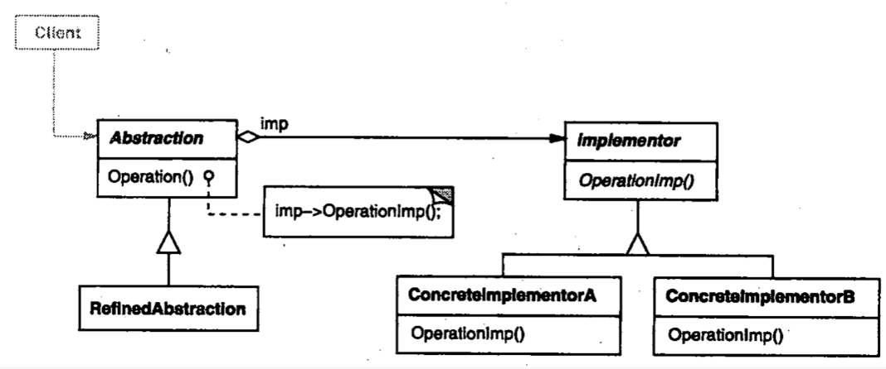

| Title                | Date             | Modified         | Category          |
|:--------------------:|:----------------:|:----------------:|:-----------------:|
| design patterns      | 2019-11-20 12:00 | 2019-11-20 12:00 | design patterns   |

# 桥接

1 意图
将抽象部分与它的实现部分分离，使它们都可以独立地变化。

2 别名
Handle/Body

3 动机

4 适用性
以下一些情况使用Bridge模式：
-你不希望在抽象和它的实现部分之间有一个固定的绑定关系。例如这种情况可能是因为，在程序运行时刻实现部分应可以被选择或者切换。
-类的抽象以及它的实现都应该可以通过生成子类的方法加以扩充。这时Bridge模式使你可以对不同的抽象接口和实现部分进行组合，并分别对它们进行扩充。
-对一个抽象的实现部分的修改应对客户不产生影响，即客户的代码不必重新编译。
-（C++）你想对客户完全隐藏抽象的实现部分。在C++中，类的表示在类接口中是可见的。
-正如在意图一节的第一个类图中所示的那样，有许多类要生成。这样一种类层次结构说明你必须将一个对象分解成两个部分。
-你想在多个对象间共享实现（可能使用引用计数），但同时要求客户并不知道这一点。

5 结构

6 参与者
-Abstraction
定义抽象类的接口
维护一个指向Implementor类型对象的指针。
-RefinedAbstraction
扩充由Abstraction定义的接口。
-Implementor
定义实现类的接口，该接口不一定要与Abstraction的接口完全一致；事实上这两个接口可以完全不同。一般来讲，Implementor接口仅提供基本操作，而Abstraction则定义了基于这些基本操作的较高层次的操作。
-ConcreteImplementor
实现Implementor接口并定义它的具体实现

7 协作
Abstraction将Client的请求转发给它的Implementor对象。

8 效果
1）分离接口及其实现部分
2）提高可扩充性
3）实现细节对客户透明

9 实现
使用Bridge模式时需要注意以下一些问题：
1）仅有一个Implementor
2）创建正确的Implementor对象
3）共享Implementor对象
4）采用多重继承机制

10 代码示例
11 已知应用
12 相关模式

