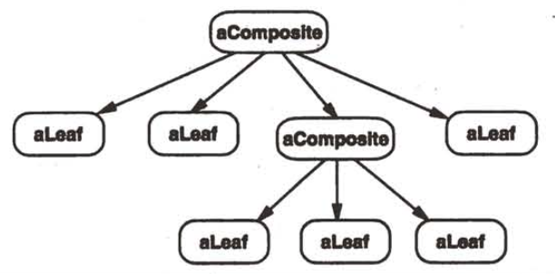

| Title                | Date             | Modified         | Category          |
|:--------------------:|:----------------:|:----------------:|:-----------------:|
| design patterns      | 2019-11-20 12:00 | 2019-11-20 12:00 | design patterns   |

# 组合

## 意图
将对象组合成树形结构以表示”部分-整体“的层次结构。Composite使得用户对单个对象和组合对象的使用具有一致性。

## 动机

## 适用性
以下情况使用Composite模式：
-你想表示对象的部分-整体层次结构。
-你希望用户忽略组合对象与单个对象的不同，用户将统一地使用组合结构中的所有对象。

## 结构

典型的Composite对象结构如下图所示。

## 参与者

### Component
- 为组合中的对象声明接口。
- 在适当的情况下，实现所有类共有接口的缺省行为。
- 声明一个接口用于访问和管理Component的子组件。
- （可选）在递归结构中定义一个接口，用于访问一个父部件，并在合适的情况下实现它。

### Leaf
- 在组合中表示叶节点对象，叶节点没有子节点。
- 在组合中定义图元对象的行为。

### Composite
- 定义有子部件的那些部件的行为。
- 存储子部件。
- 在Component接口中实现与子部件有关的操作。

### Client
通过Component接口操纵组合部件的对象。

## 协作
用户使用Component类接口与组合结构中的对象进行交互。如果接收者是一个叶节点，则直接处理请求。如果接收者是Composite，它通常将请求发送给它的子部件，在转发请求之前与/或之后可能执行一些辅助操作。

## 效果
Composite模式
- 定义了包含基本对象和组合对象的类层次结构
- 简化客户代码
- 使得更容易增加新类型的组件
- 使你的设计变得更加一般化

## 实现
我们在实现Composite模式时需要考虑以下几个问题：
- 显式的父部件引用
- 共享组件
- 最大化Component接口
- 声明管理子部件的操作
- Component是否应该实现一个Component列表
- 子部件排序
- 使用高速缓冲存贮改善性能
- 应该由谁删除Component 在没有垃圾回收机制的语言中，当一个Composite被销毁时，通常最好由Composite负责删除其子节点。但有一种情况除外，即Leaf对象不会改变，因此可以被共享。
- 存贮组件最好用哪一种数据结构 

## 代码示例
## 已知应用
## 相关模式
