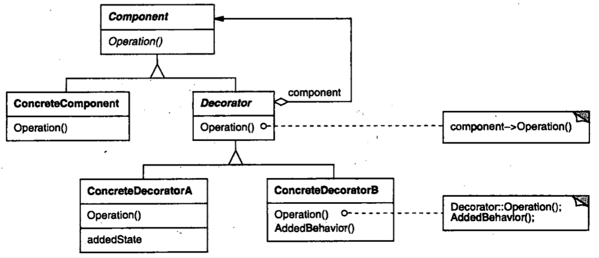

| Title                | Date             | Modified         | Category          |
|:--------------------:|:----------------:|:----------------:|:-----------------:|
| design patterns      | 2019-11-20 12:00 | 2019-11-20 12:00 | design patterns   |

# 装饰

1 意图
动态地给一个对象添加一些额外的职责。就增加功能来说，Decorator模式相比生成子类更为灵活。

2 别名
包装器Wrapper

3 动机
有时我们希望给某个对象而不是整个类添加一些功能。

4 适用性
以下情况使用Decorator模式
-在不影响其他对象的情况下，以动态，透明的方式给单个对象添加职责。
-处理那些可以撤销的职责。
-当不能采用生成子类的方法进行扩充时。一种情况是，可能有大量独立的扩展，为支持每一种组合将产生大量的子类，使得子类数目呈爆炸性增长。另一种情况可能是因为类定义被隐藏，或类定义不能用于生成子类。

5 结构

6 参与者
-Component
定义一个对象接口，可以给这些对象动态地添加指责。
-ConcreteComponent
定义一个对象，可以给这个对象添加一些指责。
-Decorator
维持一个指向Component对象的指针，并定义一个与Component接口一致的接口。
-ConcreteDecorator
向组件添加职责

7 协作
Decorator将请求转发给它的Component对象，并有可能在转发请求前后执行一些附加的动作。

8 效果
Decorator模式至少有两个主要优点和两个缺点：
1）比静态继承更灵活
2）避免在层次机构高层的类有太多的特征
3）Decorator与它的Component不一样
4）有许多小对象

9 实现
使用Decorator模式时应注意以下几点：
1）接口的一致性
2）省略抽象的Decorator类
3）保持Component类的简单性
4）改变对象外壳与改变对象内核

10 代码示例
11 已知应用

12 相关模式
