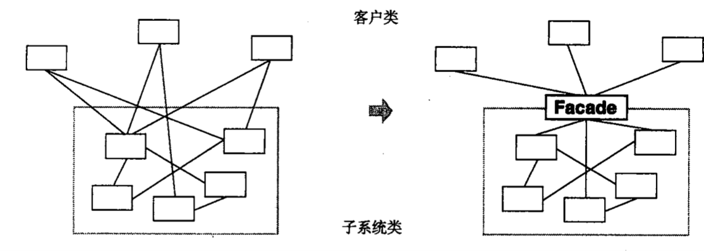
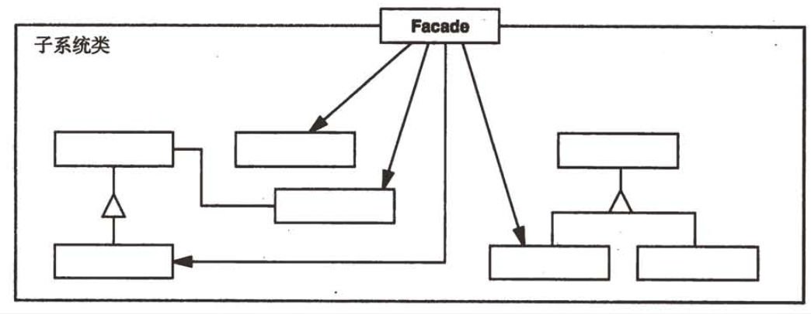

| Title                | Date             | Modified         | Category          |
|:--------------------:|:----------------:|:----------------:|:-----------------:|
| design patterns      | 2019-11-20 12:00 | 2019-11-20 12:00 | design patterns   |

# 外观

## 意图
为子系统中的一组接口提供一个一致的界面，Facade模式定义了一个高层接口，这个接口使得这一子系统更加容易使用。

## 动机
将一个系统划分成为若干个子系统有利于降低系统的复杂性。

## 适用性
当遇到以下情况使用Facade模式
- 当你要为一个复杂子系统提供一个简单接口时。子系统往往因为不断演化而变得越来越复杂。大多数模式使用时都会产生更多更小的类。这使得子系统更具可重用性，也更容易对子系统进行定制，但这也给那些不需要定制子系统的用户带来一些使用上的困难。Facade可以提供一个简单的缺省视图，这一视图对大多数用户来说已经足够，而那些需要更多的可定制性的用户可以越过facade层。
- 客户程序与抽象类的实现部分之间存在着很大的依赖性。引入facade将这个子系统与客户以及其他的子系统分离，可以提高子系统的独立性和可移植性。
- 当你需要构建一个层次结构的子系统时，使用facade模式定义子系统中每层的入口点。如果子系统之间是相互依赖的，你可以让它们仅通过facade进行通讯，从而简化了它们之间的依赖关系。

## 结构

## 参与者
### Facade
- 知道哪些子系统类负责处理请求
- 将客户的请求代理给适当的子系统对象

### Subsystem classes
- 实现子系统的功能
- 处理由Facade对象指派的任务
- 没有facade的任何相关信息；即没有指向facade的指针。

### 协作
- 客户程序通过发送请求给Facade的方式与子系统通讯，Facade将这些消息转发给适当的子系统对象。尽管是子系统中的有关对象在做实际工作，但Facade模式本身也必须将它的接口转换成子系统的接口。
- 使用Facade的客户程序不需要直接访问子系统对象。

## 效果
Facade模式有下面一些优点：
- 它对客户屏蔽子系统组件，因而减少了客户处理的对象的数目并使得子系统使用起来更加方便。
- 它实现了子系统与客户之间的松耦合关系，而子系统内部的功能组件往往是紧耦合的。
- 如果应用需要，它并不限制它们使用子系统类。因此你可以在系统易用性和通用性之间加以选择。

## 实现
使用Facade模式时需要注意以下几点：
- 降低客户-子系统之间的耦合度
- 公共子系统类与私有子系统类

## 代码示例
## 已知应用
## 相关模式
