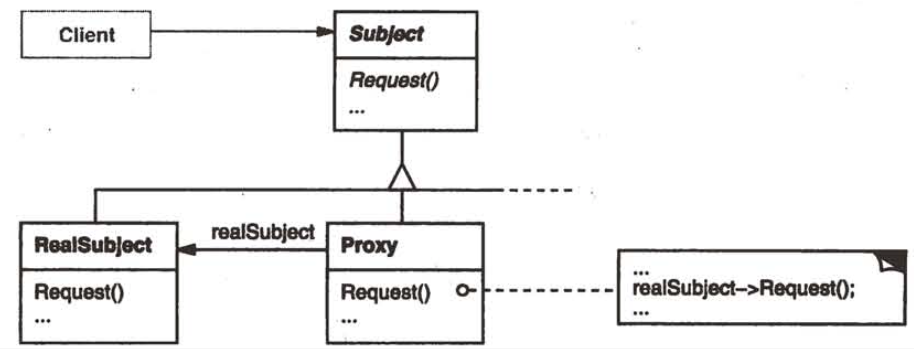
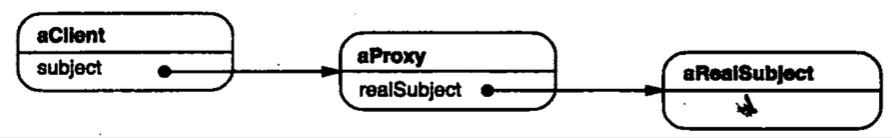

| Title                | Date             | Modified         | Category          |
|:--------------------:|:----------------:|:----------------:|:-----------------:|
| design patterns      | 2019-11-20 12:00 | 2019-11-20 12:00 | design patterns   |

# 代理

## 意图
为其他对象提供一种代理以控制对这个对象的访问。

## 别名
Surrogate

## 动机
对一个对象进行访问控制的一个原因是为了只有在我们确实需要这个对象时才对它进行创建和初始化。

## 适用性
在需要用比较通用和复杂的对象指针代替简单的指针的时候，使用Proxy模式。下面是一些可以使用Proxy模式场景情况：
- 远程代理（Remote Proxy）为一个对象在不同的地址空间提供局部代表。
- 虚代理（Virtual Proxy）根据需要创建开销很大的对象。
- 保护代理（Protection Proxy）控制对原始对象的访问。保护代理用于对象应该有不同的访问权限的时候。
- 智能指引（Smart Reference）取代了简单的指针，它在访问对象时执行一些附加操作。它的典型用途包括：
- 对指向实际对象的引用计数，这样当该对象没有引用时，可以自动释放它（也称为Smart Pointers[Ede92]）。
- 当第一次引用一个持久对象时，将它装入内存。
- 在访问一个实际对象前，检查是否已经锁定了它，以确保其他对象不能改变它。

## 结构

这是运行时刻一种可能的代理结构的对象图。

## 参与者

### Proxy
- 保存一个引用使得代理可以访问实体。若RealSubject和Subject的接口相同，Proxy会引用Subject。
- 控制对实体的存取，并可能负责创建和删除它。

其他功能依赖于代理的类型：
- Remote Proxy负责对请求及其参数进行编码，并向不同地址空间中的实体发送已编码的请求。
- Virtual Proxy可以缓存实体的附加信息，以便延迟对它的访问。
- Protection Proxy检查调用者是否具有实现一个请求所必须的访问权限。

### Subject
定义RealSubject和Proxy的共用接口，这样就在任何使用RealSubject的地方都可以使用Proxy。

### RealSubject
定义Proxy所代表的的实体。

## 协作
代理根据其种类，在适当的时候向RealSubject转发请求。

## 效果
Proxy模式在访问对象时引入了一定程度的间接性。根据代理的类型，附加的间接性有多种用途：
- Remote Proxy可以隐藏一个对象存在于不同地址空间的事实。
- Virtual Proxy可以进行最优化，例如根据要求创建对象。
- Protection Proxies和Smart Reference都允许在访问一个对象时有一些附加的内务处理（Housekeeping task）。

Proxy模式还可以对用户隐藏另一种称之为copy-on-write的优化方式，该优化与根据需要创建对象有关。拷贝一个庞大而复杂的对象是一种开销很大的操作，如果这个拷贝根本没有被修改，那么这些开销就没有必要。用代理延迟这一拷贝过程，我们可以保证只有当这个对象被修改的时候才对它进行拷贝。

在实现Copy-on-write时必须对实体进行引用计数。拷贝代理仅会增加引用计数。只有当用户请求一个修改该实体的操作时，代理才会真正的拷贝它。在这种情况下，代理还必须减少实体的引用计数。当引用计数的数目为零时，这个实体将被删除。

Copy-on-Write可以大幅度的降低拷贝庞大实体时的开销。

## 实现

## 代码示例
## 已知应用
## 相关模式

