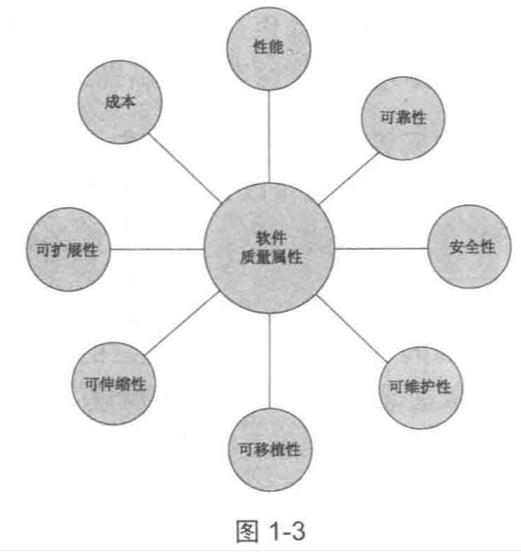

| Title                | Date             | Modified         | Category          |
|:--------------------:|:----------------:|:----------------:|:-----------------:|
| design      | 2019-11-23 12:00 | 2019-11-23 12:00 | design   |

## 为什么需要设计模式？

## 从上一个问题想到，为什么需要面向对象？

## 为什么自己会想到上面两个问题？

我已经很久没有去认真思考，或者看过关于编程思想的一些书了

还有，我本身对于C++，Java是比较排斥的，我喜欢的语言有python，Go，C。
其实最近对于Python的动态性也有很多的讨厌了。python在写大型项目的时候不好把控。

一看到各种接口，各种实现等，就会感觉到复杂。尤其是在python中出现。
可能，问题本身比较复杂，实现可能是没问题的。

有些人写各种语言的风格都是一样，从来不考虑各种语言的差别。

人本身是不善于处理复杂的事物的。

## 从书中寻找答案
首先，设计模式，面向对象等都是要解决关于怎么设计的问题。

设计的一种思想。

思想上的东西，一定都是要辩证的。

当自己无法想清楚这件事的时候，就要读一些经典的书，
不同类别的书，甚至于不同思想的书，如经典的软件设计流程，和敏捷开发，极限编程等。

辩证的东西，都是有两方面的，没有分歧的思想，不经过辩证的思想是不成熟的。

经过辩证的思想，才能为我所用。

## 原点 - 程序设计。

程序，在磁盘里是一个文件，运行起来是进程。在内核中是内核线程。
程序的本质，是数据+算法。

设计，设计的目的是如何驾驭复杂的程序逻辑。

不弄清楚本质怎么行呢？

## 来自《人月神话》一书中的观点
所有软件活动包括
- 根本任务：打造由抽象软件实体构成的复杂概念结构，
- 次要任务：使用编程语言表达这些抽象实体，在空间和时间限制内将它们映射成机器语言。

面向对象主要是在解决次要任务上面有作用。

而根本性问题依旧复杂，没有银弹。

## 程序设计思想进化史

### 史前时代：面向机器

起初，人们写01串，输入机器。

然后，创建了汇编语言做标记。

### 脱离机器第一步：面向过程

COBOL, FORTRAN, BASIC, C语言等。

### 第一次软件危机：结构化程序设计
结构化程序设计的主要特点是抛弃goto语句，采取“自顶向下，逐步细化，模块化”的指导思想。

结构化程序设计本质上还是一种面向过程的设计思想，但通过“自顶向下，逐步细化，模块化”的方法，将软件的复杂度控制在一定范围内，从而从整体上降低了软件开发的复杂度。

科学研究证明，人脑存在人类短期记忆，一般一次只能记住5~9个事物，这就是著名的7+-2原理。

### 第二次软件危机：面向对象程序设计

面向对象开始时也被当作解决软件危机的银弹，但事实证明，和软件工程一样，面向对象也不是银弹，而只是一种新的软件方法而已。

虽然面向对象并不是解决软件危机的银弹，但和面向过程相比，面向对象的思想更加贴近人类思维的特点，更加脱离机器思维，也是软件设计思想上的一次巨大的飞跃。

## 面向过程

面向过程是一种以“过程”作为中心的编程思想，其中过程的含义就是“完成一件事情的步骤”。

即使我们使用面向对象的语言进行开发，最后转换为CPU能执行的指令，也还是面向过程的。所以说，面向过程无处不在，是计算机的基石。

## 面向对象

### 什么是面向对象？

以一种我们可以理解的抽象，去构造。

面向对象是一种以“对象”作为中心的编程思想，其中对象的含义可以理解为“存在的东西”。

面向对象这种对现实世界的模拟的思想，其本质上就是“人的思想”，这是一个质的飞跃，意味着程序员可以按照人的思想来观察，分析，设计系统。

人大部分的时间都是按照面向对象的方式进行思考的，而且人类世界主要也是按照面向对象的方式进行运转的，所以说，“面向对象”其实更加符合人的思维习惯。

在面向过程中有“程序=算法+数据结构”的经典总结，面向对象也有类似的总结：“程序=对象+交互”。其中对象就是具体存在的事物，而交互则是事物之间的相互作用，互动等。

### 为什么要面向对象

面向对象思想的核心是“可扩展性”！有了面向对象，我们可以将变化带来的影响控制在有限的范围内，避免产生全流程或者大范围的影响，从而降低风险。

### 面向对象的应用范围

#### 能做什么
经常变化的地方就是面向对象应用的地方。

#### 不能做什么
图1-3所示的是软件质量属性的全图。

可以看到，“可扩展性”只是软件质量属性中很小的一部分，其他的属性都不是面向对象能够解决的。

明白了面向对象的特点和适用范围，是面向对象的关键。

经过前面的分析，我们知道，面向对象不是瑞士军刀，而只是一个普通的锤子而已，千万不要拿着锤子到处敲！

### 面向对象迷思

#### 面向对象会导致性能降低？

#### 面向对象语言=面向对象编程？

其实，不管是“面向过程”还是“面向对象”，都是一种思维方式，一种思考问题的方式，而和具体的语言没有关系。

用C语言一样可以写出面向对象的程序，用Java也可以写出面向过程的程序。

### 面向对象三大核心特征

#### 封装
封装的思想很重要，合理的隐藏和公开。

#### 继承
继承一般是为了复用代码，但是一般都用不好。使设计变得复杂。

一般推荐用组合。

#### 多态

定义接口。

但是在python中，鸭子类型，看起来像，那就是。不需要显式的定义接口。

### 设计原则

#### 内聚

##### 内聚是什么

内聚指一个模块内部元素彼此结合的紧密程度。

你可以用“内聚”来判断一个函数设计是否合理，一个类设计是否合理，一个接口设计是否合理，一个包设计是否合理，一个模块/子系统设计是否合理。

“凝聚力”就是“内聚”的核心思想。

##### 内聚的分类

内聚共有7种，以下各种形式内聚的内聚性越来越高。

- 偶然内聚（Coincidental cohesion）
- 逻辑内聚（Logical cohesion）
- 时间内聚（Temporal cohesion）
- 过程内聚（Procedural cohesion）
- 信息内聚（Informational/Communicational cohesion）
- 顺序内聚（Sequential cohesion）
- 功能内聚（Functional cohesion）

#### 耦合

##### 耦合是什么
耦合（或者称依赖）是程序模块相互之间的依赖程度。

从定义来看，耦合和内聚是相反地：内聚关注模块内部的元素结合程度；耦合关注模块之间的依赖程度。

模块和内聚里面提到的模块一样，耦合中的模块其实也是可大可小的。常见的模块有：函数，类，包，子模块，子系统等

##### 耦合的分类
- 无耦合（No coupling）
- 消息耦合（Message coupling）
- 数据耦合（Data coupling）
- 数据结构耦合（Data-structured coupling）
- 控制耦合（Control coupling）
- 外部耦合（External coupling）
- 全局耦合（Globaling coupling）
- 内容耦合（Content coupling）

#### 高内聚低耦合

为什么要高内聚低耦合？
降低复杂性。

### 类的设计原则

#### SRP
单一职责原则

#### OCP
开闭原则

#### LSP
里氏替换原则

#### ISP
接口隔离原则

#### DIP
依赖反转原则

### NOP

不要过度设计原则

## 设计模式？

### 历史
最早出现在建筑领域中

软件领域的设计模式是由 四人帮 在设计模式一书中提到的

### 定义

模式描述了一个在我们周围不断重复发生的问题，以及该问题的解决方案的核心。

即：模式是重复发生的问题的解决方案。

一般而言，一个模式包含如下几部分
-名称
-问题
-解决方案
-效果

《设计模式》一书把设计模式分为创建型模式，结构型模式，行为型模式，一共23个设计模式。

### 设计模式只是一把锤子

副标题：可复用面向对象软件的基础

设计模式解决的是“可复用”的设计问题

设计模式应用的领域是“面向对象”。

设计模式只能解决“可复用”的设计问题。

设计模式只是在面向对象语言中应用，如果是非面向对象的语言，就不怎么好用了。

所以，当你遇到一个问题就想到设计模式的时候，一定要注意“设计模式只是一把锤子”，不要拿着这把锤子到处去敲！

设计模式并没有提出新的解决方案，设计模式只是将前人的经验进行了总结，提炼出模式化的东西。

作用在于，对软件设计有很好的指导作用。用一些现有的思路去解决恰好对应的问题。

但是，不要为了用而用，要找到真正符合的问题。

### 设计模式之道

设计模式之道就隐藏在 “2.6.2封装实现依赖关系”的最后一段，很简单的一句话：
对变化的概念进行封装（encapsulate the concept that varies）。

首先，“找到变化”解决了“在哪里”使用设计模式的问题，即回答了“where”的问题。

其次，“封装变化”解决了“为什么”使用设计模式的问题，即回答了“why”的问题。

### 原则vs模式

设计原则和设计模式是互补的，设计原则和设计模式互补体现在：设计原则主要用于指导“类的定义”的设计；而设计模式主要用于指导“类的行为”的设计。

### 模式详解

“找到变化，封装变化”的设计模式之道，加上GOF给出的“基于接口编程，而不是基于实现编程”和“优先使用对象组合而不是类继承”两个设计原则，组成了《设计模式》一书中23个设计模式的指导思想，我称之为设计模式的“一个中心，两个基本点”紧紧抓住这个指导思想，理解23个设计模式就容易多了。

更进一步讲，GoF的23个设计模式，可以认为是“术”，而我们提炼出来的设计模式思想，却是“道”，如果你发现GoF的模式没有一个适合你，那么你完全可以自己想另外的方法来实现，而不必拘泥于已有的这23个设计模式。

## 计划的设计与演进的设计

### 计划的设计
提前设计好，再进行开发。

设计阶段需要花费大量的时间精力。
如果需求有变动，又要重新进行设计。

### 演进的设计
写代码吧，有新的需求，重构。

不可忽视重构的成本。

## 敏捷开发
敏捷开发告诉我们，为当下功能进行设计，不要假设未知的变化。否则会导致过度设计。

当变化真正来临的时候，重构当前设计，以满足变化的需求。

## 重构

任何的设计都不可能hold住所有的变化，即使是计划的设计。

重构是不可避免的。

重构让设计变得简单直接 的 表达需求。

以设计模式作参考，可以很好地组织。

## 关于几个编程语言

### python
我认为，Python是一门更加高级的语言。很多设计模式已经隐藏其中。
Python的动态性是优点也是缺点。

### C
C一般人叫做面向过程的语言。但其实C也是可以面向对象的思想。

### Go
没有继承的概念。

### Java
语言本身就存在着过度设计。更何况使用其设计的程序呢

## 架构设计

### 是什么
架构设计就是设计系统的顶层结构。

### 为什么做架构设计
架构设计是为了隔离关注点，降低复杂度。
架构设计是为了分工合作。

架构设计就是“面向对象”思想的一个具体应用而已。也就是说，“面向对象”的思想既可以指导程序设计，也可以指导架构设计；而且在架构设计领域，可以说只有“面向对象”这一种指导思想，因为架构设计必须划分出模块并设计好模块的交互方式。

更进一步分析：
面向对象程序设计通过封装“类”来降低复杂度，
面向对象架构设计通过封装为“模块”来降低复杂度；
面向对象程序设计通过“类交互”来完成分工合作，
面向对象架构设计通过“模块交互”来完成分工合作。

### 架构设计原则

#### 客户需求优先原则

#### 适当超前原则

唯一不变的是变化！

首先要满足客户需求，然后再超越客户需求。

关键在于“适当”二字。

### 架构设计屠龙刀

#### "拆"与"合"

#### 拆的常用手段

- 拆硬件
- 拆地点
- 拆功能
- 简单实例

#### 合的常见手段

- 客户端合
- 网络合
- 中间件合
- 子系统合

### 优秀架构设计品质

创新
