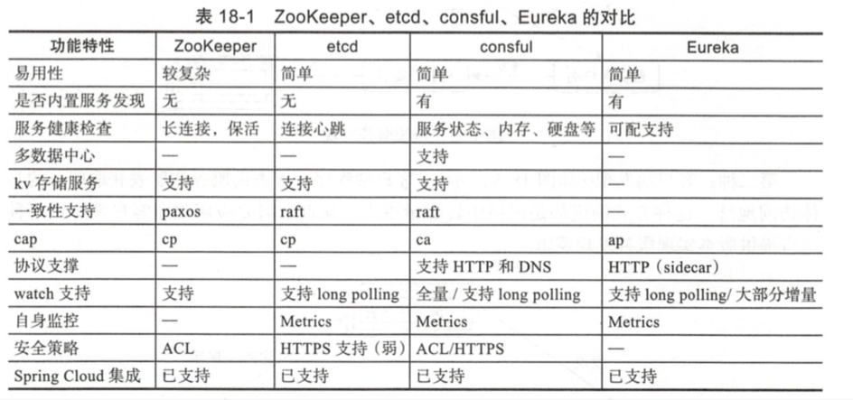

| Title                | Date             | Modified         | Category          |
|:--------------------:|:----------------:|:----------------:|:-----------------:|
| micros              | 2019-05-29 12:00 | 2019-05-29 12:00 | micros            |


# Consul


## 概念


### 服务注册与发现





### Consul


## 演示

### install consul
`$brew install consul`

#### verifying the installation
`$consul`


### run the agent
#### starting the agent
`$consul agent -dev`


为了简单，我们以开发模式启动consul agent。这个模式可以快速和容易的启动一个单节点的consul环境. 这个模式不适合用于生产环境，因为它不保存任何状态。


#### cluster members


```
$consul members
Node         Address         Status  Type    Build  Protocol  DC   Segment
avril.local  127.0.0.1:8301  alive   server  1.3.0  2         dc1  <all>
```

在另一个terminal中执行`consul members`，你可以看到consul cluster的members，你可以看到，只有 one member（yourself）.

输出显示了我们自己的node，这address it is running on，its health state, its role in the cluster, and some version information. 额外的元数据信息可以通过`-detailed` flag看到.


这个命令的输出，基于`gossip protocol`, and is 最终一致的。也就是说，在任何节点在同一时间，看到的世界，by 你本地的agent 可能不完全匹配这状态在servers。一个强一致的系统的展示，可以用这`HTTP API` 去远程请求consul servers
```
$curl localhost:8500/v1/catalog/nodes
[
    {
        "ID": "9a8b671d-ffdb-6445-f436-9ad02cf7d219",
        "Node": "avril.local",
        "Address": "127.0.0.1",
        "Datacenter": "dc1",
        "TaggedAddresses": {
            "lan": "127.0.0.1",
            "wan": "127.0.0.1"
        },
        "Meta": {
            "consul-network-segment": ""
        },
        "CreateIndex": 9,
        "ModifyIndex": 10
    }
]

```


对于这个HTTP API额外的说一下，`DNS interface`可以被用来请求这个节点。提示：你必须确保你的DNS 发现 指向 consul agent's DNS server, which 运行在 8600默认端口上的。这DNS 入口的格式，（类似 "avril.local.node.consul"）可以被发现在一会

```
$dig @127.0.0.1 -p 8600 avril.local.node.cansul


; <<>> DiG 9.10.6 <<>> @127.0.0.1 -p 8600 avril.local.node.cansul
; (1 server found)
;; global options: +cmd
;; Got answer:
;; ->>HEADER<<- opcode: QUERY, status: SERVFAIL, id: 56796
;; flags: qr rd; QUERY: 1, ANSWER: 0, AUTHORITY: 0, ADDITIONAL: 0
;; WARNING: recursion requested but not available

;; QUESTION SECTION:
;avril.local.node.cansul.	IN	A

;; Query time: 2 msec
;; SERVER: 127.0.0.1#8600(127.0.0.1)
;; WHEN: Tue Oct 23 15:50:13 CST 2018
;; MSG SIZE  rcvd: 41


```

#### stopping the agent

你可以`ctrl-C`去优雅的停止这个agent，当中断这个agent，你可以看到，它离开的cluster，and shut down。

为了优雅的leaving，consul 通知其他集群成员，这个节点离开了。如果你强行kill这个agent 进程，其他成员将发现这个node fail的。
当一个成员离开，它的服务和检查，将从catalog移除。当一个成员fails，它的健康仅仅标记为critical, 但它不会从catalog中移除。
cansul往往会重连 failed nodes，允许它从好的网络状态下恢复。然而离开的节点永远不会联系。

另外，如果一个agent 正在操作一个server，一个优雅的离开方式是重要的，去避免造成一些超出控制的影响.


### services

#### registering services

在前面的步骤里，我们运行了我们的第一个agent，查看了集群的成员，并且访问了这个节点。在本节guide，我们将注册我们第一个service，并且query这个service。


#### defining a service

一个服务，可以通过，提供一个服务定义文件，或者调用一个合适的HTTP API

一个服务定义，是最常用的方式去注册service，所以，我们用这种方式开启下一步。我们将基于上一步的agent 配置。


首先，创建一个目录用于consul configuration。consul loads 所有的配置文件，in the 配置目录，所以一个通用的形式，在unix系统上是定义这个目录like `/etc/consul.d`(the .d suffix implies "this directory contaions a set of configuration files").

`$sudo mkdir /etc/consul.d`


接下来，我们写一个服务定义文件，我们假装我们有一个服务named"web" 跑在80端口，另外，我们给它一个tag，我们可以用来额外的方式查询这个service.

`$ echo '{"service": {"name": "web", "tags": ["rails"], "port": 80}}' \
    | sudo tee /etc/consul.d/web.json`

现在，重启agent，提供这个配置目录
`$ consul agent -dev -config-dir=/etc/consul.d`

你可以注意到他的输出，同步的这个web service。这意味着这个agent加载了这个服务配置，从配置文件里，并且成功注册了他在这服务catalog。

如果你想去注册multiple services，你可以创建multiple service配置文件在这配置目录里。


#### querying services
Once the agent is started and the service is synced, we can query the service using either the DNS or HTTP API.

##### DNS API

让我们首先请求我们的服务，用DNS API。for the DNS API, the DNS name for servics is NAME.service.consul. By default, all DNS names are always in the consul namespace, though this is configurable. The service subdomain tells Consul we're querying services, and the NAME is the name of the service.


For the web service we registered, these conventions and settings yield a fully-qualified domain name of web.service.consul

```
$ dig &127.0.0.1 -p 8600 web.service.consul

```

你可以看到，一个记录返回了这IP地址，of 这个节点，on which 这个服务存在的。一个记录可以仅仅包含IP地址。

你可以用这DNS API to retrieve the entrie address/port pair as a SRV record

```
$ dig @127.0.0.1 -p 8600 web.service.consul SRV

```

这个服务记录，说，这个web service 运行在80端口，并且在节点。。上，并且额外的信息返回了，通过这DNS，with the 一个记录 for the node。

实际上，我们也可以通过DNS API去过滤服务用tags，

```
$ dig @127.0.0.1 -p 8600 rails.web.service.consul
```

##### HTTP API
```
$ curl http://localhost:8500/v1/catalog/service/web
[{"Node":"Armons-MacBook-Air","Address":"172.20.20.11","ServiceID":"web", \
    "ServiceName":"web","ServiceTags":["rails"],"ServicePort":80}]

```


The catalog API gives all nodes hosting a given service. As we will see later with health checks you'll typically want to query just for healthy instances where the checks are passing. This is what DNS is doing under the hood. Here's a query to look for only healthy instances:
```
$ curl 'http://localhost:8500/v1/health/service/web?passing'
[{"Node":"Armons-MacBook-Air","Address":"172.20.20.11","Service":{ \
    "ID":"web", "Service":"web", "Tags":["rails"],"Port":80}, "Checks": ...}]
```

#### updating services
服务定义可以被更新，通过改变配置文件，和发送 a SIGHUP to the agent. 这可以让你更新services 没有任何停机或不可用。

这HTTP API可以被用来，add，remove，modify services dynamically。


### Connect

### Consul Cluster
### Health Checks
### KV Data
### Web UI


## todos demo


TODO


## 参考资料


### GitHub 
- https://github.com/hashicorp/consul

### Website
- https://www.consul.io/
