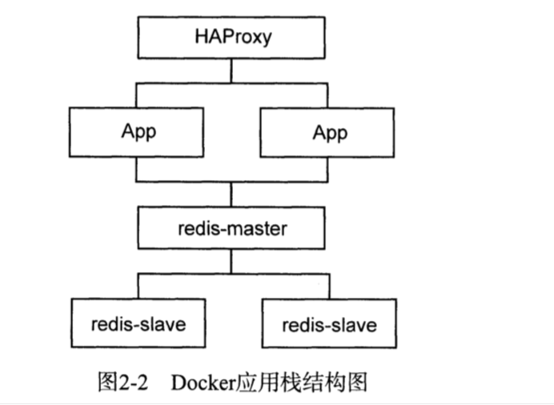
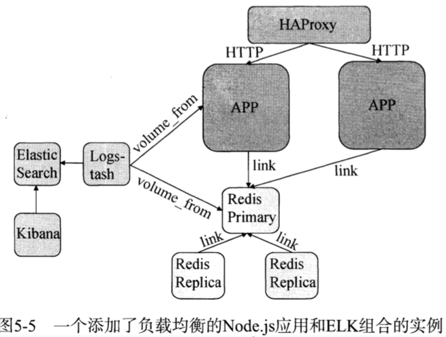
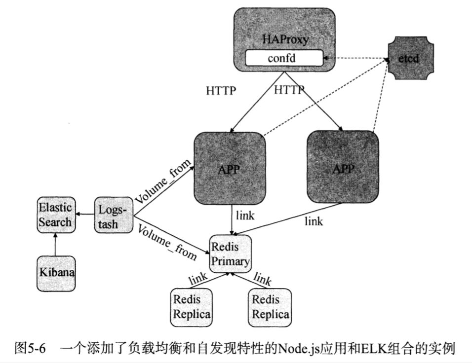

| Title                | Date             | Modified         | Category          |
|:--------------------:|:----------------:|:----------------:|:-----------------:|
| micros              | 2019-05-29 12:00 | 2019-05-29 12:00 | micros            |

# Docker

## 概述

### Container

### Docker

事实上的标准

docker，优势，可以构建一个隔离的，稳定的，安全地，高性能的容器运行环境。

## 使用

`docker help`

## Docker 与微服务

## 参考资料

### GitHub
- https://github.com/docker

### WebSite
- https://www.docker.com/

### Books
- 《Docker技术入门与实战（第3版）》
