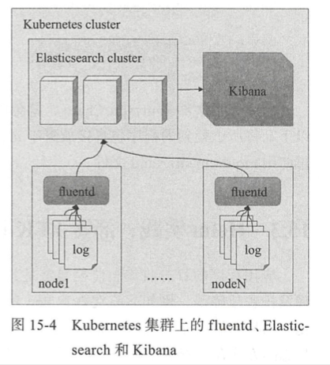
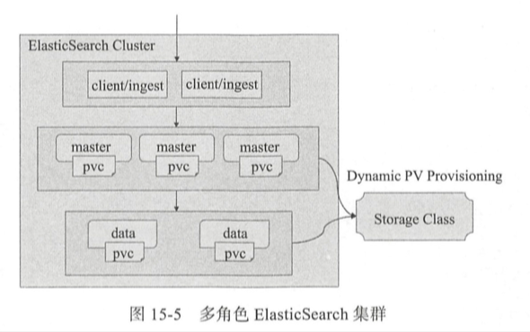
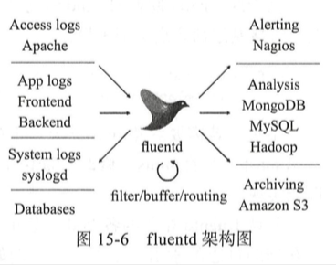

| Title                | Date             | Modified         | Category          |
|:--------------------:|:----------------:|:----------------:|:-----------------:|
| ELK              | 2019-06-11 12:00 | 2019-06-11 12:00 | micros            |

# EFK

> 一种流行的开源解决方案是将fluentd作为节点级代理程序进行日志采集，并将之聚合存储于Elasticsearch进行日志分析，以及通过Kibana进行数据可视化。这种组合通常简称EFK。

## Elasticsearch

## 日志采集代理fluentd
> fluentd是一个开源的数据收集器，基于C和Ruby语言开发，它目前有数百种以Ruby Gem形式独立存在的可选插件，用于连接多种数据源和数据输出组件等，如fluent-plugin-elasticsearch插件用于实现将采集到的数据发送给Elasticsearch。

## Kibana
> Kibana是Elasticsearch的数据分析及可视化平台，能够用来搜索，查看存储在Elasticsearch索引中的数据。
