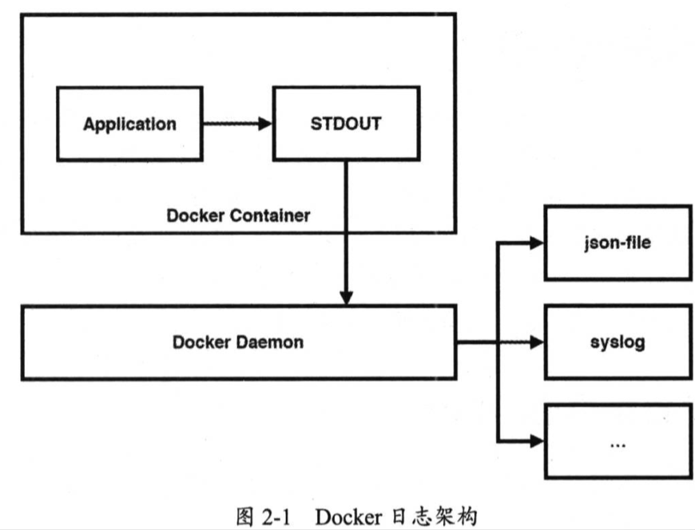

| Title                | Date             | Modified         | Category          |
|:--------------------:|:----------------:|:----------------:|:-----------------:|
| ELK              | 2019-06-11 12:00 | 2019-06-11 12:00 | micros            |


# ELK


## 将日志输出到Docker容器外

`docker run -v ~/logs:~/logs hello`


## 使用Docker容器日志

`docker logs`


查看DOcker当前所设置的日志驱动类型，它是json-file。

`docker info | grep 'Logging Driver'`


我们进入/var/lib/docker/containers/<container_id>目录，就会看到一个名为<container_id>-json.log的文件，它就是我们要寻找的JSON日志文件了。

原来如此，当我们通过docker logs命令所看到的日志，实际上就是解析这个JSON日志文件后的输出。

既然应用程序的日志可以写入JSON文件中，那么也能写入其他日志驱动中，json-file只是Docker日志驱动的一种默认选项，Docker已为我们提供了大量的日志驱动类型。

- none：容器不输出任何日志
- json-file: 容器输出的日志以JSON格式写入文件中
- syslog：容器输出的日志写入宿主机的Syslog中
- journald：容器输出的日志写入宿主机的Journald中
- gelf：容器输出的日志以GELF（Graylog Extended Log Format）格式写入Graylog中
- fluentd：容器输出的日志写入宿主机的Fluentd中
- awslogs：容器输出的日志写入Amazon CloudWatch Logs中
- splunk：容器输出的日志写入splunk中
- etwlogs：容器输出的日志写入ETW（Event Tracing for Windows）中
- gcplogs：容器输出的日志写入GCP（Google Cloud Platform）中
- nats：容器输出的日志写入NATS服务器中


我们可以在docker run命令中通过--log-driver参数来设置具体的Docker日志驱动，也可以通过--log-opt参数来指定对应日志驱动的相关选项。

就拿默认的json-file来说，其实可以这样启动docker容器：

`docker run -d -p 80:80 --log-driver json-file --log-opt max-size=10m --log-opt max-file=3 --name nginx nginx`

在以上众多日志驱动类型中，最为常用的是Syslog，因为Syslog是Linux的日志系统，很多日志分析工具都可以从Syslog中获取日志，比如流行的ELK日志中心，它包括以下三个组件。
- 日志存储：由Elasticsearch负责
- 日志收集：由Logstash负责
- 日志查询：由Kinana负责

在ELK的三个组件中，
- Logstash用于收集日志，Syslog中写入的日志可转发到Logstash中，
- 随后将日志存入Elasticsearch中，
- 最后可通过Kibana来查询日志。


## syslog Linux日志系统


默认情况下，Linux操作系统已安装了Syslog软件包，但它叫Rsyslog。实际上，Rsyslog是Syslog标准的一种实现。除了Rsyslog这一种实现，还有一种叫Syslog-ng的第三方实现。

查看命令

`rsyslogd -v`


开启Rsyslog服务：

编辑配置文件

`vi /etc/rsylog.conf`

重启服务

`systemctl restart rsyslog`

查看端口

`netstat -anpt | grep 514`

启动一个nginx容器，用syslog日志驱动
```bash
docker run \
-d \
-p 80:80 \
--log-driver syslog \
--log-opt syslog-address=tcp://localhost:514 \
--log-opt tag="{{.ImageName}}/{{.Name}}/{{.ID}}" \
--name nginx \
nginx
tail -f /var/log/messages
```


## Docker 日志架构

Docker 容器（Docker Container） 中的应用程序（Application） 将 日志写入到标准输出设备（STDOUT），Docker守护进程（Docker Daemon）负责从STDOUT中获取日志，并将日志写入对应的日志驱动中，





目前，应用程序中的日志已经从Docker容器内部成功写入宿主机的Syslog中，接下来我们要做的是，将Syslog中的日志转发到ELK平台的Logstash中，从而建立我们所需要的“应用日志中心”，


## ELK


从Elastic公司的官网上，我们就能快速了解该公司所提供的产品，用官方的说法，叫“开源Elastic栈（Open Source Elastic Stack）”。
从官网上可知，Elastic官方推出了6款开源产品。
1. Kibana：用于数据可视化
2. Elasticsearch：用于数据搜索，分析与存储
3. Logstash：用于数据收集，将数据存入Elasticsearch中
4. Beats：用于数据传输，将数据从磁盘上传输到Logstash中
5. X-Pack：提供一些扩展功能，包括安全，预警，监控，报表，图形化等
6. Elastic Cloud：提供Elastic栈的云服务，提供公有云与私有云解决方案


### 日志存储系统：Elasticsearch

> Elasticsearch是一个可高度扩展的开源全文搜索与分析引擎，它可以帮助我们快速的存储，搜索与分析大规模的实时数据。Elasticsearch的底层基于开源搜索引擎Lucene，并在此基础上提供了一系列便于应用程序使用的REST API，并且还提供了先天性的集群能力，可自由水平扩展以支持日益增长的数据。


通过Docker容器启动Elasticsearch：
```bash
docker run \
--rm \
-p 9200:9200 \
--name elasticsearch \
elasticsearch
```

### 日志收集系统：Logstash

> Logstash是一款开源的数据收集引擎，它既提供了实时管道能力，也提供了灵活的插件机制，我们可以自由选择已有的插件，也能自行开发所需的插件。我们使用Logstash更多的时候都是在做参数配置，以实现我们所需的功能。


### 日志查询系统：Kibana

> Kibana是一个开源的基于Elasticsearch的分析与可视化平台，我们既可用它来查看并搜索存储在Elasticsearch中的数据，也可用它来制作各式各样的图表，表格，地图等图形化数据。


### ELK 集成日志中心

# 参考资料

## books
- 《架构探险：轻量级微服务架构（下册）》