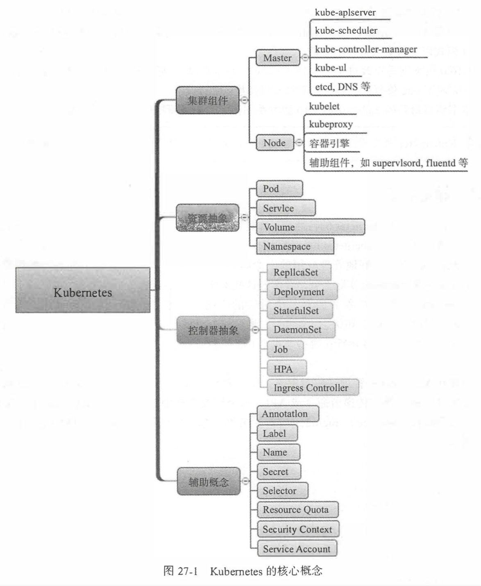

# kubernetes

## 概念

k8s业已称为容器编排领域事实上的标准

还要考虑集群管理，高可用，安全，持续集成等方方面面的问题。
这些关于容器集群管理的问题，其实就是容器编排的问题，即Kubernetes要解决的问题。

Kubernetes特性
1. 自动装箱
2. 自我修复
3. 水平扩展
4. 服务发现和负载均衡
5. 自动发布和回滚
6. 密钥和配置管理
7. 存储编排
8. 批量处理执行

### Helm

Kuberneres的安装包管理器，类似于yum，apt-get等
K8s类似于微服务层的操作系统，Helm类似于操作系统上的包管理器。

## 使用

## todos demo

TODO

## 参考资料

### GitHub
- https://github.com/kubernetes

### WebSite
- https://kubernetes.io/
- https://kubernetes.io/zh/docs/tutorials/

### Books
- 《每天5分钟玩转Kubernetes》
- 《Kubernetes进阶实战》
- 《基于Kubernetes的容器云平台实战》