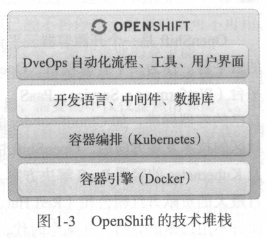
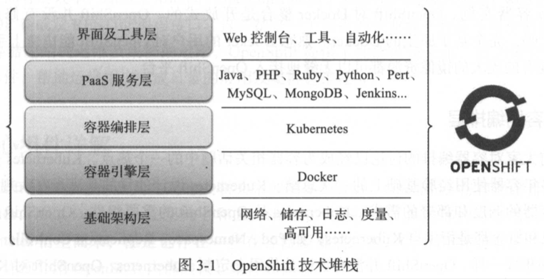
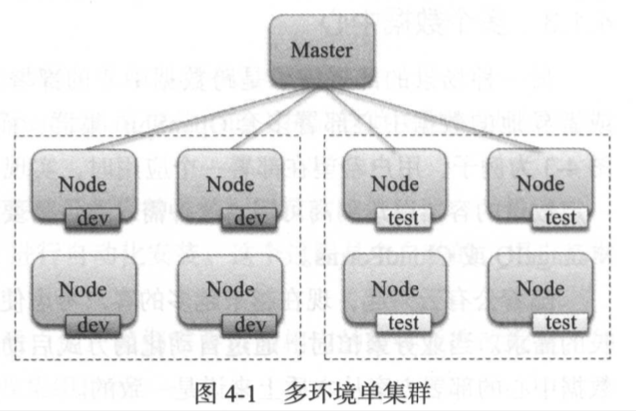
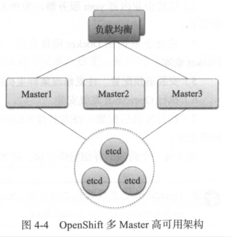
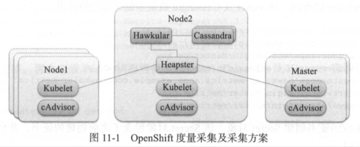
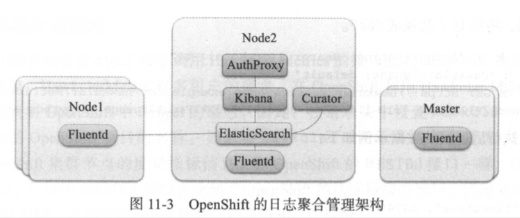

| Title                | Date             | Modified         | Category          |
|:--------------------:|:----------------:|:----------------:|:-----------------:|
| micros              | 2019-05-29 12:00 | 2019-05-29 12:00 | micros            |

# OpenShift 3

## 概念

### Red Hat
- Red Hat就是开源软件商业模式的奠基人，而且是目前世界上最大的开源软件公司。
- 作为一个开源软件公司，red hat所有产品的企业版的源代码也是完全公开的。
- Red Hat是Kubernetes, Istio的主要贡献者之一。

### OpenShift

- OpenShift是一个开源容器云平台，是一个基于主流的容器技术Docker及Kubernetes构建的云平台。
- 通过OpenShift这个平台，企业可以快速在内部网络中构建出一个多租户的云平台，在这朵云上提供应用开发，测试，部署，运维的各项服务（如图1-2所示）。
- OpenShift在一个平台上贯通开发，测试，部署，运维的流程，实现高度的自动化，满足应用持续集成及持续交付和部署的需求；满足企业及组织对容器管理，容器编排的需求。
- 通过OpenShift的灵活架构，企业可以以OpenShift作为核心，在其上搭建一个企业的DevOps引擎，推动企业的DevOps变革和转型。

容器引擎及容器编排组件是两项关键的技术，但还不能满足生产效率的要求。

OpenShift在Docker和k8s的基础上提供了各种功能，以满足业务应用，研发用户及运维用户在生产效率上的诉求。

- 应用开发框架及中间件
- 应用及服务目录
- 自动化流程及工具。
- 软件自定义网络
- 性能监控及日志管理
- 多用户接口
- 自动化集群部署及管理

OpenShift集成了原生的Kubernetes作为容器编排组件。OpenShift通过Kubernetes来管理容器集群中的机器节点及容器，为业务应用提供：
- 容器调度
- 弹性伸缩
- 异常自愈
- 持久化卷
- 服务发现
- 配置管理

K8s是一个容器编排工具，虽然提供了很多的功能，但只是一个工具。而OpenShift是一整套企业解决方案。

#### 架构概览

#### 核心组件

#### 构建与部署自动化 CI/CD

#### 企业部署

多环境单集群

多环境多集群

多数据中心

#### 高可用

主控节点的高可用

#### 度量与日志管理

度量采集

日志采集

### 混合云

## 演示

- 演示本地macos的OpenShift单节点集群
- 演示OpenShift的Web Dashboard

## todos demo

TODO

## 参考资料

### GitHub

- https://github.com/openshift

### WebSite

- http://www.openshift.org
- https://www.okd.io/

### Books

- 《开源容器云OpenShift 构建基于Kubernetes的企业应用云》
