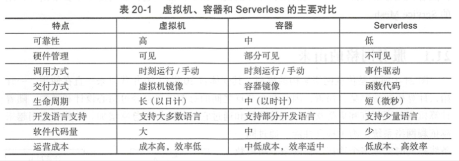
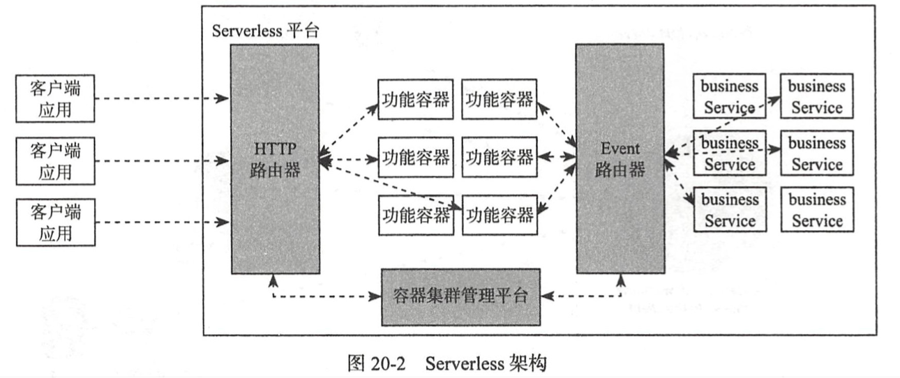

| Title                | Date             | Modified         | Category          |
|:--------------------:|:----------------:|:----------------:|:-----------------:|
| serverless              | 2019-06-11 12:00 | 2019-06-11 12:00 | micros            |

# Serverless

## 概述

Serverless下包含的两个概念：
- 函数即服务，即Function as a Service，简称FaaS
- 后端即服务，即Backend as a Service，简称BaaS。

目前，Serverless平台主要分为三大类：
1. 公有云上的功能即服务（Functions as a Service，FaaS）解决方案。
2. 运行在共有和私有数据中心的Serverless框架，如Fission运行在Kubernetes上，Funktion运行在Kubernetes上，IBM OpenWhisk运行在Docker上。
3. 提供agnostic应用接口或/和现有Serverless框架增值服务的包装框架，如Serverless.com支持AWS Lambda，Apex支持AWS Lambda。

Serverless适用场景:
1. 应用负载变化显著的场景
2. 基于事件驱动的算法服务化场景
3. 基于事件驱动的数据分析服务化场景
4. 基于事件驱动的数据服务化场景
5. 低频请求场景

## 参考资料
### books
- 《基于Kubernetes的容器云平台实战》