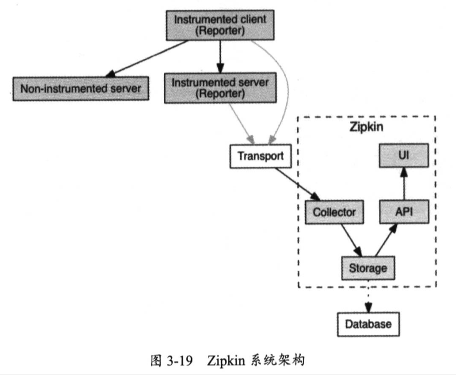

| Title                | Date             | Modified         | Category          |
|:--------------------:|:----------------:|:----------------:|:-----------------:|
| Zipkin              | 2019-06-11 12:00 | 2019-06-11 12:00 | micros            |

# Zipkin

> Zipkin是Twitter公司开源的一款调用追踪中心（也称为分布式追踪系统），它可以帮助我们收集分布式系统中每个组件所花费的调用时长，并通过图形化界面的方式来展现整个调用链依赖关系，还能展现调用每个组件所花费的时长。

Zipkin在系统设计上参考了Google Dapper，它是Google公司内部所使用的大规模分布式系统追踪基础设施。

可以毫不夸张的说，Zipkin是开源社区中调用追踪中心的首选方案，我们可从Zipkin官网上了解更多关于它的相关介绍与使用方法。

使用Zipkin之前，我们有必要学习它的几个核心概念。

## Span

是调用一个组件所经历的一段过程，也就是说，从请求组件开始，直到组件响应为止，在这段过程中会花费一定的时间，这是一个时间跨度，所以我们形象的将其称为Span。

## Trace

Trace指的是从客户端发出请求，直到完成整个内部调用的全部过程，我们将这个过程称为一次追踪，Trace就是这次追踪过程。

## Reporter

我们需要将Span与Trace所产生的追踪数据推送至Zipkin中，因此需要在相关的组件中安置一个客户端，它用于收集这些追踪数据并将它们报告给Zipkin，我们将这个客户端称为Reporter。

只有被Reporter装配的（Instrumented）组件才能通过Transport向Zipkin发送数据，随后通过COllector进行数据收集，并通过Storage进行数据存储（可将数据持久化到Database中）。

此后，可通过API（Query Service）来查询Storage中的数据，并通过一个UI（Web UI）来展示Trace与Span的调用链及其相关数据。

可以把Transport理解为一个数据传输方式，Zipkin提供了多种主要方式。最简单的情况下，可通过HTTP来传输数据，在并发量较高的情况下，可通过Kafka或Scribe来传输数据，可起到数据缓冲的作用，提高了整个调用追踪中心的吞吐率。

Kafka是一个Apache开源的一款分布式消息系统，Scribe是Facebook开源的一款日志收集系统。

下面，开始进入Zipkin的内部来学习它的系统架构。

1. Collector
2. Storage
3. Query Service
4. Web UI

# 参考资料

## books
- 《架构探险：轻量级微服务架构（下册）》
