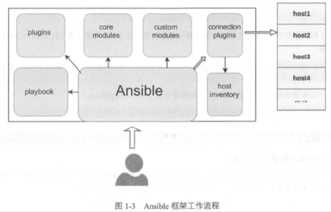

| Title                | Date             | Modified         | Category          |
|:--------------------:|:----------------:|:----------------:|:-----------------:|
| ansible              | 2019-06-11 12:00 | 2019-06-11 12:00 | ops            |

# Ansible

Ansible就是一个简单的自动化运维工具。

现在，成熟的自动化运维工具已经有了不少，比如Ansible，Puppet，Cfengine，Chef，Func，Fabric。

Ansible是一款由Python编程语言开发，基于SSH远程通信的自动化运维工具，

## Ansible的特性与框架

对于Ansible的特性主要有如下几个：

- 不需要在被管控主机上安装客户端
- 无服务端，使用时直接运行命令即可
- 基于模块工作，可使用任意语言开发模块
- 使用yaml语言定制编排剧本playbook
- 基于SSH远程通信协议
- 可实现多级指挥
- 支持sudo
- 基于python语言，管理维护简单
- 支持邮件，日志等多种功能。

